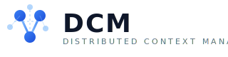
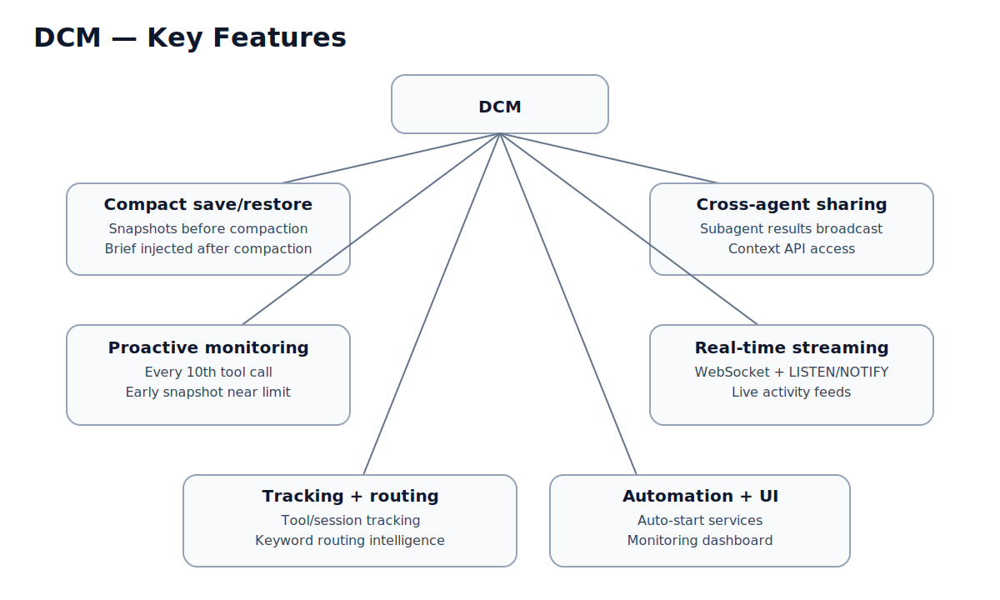
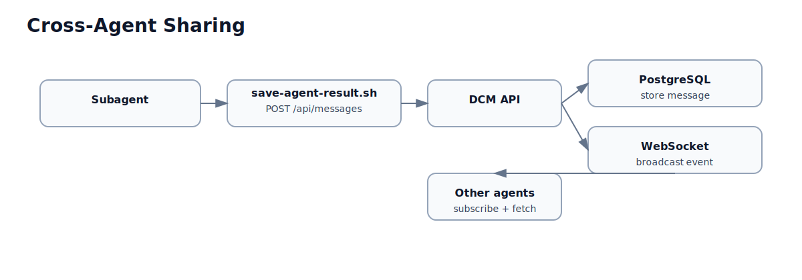

# DCM - Distributed Context Manager

<p align="center">
  
</p>

<p align="center">
  <a href="LICENSE"></a>
  <a href="https://bun.sh"></a>
  <a href="https://www.postgresql.org/"></a>
</p>

<p align="center">
  <strong>Persistent context, compact recovery, and cross-agent sharing for Claude Code multi-agent sessions.</strong>
</p>

---

## What is DCM?

DCM (Distributed Context Manager) is a backend service that gives Claude Code sessions persistent memory. When Claude Code runs multi-agent workflows, each agent operates in isolation with a finite context window. DCM solves this by tracking every tool call, saving context snapshots before compaction, restoring them afterward, and sharing results across agents in real time.

DCM integrates with Claude Code through its hooks system. Lightweight bash scripts fire on key lifecycle events -- session start, tool use, agent completion, compaction -- and report to a local API backed by PostgreSQL. When Claude's context window fills up and the conversation compacts, DCM injects a context brief so the session picks up where it left off without losing track of active tasks, modified files, or key decisions.

The system consists of three services: a REST API for tracking and context management, a WebSocket server for real-time event streaming, and a Next.js dashboard for monitoring. All three can be started with a single command, or auto-launched when Claude Code starts via the plugin system.

## Key Features

<p align="center">
  
</p>

- **Compact save/restore** -- Automatically saves context snapshots before compaction and restores them afterward, so sessions never lose track of work in progress
- **Cross-agent sharing** -- When a subagent finishes, its result is broadcast so other agents can access it through the context API
- **Proactive monitoring** -- Monitors transcript size every 10th tool call and triggers early snapshots when nearing the context limit
- **Real-time event streaming** -- WebSocket server with LISTEN/NOTIFY bridge for live activity feeds
- **Tool and session tracking** -- Records every tool invocation, agent delegation, and session lifecycle event
- **Routing intelligence** -- Keyword-based tool suggestion with feedback-driven weight adjustment
- **Inter-agent messaging** -- Pub/sub messaging system for agent coordination
- **Auto-start services** -- In both CLI and plugin mode, DCM auto-launches when Claude Code starts a session
- **Monitoring dashboard** -- Next.js UI with live activity feeds, session timelines, agent statistics, and tool analytics

## Architecture Overview

<p align="center">
  
</p>

| Component         | Stack                                      | Port | Description                                         |
| ----------------- | ------------------------------------------ | ---- | --------------------------------------------------- |
| **DCM API**       | Bun, Hono, Bun.sql, Zod                    | 3847 | REST API, compact save/restore, routing intelligence |
| **DCM WebSocket** | Bun native WS, LISTEN/NOTIFY               | 3849 | Real-time events, HMAC auth, auto-reconnect          |
| **DCM Dashboard** | Next.js 16, React 19, Recharts, shadcn/ui  | 3848 | Monitoring UI with live activity feed                |
| **PostgreSQL**    | PostgreSQL 16                               | 5432 | 10 tables, 4 views, JSONB metadata                   |

## Quick Start

### Prerequisites

- [Bun](https://bun.sh) 1.x
- [PostgreSQL](https://www.postgresql.org/) 16+
- `jq` and `curl` (standard on most Linux/macOS systems)
- [Node.js](https://nodejs.org/) 22+ (for the dashboard only)

### One-command install

```bash
cd context-manager
./dcm install
```

Restart Claude Code to pick up the new hooks. From that point on, DCM tracks every session automatically.

### Auto-start via plugin

When installed as a Claude Code plugin, DCM auto-launches its services the moment Claude Code starts a session. No manual `dcm start` needed.

```bash
# Symlink or copy the context-manager directory into Claude Code's plugin path
ln -s /path/to/Claude-DCM/context-manager ~/.claude/plugins/dcm
```

On the next Claude Code session, the `ensure-services.sh` hook detects that DCM is not running, starts the API and WebSocket servers, and waits for health confirmation -- all within the SessionStart hook timeout.

**Prerequisite**: PostgreSQL must be running before Claude Code starts. Using systemd to manage PostgreSQL is recommended so it starts at boot.

## Installation Methods

| Feature                      | CLI Mode (`dcm install`)                   | Plugin Mode (auto-discovery)                     |
| ---------------------------- | ------------------------------------------ | ------------------------------------------------ |
| **Setup**                    | `./dcm install` then `./dcm hooks`         | Symlink into `~/.claude/plugins/`                |
| **Hook injection**           | Merges into `~/.claude/settings.json`      | Plugin's `hooks.json` loaded by Claude Code      |
| **Service startup**          | `./dcm start` or auto via ensure-services  | Auto via `ensure-services.sh` on SessionStart    |
| **Hook paths**               | Absolute paths to hooks directory           | `${CLAUDE_PLUGIN_ROOT}` variable paths           |
| **Scope**                    | Global (all projects)                       | Per-plugin                                       |
| **Uninstall**                | `./dcm unhook`                              | Remove the symlink                               |

Both modes include the `ensure-services.sh` hook, which auto-starts DCM services if they are not already running when a Claude Code session begins.

## How It Works

DCM uses Claude Code's hooks system to track and manage context. All hooks are fire-and-forget with short timeouts -- they never block Claude.

<p align="center">
  
</p>

### Compact save/restore

<p align="center">
  
</p>

When Claude's context window fills up, the conversation compacts. Without DCM, agents lose track of what happened before. DCM handles this automatically:

1. **Before compact**: `pre-compact-save.sh` saves active tasks, modified files, agent states, and key decisions to the database
2. **After compact**: `post-compact-restore.sh` fetches a context brief and injects it back into the session via `additionalContext`
3. **Proactive monitoring**: `monitor-context.sh` runs every 10th tool call; if the transcript exceeds 800 KB, it triggers an early snapshot so data is saved even if compaction happens unexpectedly

### Cross-agent sharing

<p align="center">
  
</p>

When a subagent finishes, `save-agent-result.sh` broadcasts its result as a message. Other agents pick this up through the context API, preventing work from getting siloed.

## Auto-Start Feature

<p align="center">
  
</p>

In both CLI and plugin installation modes, the `ensure-services.sh` hook runs on every `SessionStart` event. It performs the following:

1. **Health check** -- Calls `GET /health` on the API. If healthy, exits immediately (no-op).
2. **Lock acquisition** -- Creates a lock file to prevent concurrent auto-starts when multiple Claude sessions launch simultaneously.
3. **PostgreSQL check** -- Verifies PostgreSQL is reachable via `pg_isready`. If not, logs a warning and exits gracefully.
4. **Service start** -- Launches the API and WebSocket servers as background processes.
5. **Readiness wait** -- Polls the health endpoint for up to 5 seconds until the API confirms healthy status.

The hook is idempotent: if services are already running, it exits in under 50 ms. If PostgreSQL is not available, it skips startup without error.

**Recommended setup**: Configure PostgreSQL to start at boot via systemd so it is always available when Claude Code launches:

```bash
sudo systemctl enable postgresql
sudo systemctl start postgresql
```

## CLI Commands

| Command              | Description                                                       |
| -------------------- | ----------------------------------------------------------------- |
| `dcm install`        | Full setup: dependencies, database, hooks                         |
| `dcm start`          | Start API + WebSocket + Dashboard                                 |
| `dcm stop`           | Stop all DCM services                                             |
| `dcm restart`        | Restart all services                                              |
| `dcm status`         | Health check for all components                                   |
| `dcm hooks`          | Install or update Claude Code hooks                               |
| `dcm unhook`         | Remove DCM hooks from `~/.claude/settings.json`                   |
| `dcm logs <service>` | Tail logs for a service (`api`, `ws`, or `dashboard`)             |
| `dcm snapshot`       | Trigger a manual context snapshot                                 |
| `dcm context`        | Get context brief for an agent                                    |
| `dcm health`         | Quick API health check (JSON output)                              |
| `dcm db:setup`       | Initialize database schema                                       |
| `dcm db:reset`       | Drop and recreate database (destructive)                          |
| `dcm version`        | Show DCM version                                                  |

## Documentation

| Document                                                  | Description                                     |
| --------------------------------------------------------- | ----------------------------------------------- |
| [Architecture](docs/ARCHITECTURE.md)                      | System design, data flow, database schema, ADRs |
| [API Reference](docs/API.md)                              | Full API reference with examples                |
| [Integration Guide](docs/INTEGRATION.md)                  | Claude Code hooks setup, SDK usage              |
| [Deployment Guide](docs/DEPLOYMENT.md)                    | Docker, systemd, manual deployment guides       |
| [OpenAPI Specification](context-manager/openapi.yaml)     | OpenAPI 3.0 specification                       |

## Dashboard

The monitoring dashboard is available at `http://localhost:3848` and updates in real time via WebSocket.

| Page               | Features                                                                 |
| ------------------ | ------------------------------------------------------------------------ |
| **Dashboard**      | Health gauge, KPI cards with sparklines, area/bar charts, activity feed  |
| **Live Activity**  | Real-time event stream, agent topology grid                              |
| **Sessions**       | Session list with filters, search, tool counters                         |
| **Session Detail** | Timeline view with request cards and task items                          |
| **Projects**       | Project list with KPIs, search                                           |
| **Agents**         | Agent statistics, active agents, type distribution                       |
| **Tools**          | Tool usage analytics, type distribution, success rates                   |
| **Routing**        | Keyword-tool mappings, routing tester with live feedback                 |
| **Messages**       | Inter-agent message history with expandable payloads                     |
| **Context**        | Agent context browser with stats and type distribution                   |

Built with shadcn/ui, Radix UI, and Tailwind CSS. Dark mode with glassmorphism cards.

## Configuration

Copy `.env.example` to `.env` and edit:

```bash
cp .env.example .env
```

| Variable             | Default            | Description                                            |
| -------------------- | ------------------ | ------------------------------------------------------ |
| `DB_HOST`            | `127.0.0.1`        | PostgreSQL host                                        |
| `DB_PORT`            | `5432`             | PostgreSQL port                                        |
| `DB_NAME`            | `claude_context`   | Database name                                          |
| `DB_USER`            | *(required)*       | Database user                                          |
| `DB_PASSWORD`        | *(required)*       | Database password                                      |
| `PORT`               | `3847`             | API server port                                        |
| `WS_PORT`            | `3849`             | WebSocket server port                                  |
| `DASHBOARD_PORT`     | `3848`             | Dashboard port                                         |
| `WS_HMAC_SECRET`     | --                 | HMAC secret for WebSocket auth (required in production)|
| `API_HOST`           | `localhost`        | External host for dashboard API URLs                   |
| `NODE_ENV`           | `development`      | Environment (`production` enforces WS auth)            |

## Tests

```bash
cd context-manager
bun test
```

## Contributing

1. Fork the repository
2. Create a feature branch (`git checkout -b feature/my-feature`)
3. Make your changes and add tests
4. Run the test suite (`bun test`)
5. Commit your changes (`git commit -m "feat: add my feature"`)
6. Push to the branch (`git push origin feature/my-feature`)
7. Open a Pull Request

Please ensure all tests pass and follow the existing code style.

## License

MIT
