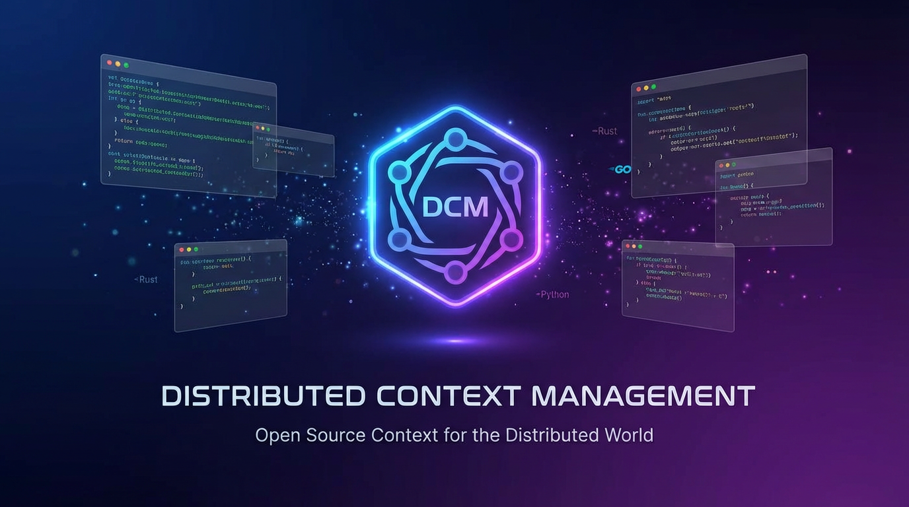
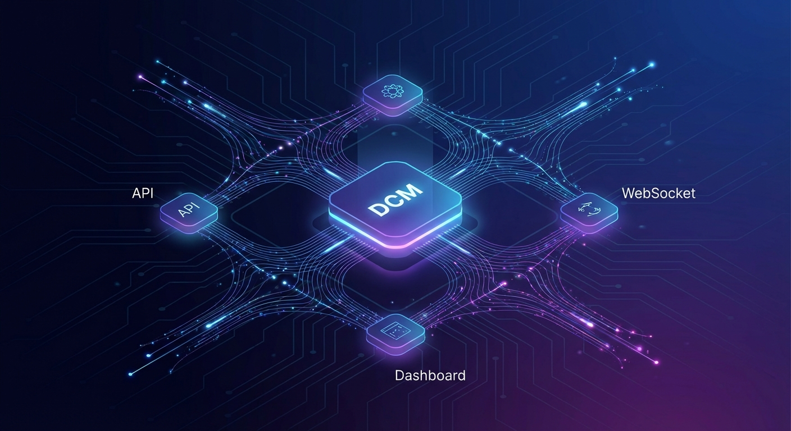
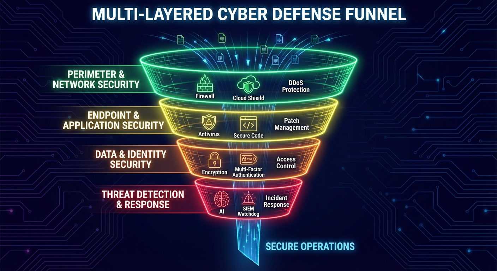
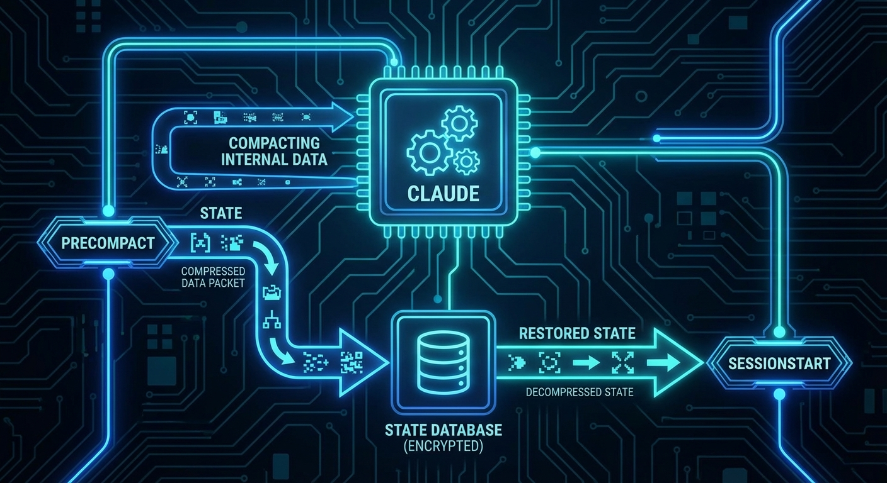
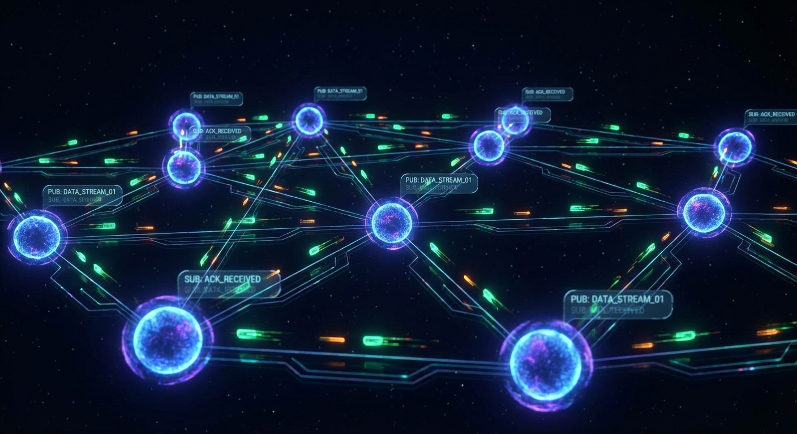
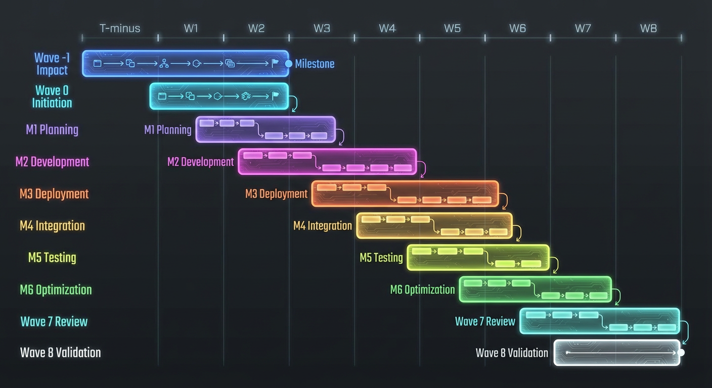
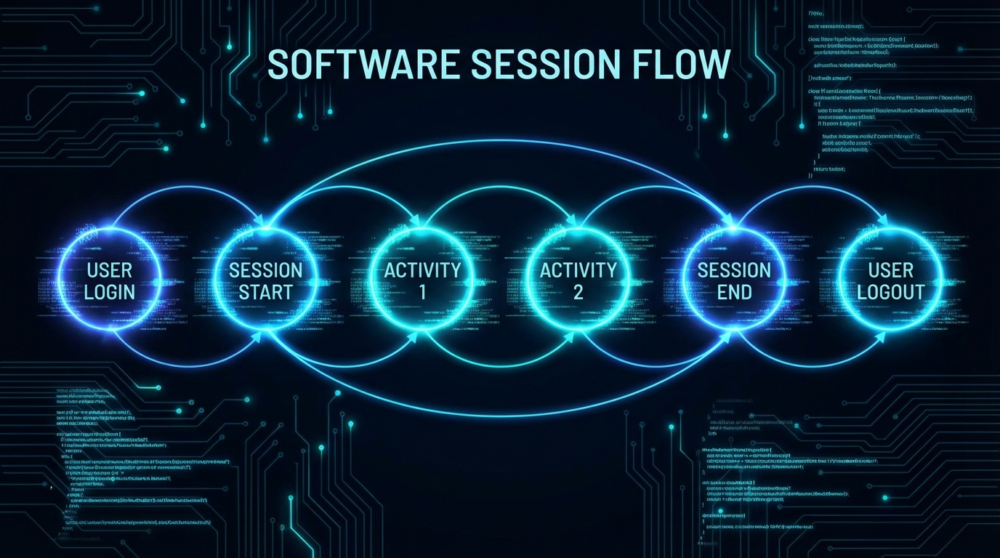

# DCM - Distributed Context Manager

<p align="center">
  
</p>

<p align="center">
  <a href="LICENSE"></a>
  <a href="https://bun.sh"></a>
  <a href="https://www.postgresql.org/"></a>
  <a href="https://hono.dev"></a>
  
</p>

<p align="center">
  <strong>Persistent memory, compact recovery, and multi-agent orchestration for Claude Code sessions.</strong>
</p>

---

## The Problem

Claude Code sessions hit a hard limit: the **context window**. When a conversation grows too large, Claude triggers **compaction** -- compressing the conversation history to free space. Without external help, this means:

- **Active tasks vanish.** Agents lose track of what they were building, which files they modified, and what decisions they made.
- **Agents work in silos.** A backend agent finishes an API endpoint, but the frontend agent has no idea it exists.
- **No visibility.** There is no way to see what is happening across a multi-agent session -- which agents are running, what tools they are calling, or whether things are going well.
- **Manual recovery.** After each compact, users must re-explain the entire project state from memory.

## The Solution

<p align="center">
  
</p>

DCM sits alongside Claude Code as a persistent memory layer. It hooks into Claude's lifecycle events -- every tool call, every agent launch, every compaction -- and maintains a complete picture of what is happening. When compaction occurs, DCM automatically saves the session state beforehand and restores it afterward, so Claude picks up exactly where it left off.

The system consists of three services working together: a REST API that tracks and stores everything, a WebSocket server that streams events in real time, and a Next.js dashboard that puts it all on screen.

## Key Features

### Context Guardian -- 4-Layer Defense

<p align="center">
  
</p>

DCM protects against context loss with four layers of defense, each catching what the previous one might miss:

| Layer | Mechanism | Frequency | Latency | What It Does |
|-------|-----------|-----------|---------|--------------|
| **1. Local Monitor** | `context-guardian.sh` | Every tool call | <10ms | Checks transcript file size locally. Green (<500KB), Yellow (500-750KB), Orange (750KB-1MB, alerts Claude), Red (>1MB, alerts + saves snapshot). |
| **2. API Health Check** | `monitor-context.sh` | Every 5th call | 25-100ms | Queries the API for capacity metrics. Triggers a proactive snapshot if usage exceeds 80%. Cooldown prevents snapshot spam. |
| **3. Stop Guard** | `context-stop-guard.sh` | On Stop event | <100ms | Blocks session termination if running tasks exist, preventing accidental context loss. |
| **4. Compact Save/Restore** | `pre-compact-save.sh` + `post-compact-restore.sh` | Each compaction | 500ms-2s | Saves a comprehensive snapshot before compact. Restores a token-optimized context brief after compact via `additionalContext` injection. |

### Compact Save/Restore Lifecycle

<p align="center">
  
</p>

When Claude's context window fills up:

1. **PreCompact** -- DCM collects active tasks, modified files, agent states, key decisions, and recent messages, then saves them as a compressed snapshot in PostgreSQL.
2. **Compaction** -- Claude compresses the conversation. Without DCM, everything before this point is gone.
3. **SessionStart (compact)** -- DCM fetches the latest snapshot, generates a token-optimized context brief using role-specific templates, and injects it back into the session. Claude resumes with full awareness of prior work.

### Inter-Agent Communication

<p align="center">
  
</p>

Agents coordinate through a built-in pub/sub messaging system:

- **Messages** -- Agents publish to topics (e.g., `api_endpoint_created`, `schema_updated`). Other agents receive these through the context API or WebSocket subscriptions.
- **Subscriptions** -- Agents subscribe to topics they care about and receive targeted notifications.
- **Blocking** -- An agent can declare a dependency on another, preventing premature execution until the upstream work is done.
- **Broadcast** -- When a subagent finishes, `save-agent-result.sh` automatically broadcasts its result so other agents can consume it.

```bash
# Agent publishes a message
curl -X POST http://127.0.0.1:3847/api/messages \
  -H "Content-Type: application/json" \
  -d '{
    "from_agent_id": "backend-laravel",
    "topic": "api_endpoint_created",
    "payload": {"endpoint": "/api/users", "methods": ["GET", "POST"]}
  }'

# Another agent checks messages
curl "http://127.0.0.1:3847/api/messages/frontend-react?session_id=abc123"
```

### Wave Orchestration

<p align="center">
  
</p>

Complex work is decomposed into **waves** -- sequential execution phases where subtasks within each wave run in parallel:

```
Wave 0: Exploration     -->  Wave 1: Implementation  -->  Wave 2: Validation  -->  Wave 3: Documentation
 [analyze codebase]          [backend] [frontend]         [tests] [review]        [docs] [changelog]
 [read requirements]         [database] [api]             [security audit]        [api spec update]
```

The orchestration API supports:
- **Task decomposition** -- Break a high-level request into typed subtasks (`POST /api/orchestration/decompose`)
- **Batch submission** -- Submit a wave of subtasks at once (`POST /api/orchestration/batch-submit`)
- **Conflict detection** -- Identify agents modifying the same files (`GET /api/orchestration/conflicts/:id`)
- **Result synthesis** -- Aggregate results from a completed batch (`POST /api/orchestration/batch/:id/complete`)

### Hook Lifecycle

<p align="center">
  
</p>

DCM integrates through Claude Code's hooks system. Lightweight bash scripts fire on lifecycle events, each calling the DCM API with relevant data:

| Event | Hook Script | Timeout | Purpose |
|-------|-------------|---------|---------|
| `SessionStart` | `ensure-services.sh` | 10s | Auto-starts DCM services if not running |
| `SessionStart` | `track-session.sh` | 5s | Records session start |
| `SessionStart (compact)` | `post-compact-restore.sh` | 8s | Restores context brief after compaction |
| `PostToolUse (*)` | `track-action.sh` | 3s | Records every tool invocation for routing intelligence |
| `PostToolUse (Task)` | `track-agent.sh` | 3s | Records agent delegations |
| `PostToolUse (*)` | `context-guardian.sh` | 2s | Layer 1 local context monitoring |
| `PostToolUse (*)` | `monitor-context.sh` | 2s | Layer 2 proactive API health check |
| `PreCompact` | `pre-compact-save.sh` | 5s | Saves full context snapshot before compact |
| `SubagentStop` | `save-agent-result.sh` | 3s | Broadcasts subagent result to other agents |
| `Stop` | `context-stop-guard.sh` | 3s | Blocks stop if critical tasks are running |
| `SessionEnd` | `track-session-end.sh` | 3s | Records session completion |

All hooks are fire-and-forget -- they never block Claude Code execution.

### Real-Time Dashboard

The monitoring dashboard runs at `http://localhost:3848` and provides live visibility into multi-agent sessions:

| Page | What It Shows |
|------|---------------|
| **Dashboard** | Health gauge, KPI cards (success rate, actions/hour, active agents), agent distribution |
| **Sessions** | Session browser with filters, tool counters, timeline view |
| **Agents** | Active agents, context snapshots, type distribution |
| **Messages** | Inter-agent message history with expandable payloads |
| **Waves** | Wave execution tracking, batch progress |
| **Routing** | Keyword-to-tool mappings, routing tester with live feedback |
| **Registry** | Agent catalog browser (66+ agents, 226+ skills) |
| **Live** | Real-time WebSocket event stream |
| **Compact** | Compact operations and snapshot history |
| **Performance** | API response times, success rates, system health |

Built with Next.js 16, React 19, shadcn/ui, Recharts, and Tailwind CSS. Dark mode with glassmorphism cards.

### Intelligent Routing

DCM learns which tools work best for which tasks through a feedback-driven keyword scoring system:

```bash
# Get tool suggestions for a keyword
curl "http://127.0.0.1:3847/api/routing/suggest?keyword=database&limit=5"

# Provide feedback after a successful tool use
curl -X POST http://127.0.0.1:3847/api/routing/feedback \
  -H "Content-Type: application/json" \
  -d '{"keyword": "database", "tool_name": "Bash", "successful": true}'
```

Scores adjust dynamically based on success rates, guiding future tool selection.

---

## Quick Start

### Prerequisites

- [Bun](https://bun.sh) >= 1.x
- [PostgreSQL](https://www.postgresql.org/) >= 16
- [Node.js](https://nodejs.org/) >= 22 (dashboard only)
- `jq` and `curl` (standard on most Linux/macOS systems)

### Installation

```bash
git clone https://github.com/ronylicha/Claude-DCM.git
cd Claude-DCM/context-manager
bun install
./dcm install
```

The `dcm install` command runs a 5-step setup:

1. Checks prerequisites (bun, psql, jq, curl)
2. Installs dependencies
3. Creates `.env` from template
4. Sets up the PostgreSQL database (10 tables, 4 views, indexes)
5. Injects hooks into Claude Code's `settings.json`

### Start Services

```bash
./dcm start
```

This launches three processes:
- **API Server** on port `3847`
- **WebSocket Server** on port `3849`
- **Dashboard** on port `3848`

### Verify

```bash
# Check all components
./dcm status

# Direct health check
curl http://127.0.0.1:3847/health | jq .
```

Expected output from `dcm status`:

```
DCM Status
  API (port 3847):       healthy (v3.0.0)
  WebSocket (port 3849):  running
  Dashboard (port 3848):  running
  PostgreSQL:             connected
  Claude Code hooks:      installed
```

### Auto-Start via Plugin

DCM can also run as a Claude Code plugin that auto-starts when a session begins:

```bash
ln -s /path/to/Claude-DCM/context-manager ~/.claude/plugins/dcm
```

The `ensure-services.sh` hook detects when DCM is not running, starts services, and waits for health confirmation -- all within the SessionStart hook timeout.

---

## Architecture

| Component | Stack | Port | Role |
|-----------|-------|------|------|
| **DCM API** | Bun + Hono + Zod | 3847 | REST API, compact save/restore, routing, orchestration |
| **WebSocket** | Bun native WS + LISTEN/NOTIFY | 3849 | Real-time event streaming, HMAC auth, channel subscriptions |
| **Dashboard** | Next.js 16 + React 19 + Recharts | 3848 | Monitoring UI with live activity feed |
| **PostgreSQL** | PostgreSQL 16 | 5432 | 10 tables, 4 views, JSONB metadata, GIN indexes |

### Database Schema

The schema tracks the full hierarchy: **Projects** contain **Requests**, which spawn **Waves** (task lists) of **Subtasks** assigned to agents. Every tool invocation is recorded as an **Action**. Inter-agent coordination uses **Messages**, **Subscriptions**, and **Blocking** relations. **Agent Contexts** store recovery snapshots for compact operations.

### WebSocket Channels

Real-time events flow through PostgreSQL LISTEN/NOTIFY, bridged to WebSocket clients:

```
agents/{agent_id}       -- Agent-specific events
sessions/{session_id}   -- Session-specific events
global                  -- Broadcast to all clients
metrics                 -- System metrics snapshots
topics/{topic_name}     -- Topic-based routing
```

---

## API Reference

DCM exposes 50+ REST endpoints organized into functional groups. Full interactive documentation is available through the [Swagger UI](docs/api/swagger.html) and [OpenAPI spec](docs/api/openapi.yaml).

### Endpoint Groups

| Group | Endpoints | Description |
|-------|-----------|-------------|
| Health & Stats | 2 | Service health, database statistics |
| Projects | 5 | Project CRUD by working directory |
| Sessions | 6 | Session lifecycle and statistics |
| Requests | 5 | User prompt tracking |
| Tasks (Waves) | 5 | Wave management |
| Subtasks | 6 | Agent task assignment and tracking |
| Actions | 5 | Tool invocation recording |
| Messages | 3 | Inter-agent pub/sub messaging |
| Subscriptions | 5 | Topic subscription management |
| Blocking | 5 | Agent dependency management |
| Compact | 4 | Context save/restore operations |
| Context | 2 | Context brief generation |
| Routing | 3 | Intelligent tool suggestion |
| Orchestration | 7 | Batch submission, synthesis, decomposition |
| Waves | 5 | Wave create, start, transition, history |
| Registry | 6 | Agent catalog and context enrichment |
| Tokens | 4 | Token tracking and capacity monitoring |
| Dashboard | 1 | Aggregated KPI metrics |
| Auth | 1 | WebSocket HMAC token generation |

### Key API Examples

**Check service health:**

```bash
curl http://127.0.0.1:3847/health | jq .
```

```json
{
  "status": "healthy",
  "version": "3.0.0",
  "timestamp": "2026-02-09T10:30:00.000Z",
  "database": "connected",
  "features": ["compact", "messaging", "orchestration", "registry"]
}
```

**Save a context snapshot:**

```bash
curl -X POST http://127.0.0.1:3847/api/compact/save \
  -H "Content-Type: application/json" \
  -d '{
    "session_id": "session-abc123",
    "trigger": "manual",
    "context_summary": "Working on authentication feature",
    "active_tasks": [{"description": "Create User model", "status": "running"}]
  }'
```

**Restore context after compact:**

```bash
curl -X POST http://127.0.0.1:3847/api/compact/restore \
  -H "Content-Type: application/json" \
  -d '{
    "session_id": "session-abc123",
    "agent_id": "orchestrator",
    "agent_type": "orchestrator",
    "max_tokens": 2000
  }'
```

**Submit a batch of subtasks:**

```bash
curl -X POST http://127.0.0.1:3847/api/orchestration/batch-submit \
  -H "Content-Type: application/json" \
  -d '{
    "session_id": "session-abc123",
    "tasks": [
      {"agent_type": "backend-laravel", "description": "Create User model and migration"},
      {"agent_type": "frontend-react", "description": "Build login form component"}
    ]
  }'
```

**Get context brief for an agent:**

```bash
curl "http://127.0.0.1:3847/api/context/orchestrator?session_id=abc123&format=brief"
```

---

## Hooks System

Hooks are the integration layer between Claude Code and DCM. Each hook is a bash script that receives JSON on stdin, processes the event, and optionally returns JSON output.

### Hook Data Flow

```
Claude Code Event  -->  Bash Hook Script  -->  curl POST to DCM API  -->  PostgreSQL
                                           <--  JSON response (if needed)
```

### Hook Input Format

Every hook receives JSON on stdin:

```json
{
  "tool_name": "Read",
  "tool_input": {"file_path": "/src/server.ts"},
  "tool_output": {"content": "..."},
  "session_id": "session-abc123",
  "cwd": "/home/user/project",
  "timestamp": "2026-02-09T10:30:00.000Z",
  "exit_code": 0
}
```

### Context Injection

SessionStart hooks can inject context into Claude by outputting:

```json
{
  "hookSpecificOutput": {
    "additionalContext": "# Restored Context\n\nYou were working on..."
  }
}
```

This is how DCM restores context after compaction -- the brief appears as if Claude always knew the information.

---

## CLI Reference

The `dcm` command is the single entry point for all operations.

### Service Management

```bash
dcm install          # Full setup: dependencies, database, hooks
dcm start            # Start API + WebSocket + Dashboard
dcm stop             # Stop all services
dcm restart          # Stop then start
dcm status           # Health check for all components
dcm health           # Quick API health check (JSON)
dcm logs api         # Tail API logs
dcm logs ws          # Tail WebSocket logs
dcm logs dashboard   # Tail Dashboard logs
```

### Hook Management

```bash
dcm hooks            # Install/update Claude Code hooks
dcm unhook           # Remove all DCM hooks (with backup)
```

### Database Management

```bash
dcm db:setup         # Initialize database schema
dcm db:reset         # Drop and recreate database (destructive, requires confirmation)
```

### Context Operations

```bash
dcm snapshot <session_id>              # Trigger a manual context snapshot
dcm context <agent_id> [session_id]    # Get context brief for an agent
```

### Meta

```bash
dcm version          # Show version (3.0.0)
dcm help             # Show usage information
```

---

## Installation Methods

| Feature | CLI Mode (`dcm install`) | Plugin Mode (auto-discovery) |
|---------|--------------------------|------------------------------|
| **Setup** | `./dcm install` then `./dcm hooks` | Symlink into `~/.claude/plugins/` |
| **Hook injection** | Merges into `~/.claude/settings.json` | Plugin's `hooks.json` loaded by Claude Code |
| **Service startup** | `./dcm start` or auto via ensure-services | Auto via `ensure-services.sh` on SessionStart |
| **Hook paths** | Absolute paths to hooks directory | `${CLAUDE_PLUGIN_ROOT}` variable paths |
| **Scope** | Global (all projects) | Per-plugin |
| **Uninstall** | `./dcm unhook` | Remove the symlink |

Both modes include `ensure-services.sh`, which auto-starts services if they are not running when a Claude Code session begins. PostgreSQL must be running first -- using systemd is recommended:

```bash
sudo systemctl enable postgresql
sudo systemctl start postgresql
```

---

## Configuration

Copy `.env.example` to `.env` in the `context-manager` directory:

```bash
cp .env.example .env
```

| Variable | Default | Description |
|----------|---------|-------------|
| `DB_HOST` | `127.0.0.1` | PostgreSQL host |
| `DB_PORT` | `5432` | PostgreSQL port |
| `DB_NAME` | `claude_context` | Database name |
| `DB_USER` | *(required)* | Database user |
| `DB_PASSWORD` | *(required)* | Database password |
| `PORT` | `3847` | API server port |
| `WS_PORT` | `3849` | WebSocket server port |
| `DASHBOARD_PORT` | `3848` | Dashboard port |
| `WS_HMAC_SECRET` | -- | HMAC secret for WebSocket auth (required in production) |
| `API_HOST` | `localhost` | External host for dashboard API URLs |
| `NODE_ENV` | `development` | Environment (`production` enforces WS auth) |

---

## Performance

DCM is designed for zero-impact integration. Hooks must never slow down Claude Code.

| Operation | Latency | Notes |
|-----------|---------|-------|
| Context guardian (Layer 1) | <10ms | Local file stat, no HTTP call |
| Hook tracking (fire-and-forget) | 2-5ms | Background curl, non-blocking |
| API response (database query) | 5-50ms | Indexed PostgreSQL queries |
| Compact save | 500ms-2s | Comprehensive snapshot, runs in hook timeout |
| Compact restore | 200ms-1s | Context brief generation with templates |
| WebSocket event delivery | 1-5ms | Bun native WS + LISTEN/NOTIFY bridge |
| Dashboard first paint | 500ms-1s | Next.js with TanStack Query caching |

---

## Security

- **Input validation**: Zod schemas on all API endpoints
- **Rate limiting**: Auth endpoint limited to 10 requests per 15 minutes
- **HMAC authentication**: WebSocket connections require signed tokens in production
- **Parameterized queries**: All SQL uses parameterized queries (no injection risk)
- **CORS protection**: Configurable allowed origins
- **Graceful degradation**: All hooks fail silently if the API is unreachable
- **No secrets in logs**: Configuration via environment variables only

---

## Documentation

| Resource | Description |
|----------|-------------|
| [Wiki](docs/wiki/) | 16-page technical documentation covering every subsystem |
| [API Docs (Swagger UI)](docs/api/swagger.html) | Interactive API reference with try-it-out |
| [OpenAPI Spec](docs/api/openapi.yaml) | Machine-readable API specification (3000+ lines) |
| [Codebase Analysis](docs/_codebase-analysis.md) | Complete technical analysis of all endpoints, schema, hooks |

### Wiki Pages

| Page | Topic |
|------|-------|
| [00 - Overview](docs/wiki/00-overview.md) | Project overview and key concepts |
| [01 - Getting Started](docs/wiki/01-getting-started.md) | Installation and first steps |
| [02 - Architecture](docs/wiki/02-architecture.md) | System design and data flow |
| [03 - API Reference](docs/wiki/03-api-reference.md) | Complete endpoint documentation |
| [04 - Hooks System](docs/wiki/04-hooks-system.md) | Hook scripts deep dive |
| [05 - Context Guardian](docs/wiki/05-context-guardian.md) | 4-layer protection system |
| [06 - Compact Lifecycle](docs/wiki/06-compact-lifecycle.md) | Save/restore mechanics |
| [07 - Inter-Agent Comm](docs/wiki/07-inter-agent-comm.md) | Pub/sub messaging |
| [08 - Orchestration](docs/wiki/08-orchestration.md) | Waves and batch execution |
| [09 - WebSocket](docs/wiki/09-websocket.md) | Real-time event system |
| [10 - Dashboard](docs/wiki/10-dashboard.md) | Monitoring UI guide |
| [11 - Database Schema](docs/wiki/11-database-schema.md) | Tables, views, indexes |
| [12 - CLI Reference](docs/wiki/12-cli-reference.md) | All CLI commands |
| [13 - Configuration](docs/wiki/13-configuration.md) | Environment variables and tuning |
| [14 - Troubleshooting](docs/wiki/14-troubleshooting.md) | Common issues and solutions |
| [15 - Contributing](docs/wiki/15-contributing.md) | Development setup and guidelines |

---

## Tests

```bash
cd context-manager
bun test
```

Test suites cover API endpoints, message handling, cleanup logic, orchestration planning, and WebSocket functionality.

---

## Contributing

1. Fork the repository
2. Create a feature branch (`git checkout -b feature/my-feature`)
3. Install dependencies (`cd context-manager && bun install`)
4. Set up the database (`./dcm db:setup`)
5. Make changes and add tests
6. Run the test suite (`bun test`)
7. Commit with conventional format (`git commit -m "feat: add my feature"`)
8. Push and open a Pull Request

Key extension points:
- Add agent types in `src/data/catalog.ts`
- Create prompt templates in `src/templates/`
- Add custom hooks in `hooks/`
- Extend the schema via migrations in `src/db/migrations/`

See the full [Contributing Guide](docs/wiki/15-contributing.md) for development setup, code style, and PR process.

---

## License

MIT
