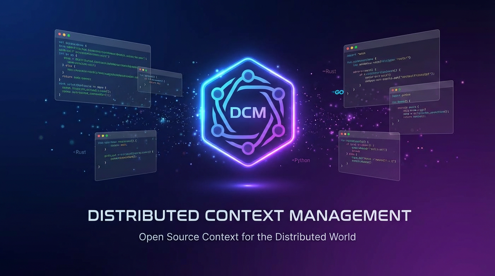

# DCM -- Distributed Context Manager

<p align="center">
  
</p>

<p align="center">
  <a href="LICENSE"></a>
  <a href="https://bun.sh"></a>
  <a href="https://www.postgresql.org/"></a>
  <a href="https://hono.dev"></a>
  
</p>

<p align="center">
  <strong>DCM is an AI-powered pipeline orchestrator for Claude Code -- it plans, executes, and monitors multi-agent workflows with sprint-based delivery, live streaming, and intelligent retry.</strong>
</p>

---

DCM sits alongside [Claude Code](https://docs.anthropic.com/en/docs/claude-code) as a persistent memory layer and execution engine. It hooks into Claude's lifecycle events, maintains full session state across context compactions, and provides an autonomous pipeline engine that can decompose complex tasks into multi-wave plans, delegate each step to specialized agents, and recover from failures automatically.

The system consists of five services: a **REST API** (143+ endpoints) backed by PostgreSQL, a **Redis** cache for pub/sub and fast lookups, a **WebSocket server** for real-time event streaming, a **Next.js dashboard** for live monitoring, and a **pipeline engine** that orchestrates agent workflows with sprint-based delivery.

## Table of Contents

- [Key Features](#key-features)
- [Quick Start](#quick-start)
- [Docker Quick Start](#docker-quick-start)
- [Architecture](#architecture)
- [Tech Stack](#tech-stack)
- [Configuration](#configuration)
- [CLI Reference](#cli-reference)
- [Documentation](#documentation)
- [Contributing](#contributing)

---

## Key Features

### Pipeline Engine

Submit instructions and optional documents. DCM calls an LLM planner to generate a multi-wave execution plan, then runs each wave sequentially while parallelizing steps within a wave. A decision engine evaluates failures and chooses between retry, enhanced retry with error context, alternate agent, skip, pause, abort, step injection, or human escalation. Pipelines produce a final synthesis report with per-step results, modified files, and timing.

### Sprint System

Pipelines are organized into sprints. Each sprint groups consecutive waves, tracks git commits, and generates a sprint report with objectives met, files changed, and duration. Sprints integrate with git for automatic commits and optional PR creation at sprint boundaries.

### Live Dashboard

18 pages of real-time monitoring built with Next.js 16, React 19, Three.js, and Remotion. Includes a 3D Neural Constellation cockpit, pipeline execution viewer with live streaming output, wave timelines, agent topology, token consumption analytics, activity heatmaps, and a settings panel for LLM provider configuration.

### 6 LLM Providers

Plan pipelines using any of 6 providers: Claude CLI, Codex CLI, Gemini CLI (local CLIs, no API key needed), MiniMax, ZhipuAI, and Moonshot (cloud APIs). Configure provider API keys and select the active planner from the dashboard settings page or the API.

### Pipeline Worker & Smart Recovery

The **pipeline worker** runs as a background supervisor loop (every 10s) ensuring no job is ever lost:
- Monitors all CLI jobs via the `pipeline_jobs` DB table
- Auto-detects completed planner outputs and injects plans into the pipeline
- Auto-detects completed agent outputs and updates step statuses
- Recovers stuck pipelines from workspace files or orphaned temp outputs
- Relaunches queued steps without active executor processes
- Decision engine handles failures with retry, alternate agent, or decomposition

### Context Tracking

Every tool call, agent spawn, session event, and message is tracked in PostgreSQL. Inter-agent pub/sub messaging, topic subscriptions, and blocking dependencies enable coordination across agents. Routing intelligence learns which tools work best for which keywords through a feedback loop.

### Docker Ready

Single-command deployment with `docker compose up -d`. PostgreSQL schema applies automatically on first boot. All five services (PostgreSQL, Redis, API, WebSocket, Dashboard) run in containers with health checks, restart policies, and volume persistence.

---

## Quick Start

```bash
git clone https://github.com/ronylicha/Claude-DCM.git
cd Claude-DCM
cd context-manager
./dcm install
./dcm start
```

The installer checks prerequisites, installs dependencies, configures the database, registers Claude Code hooks, and sets up systemd supervision. After `dcm start`, three services are running:

| Service | Port | URL |
|---------|------|-----|
| REST API | 3847 | http://127.0.0.1:3847/health |
| Dashboard | 3848 | http://localhost:3848 |
| WebSocket | 3849 | ws://127.0.0.1:3849 |

Verify everything:

```bash
./dcm status
```

For a detailed walkthrough, see the [Getting Started tutorial](docs/tutorials/getting-started.md).

---

## Docker Quick Start

```bash
git clone https://github.com/ronylicha/Claude-DCM.git
cd Claude-DCM

# Create .env at project root
cat > .env << 'EOF'
DB_PASSWORD=your_secure_password
WS_AUTH_SECRET=your_hmac_secret_at_least_32_chars
EOF

docker compose up -d
```

PostgreSQL schema applies automatically. Open `http://localhost:3848` for the dashboard.

You still need to install Claude Code hooks on the host:

```bash
cd context-manager && ./dcm hooks
```

For production deployment options (Docker, systemd, manual), see the [Deployment guide](docs/howto/deployment.md).

---

## Architecture

```
+-----------------------------------------------------------------------------+
|                           CLAUDE CODE SESSION                                |
|                                                                              |
|  PreToolUse --- safety-gate.sh -------- BLOCK dangerous ops --> DCM API      |
|  PreToolUse --- skill-gate-enforce.sh - Enforce skills -------> DCM API      |
|  PreToolUse --- track-agent-start.sh -- Log agent spawn ------> DCM API      |
|  PostToolUse -- track-action.sh ------- Log all tools --------> DCM API      |
|  PostToolUse -- track-agent-end.sh ---- Mark completed -------> DCM API      |
|  PreCompact --- pre-compact-save.sh --- Save snapshot --------> DCM API      |
|  SessionStart - post-compact-restore.sh  Restore context <----- DCM API      |
|                                                                              |
+--------------------------------------+---------------------------------------+
                                       | HTTP / curl
                                       v
+------------------------------------------------------------------------------+
|                     DCM API Server (Bun + Hono)                              |
|                           Port 3847                                          |
|                                                                              |
|  143+ REST endpoints: projects, sessions, actions, agents, pipelines,        |
|  sprints, routing, orchestration, waves, registry, tokens, cockpit,          |
|  compact, settings, skill-gate, stats                                        |
|                                                                              |
|  Pipeline Engine: LLM planner -> wave executor -> decision engine            |
|  LLM Providers: Claude CLI, Codex CLI, Gemini CLI, MiniMax, ZhipuAI,        |
|                 Moonshot                                                     |
|                                                                              |
|  PostgreSQL 17+: 25+ tables, 4 views, JSONB metadata, 50+ indexes           |
|  Redis: pub/sub, cache, fast lookups                                         |
+--------------+-------------------------------+-------------------------------+
               | LISTEN/NOTIFY                 | HTTP
               v                               v
+--------------------------+     +---------------------------------------------+
|   WebSocket Server       |     |   Next.js Dashboard                         |
|   Port 3849              |     |   Port 3848                                 |
|                          |     |                                             |
|   Real-time events       |     |   18 pages: Cockpit, Projects, Sessions,    |
|   HMAC auth              |---->|   Agents, Context, Compact, Tools, Routing, |
|   Channel subscriptions  |     |   Messages, Registry, Perf, Stats,          |
|                          |     |   Pipeline, Settings                         |
+--------------------------+     +---------------------------------------------+
```

### Service Architecture

| Service | Stack | Port | Role |
|---------|-------|------|------|
| **DCM API** | Bun + Hono + Zod | 3847 | REST API, pipeline engine, LLM planner, compact save/restore, routing |
| **WebSocket** | Bun native WS | 3849 | Real-time event streaming with HMAC auth |
| **Dashboard** | Next.js 16 + React 19 + Three.js | 3848 | 18-page monitoring and management UI |
| **PostgreSQL** | PostgreSQL 17+ | 5432 | 25+ tables, 4 views, full audit trail |
| **Redis** | Redis 7 | 6379 | Pub/sub, caching, fast lookups |

### Data Flow

```
Claude Code hooks (bash scripts)
        |
        | curl POST (fire-and-forget, <5ms)
        v
    DCM API (Hono)
        |
        +--- Pipeline Engine --- LLM Planner --- Agent Executor --- Worker Supervisor
        |
        | Parameterized SQL        | Redis pub/sub
        v                          v
    PostgreSQL              Redis
        |
        | LISTEN/NOTIFY
        v
    WebSocket Server
        |
        | ws:// push
        v
    Dashboard (browser)
```

### Directory Structure

```
Claude-DCM/
|-- context-manager/           # Backend: API + WebSocket + Pipeline Engine
|   |-- src/
|   |   |-- api/               # 31 API route modules
|   |   |-- db/                # Database client, schema, migrations
|   |   |-- llm/               # LLM provider system (6 providers)
|   |   |-- pipeline/          # Pipeline engine (planner, executor, decisions)
|   |   |-- lib/               # Logger, utilities
|   |   |-- middleware/         # Rate limiting, CORS
|   |   |-- websocket/         # WS server, auth, bridge
|   |   |-- server.ts          # API entry point
|   |   +-- websocket-server.ts # WS entry point
|   |-- hooks/                 # 28 bash hook scripts
|   |-- scripts/               # Setup and maintenance scripts
|   |-- dcm                    # CLI entry point (bash)
|   +-- package.json
|-- context-dashboard/         # Frontend: Next.js 16 dashboard
|   |-- src/
|   |   |-- app/               # 18 page routes (App Router)
|   |   |-- components/        # React components (shadcn/ui)
|   |   +-- lib/               # Shared utilities
|   +-- package.json
|-- docker-compose.yml         # Containerized deployment
|-- docs/                      # Documentation
+-- README.md
```

---

## Tech Stack

### Backend (API + WebSocket + Pipeline)

| Technology | Version | Role |
|------------|---------|------|
| [Bun](https://bun.sh) | 1.x | Runtime, package manager, test runner |
| [Hono](https://hono.dev) | 4.x | HTTP framework |
| [PostgreSQL](https://www.postgresql.org/) | 17+ | Persistent storage |
| [Redis](https://redis.io/) | 7.x | Pub/sub, cache |
| [Zod](https://zod.dev) | 4.x | Input validation |
| TypeScript | 5.x | Type safety |

### Dashboard

| Technology | Version | Role |
|------------|---------|------|
| [Next.js](https://nextjs.org/) | 16.x | React framework, SSR |
| [React](https://react.dev/) | 19.x | UI library |
| [TanStack Query](https://tanstack.com/query) | 5.x | Server state management |
| [Recharts](https://recharts.org/) | 3.x | Charts and gauges |
| [Three.js](https://threejs.org/) | 0.183.x | 3D topology visualization |
| [Remotion](https://www.remotion.dev/) | 4.x | Animated recap sequences |
| [Tailwind CSS](https://tailwindcss.com/) | 4.x | Styling |
| [shadcn/ui](https://ui.shadcn.com/) | -- | Component library (Radix primitives) |

### LLM Providers

| Provider | Type | Models |
|----------|------|--------|
| Claude CLI | Local CLI | claude-opus-4-6, claude-sonnet-4-6 |
| Codex CLI | Local CLI | gpt-5.4, gpt-5.3-codex |
| Gemini CLI | Local CLI | gemini-3.1-pro, gemini-2.5-pro |
| MiniMax | Cloud API | MiniMax-M2.7, MiniMax-M2.5 |
| ZhipuAI | Cloud API | glm-5, glm-5-turbo, glm-4.7 |
| Moonshot | Cloud API | kimi-k2.5, kimi-k2-thinking |

### Infrastructure

| Technology | Role |
|------------|------|
| WebSocket (Bun native) | Real-time event streaming with HMAC auth |
| PostgreSQL LISTEN/NOTIFY | Event bridge to WebSocket |
| Redis pub/sub | Inter-service messaging and cache |
| systemd user services | Process supervision, auto-restart |
| Docker Compose | Containerized deployment |
| Bash hooks | Claude Code lifecycle integration |

---

## Configuration

All backend configuration is done through `context-manager/.env`. Bun loads the file automatically.

### Minimum required

```bash
DB_USER=dcm
DB_PASSWORD=your_password
```

### Recommended for production

```bash
DB_HOST=127.0.0.1
DB_PORT=5432
DB_NAME=claude_context
DB_USER=dcm
DB_PASSWORD=strong_random_password
DB_MAX_CONNECTIONS=20
HOST=127.0.0.1
PORT=3847
WS_PORT=3849
WS_AUTH_SECRET=$(openssl rand -hex 32)
NODE_ENV=production
ALLOWED_ORIGINS=http://localhost:3848
LOG_LEVEL=warn
```

For every available variable, see the [Environment Variables reference](docs/reference/environment-variables.md).

---

## CLI Reference

Run from the `context-manager/` directory:

```bash
./dcm install              # Full setup: prereqs, deps, database, hooks, supervisor
./dcm start                # Start API + WebSocket + Dashboard
./dcm stop                 # Stop all services
./dcm restart              # Stop then start
./dcm status               # Health check for all components
./dcm health               # Quick API health check (JSON)

./dcm logs api             # Tail API server logs
./dcm logs ws              # Tail WebSocket server logs
./dcm logs dashboard       # Tail Dashboard logs

./dcm hooks                # Install Claude Code hooks
./dcm unhook               # Remove all DCM hooks

./dcm db:setup             # Initialize database schema
./dcm db:reset             # Drop and recreate database

./dcm snapshot <session>   # Trigger a manual context snapshot
./dcm context <agent> [session]  # Get context brief

./dcm deploy               # Pull latest, rebuild, apply migrations, restart

./dcm supervisor status    # Systemd supervisor status
./dcm supervisor restart   # Restart all via systemd
./dcm supervisor enable    # Enable auto-start on boot
./dcm supervisor disable   # Disable auto-start
./dcm supervisor reload    # Re-template & restart after update
./dcm supervisor uninstall # Remove supervisor completely

./dcm docker:up            # Start DCM with Docker Compose
./dcm docker:down          # Stop Docker services
./dcm docker:logs          # Show Docker logs
./dcm docker:reset         # Remove volumes and rebuild (destructive)

./dcm version              # Show version
./dcm help                 # Show all commands
```

---

## Documentation

| Document | Description |
|----------|-------------|
| [Getting Started](docs/tutorials/getting-started.md) | Step-by-step tutorial: install, configure, verify |
| [Deployment Guide](docs/howto/deployment.md) | Docker Compose, systemd, manual deployment |
| [Troubleshooting](docs/howto/troubleshooting.md) | Common issues and solutions |
| [API Reference](docs/reference/api-overview.md) | All 143+ REST endpoints |
| [Database Schema](docs/reference/database-schema.md) | 25+ tables, views, indexes, migrations |
| [Environment Variables](docs/reference/environment-variables.md) | Complete configuration reference |

---

## Contributing

1. Fork the repository
2. Create a feature branch: `git checkout -b feature/your-feature`
3. Make your changes
4. Run tests: `cd context-manager && bun test`
5. Submit a pull request

---

## License

MIT
