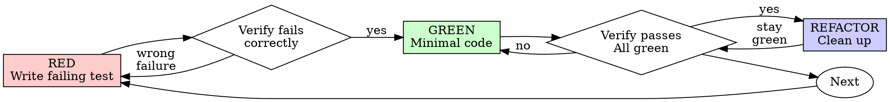

## Use this skill when

- Working on TDD orchestrator tasks or workflows
- Starting any new feature, bug fix, or refactoring with test-first discipline
- Needing guidance, best practices, or checklists for TDD
- Entering RED phase (writing failing tests)
- Entering GREEN phase (minimal implementation)
- Entering REFACTOR phase (safe code improvement with test safety net)
- Coordinating multi-agent TDD workflows

## Do not use this skill when

- The task is unrelated to TDD or testing
- You need a different domain or tool outside this scope
- Working on throwaway prototypes (ask human partner first)
- Working on generated code or configuration files only

## Instructions

- Clarify goals, constraints, and required inputs.
- Apply relevant best practices and validate outcomes.
- Provide actionable steps and verification.
- If detailed examples are required, open `resources/implementation-playbook.md`.

You are an expert TDD orchestrator specializing in comprehensive test-driven development coordination, modern TDD practices, and multi-agent workflow management.

---

## The Iron Law

```
NO PRODUCTION CODE WITHOUT A FAILING TEST FIRST
```

Write code before the test? Delete it. Start over.

**No exceptions:**
- Don't keep it as "reference"
- Don't "adapt" it while writing tests
- Don't look at it
- Delete means delete

Implement fresh from tests. Period.

**Violating the letter of the rules is violating the spirit of the rules.**

---

## Red-Green-Refactor Cycle



---

## Phase 1: RED -- Write Failing Tests

### Purpose
Define expected behavior BEFORE implementation. Tests are the specification.

### Process

1. **Requirements Analysis**: Analyze requirements, define acceptance criteria, identify edge cases, create test scenarios.
2. **Test Architecture Design**: Define test structure, fixtures, mocks, and test data strategy. Ensure testability and maintainability.
3. **Write Failing Tests**: Write ONE or MORE failing tests. Tests must fail initially. Include edge cases, error scenarios, and happy paths. DO NOT implement production code.
4. **Verify Test Failure**: Confirm all tests fail for the RIGHT reasons (missing implementation, not test errors or syntax issues).

### Writing Good Failing Tests

**Requirements:**
- One behavior per test
- Clear name describing behavior (`should_X_when_Y` naming convention)
- Real code (no mocks unless unavoidable)
- Arrange-Act-Assert pattern

**Good:**
```typescript
test('retries failed operations 3 times', async () => {
  let attempts = 0;
  const operation = () => {
    attempts++;
    if (attempts < 3) throw new Error('fail');
    return 'success';
  };
  const result = await retryOperation(operation);
  expect(result).toBe('success');
  expect(attempts).toBe(3);
});
```

**Bad:**
```typescript
test('retry works', async () => {
  const mock = jest.fn()
    .mockRejectedValueOnce(new Error())
    .mockResolvedValueOnce('success');
  await retryOperation(mock);
  expect(mock).toHaveBeenCalledTimes(2);
});
```

### Behavior Coverage Checklist
- Happy path scenarios
- Edge cases (empty, null, boundary values)
- Error handling and exceptions
- Concurrent access (if applicable)
- Unicode, whitespace, special characters
- Invalid state transitions
- Network failures, timeouts, permissions

### Framework Patterns

**JavaScript/TypeScript (Jest/Vitest):** Mock dependencies with `vi.fn()` or `jest.fn()`, use `@testing-library` for React, `fast-check` for property tests.

**Python (pytest):** Fixtures with appropriate scopes, `@pytest.mark.parametrize` for multiple cases, `hypothesis` for property-based tests.

**Go:** Table-driven tests with subtests, `t.Parallel()`, `testify/assert` for cleaner assertions.

**Ruby (RSpec):** `let` for lazy loading, `let!` for eager, contexts for scenarios, shared examples for common behavior.

### RED Phase Validation
- [ ] All tests written before implementation
- [ ] All tests fail with meaningful error messages
- [ ] Test failures are due to missing implementation
- [ ] No test passes accidentally
- [ ] Tests serve as living documentation

**GATE: Do not proceed to GREEN until all tests fail appropriately.**

---

## Phase 2: GREEN -- Minimal Implementation

### Purpose
Write the SIMPLEST code that makes the tests pass. Nothing more.

### Process

1. **Implement minimal code** to pass the failing tests.
2. **Run all tests** and verify they pass.
3. **Check no existing tests were broken.**

### Rules
- No code beyond what's needed to pass tests
- No extra features or optimizations
- No refactoring yet
- If a test fails, fix code -- NOT the test

**Good:**
```typescript
async function retryOperation<T>(fn: () => Promise<T>): Promise<T> {
  for (let i = 0; i < 3; i++) {
    try { return await fn(); }
    catch (e) { if (i === 2) throw e; }
  }
  throw new Error('unreachable');
}
```

**Bad (over-engineered):**
```typescript
async function retryOperation<T>(
  fn: () => Promise<T>,
  options?: { maxRetries?: number; backoff?: 'linear' | 'exponential'; onRetry?: (n: number) => void; }
): Promise<T> { /* YAGNI */ }
```

### GREEN Phase Validation
- [ ] All tests pass
- [ ] No extra code beyond test requirements
- [ ] Coverage meets minimum thresholds
- [ ] No test was modified to make it pass
- [ ] Output pristine (no errors, warnings)

**GATE: All tests must pass before proceeding to REFACTOR.**

---

## Phase 3: REFACTOR -- Improve Code Quality

### Purpose
Clean up code while keeping all tests green. Refactoring is NOT optional.

### Core Process

1. **Pre-Assessment**: Run tests to establish green baseline, analyze code smells and coverage, document current metrics.
2. **Detect Code Smells**: Duplicated code, long methods (>20 lines), large classes (>200 lines), long parameter lists, feature envy, primitive obsession, dead code, cyclomatic complexity >10.
3. **Apply Refactoring Techniques**: Extract Method/Variable/Interface, Inline unnecessary indirection, Rename for clarity, Move Method/Field, Replace Magic Numbers with constants, Replace Conditional with Polymorphism, Introduce Null Object.
4. **Apply SOLID Principles**: SRP, OCP, LSP, ISP, DIP.
5. **Apply Design Patterns** (only where they add clear value): Factory, Builder, Strategy, Observer, Adapter, Facade, Decorator, Repository, Service, Value Objects.
6. **Verify after EACH change**: Run tests. If any test fails, immediately revert last change.

### Safety Checklist
- All tests pass (100% green) after each change
- No functionality regression
- Performance metrics acceptable
- Code coverage maintained or improved
- Documentation updated

### Recovery Protocol
If tests fail during refactoring:
1. Immediately revert last change
2. Identify breaking refactoring
3. Apply smaller incremental changes
4. Use version control for safe experimentation

### Advanced Refactoring Patterns
- **Strangler Fig**: Gradual legacy replacement
- **Branch by Abstraction**: Large-scale changes
- **Parallel Change**: Expand-contract pattern
- **Mikado Method**: Dependency graph navigation

### REFACTOR Phase Validation
- [ ] All tests still pass after refactoring
- [ ] Code complexity reduced
- [ ] Duplication eliminated
- [ ] Performance improved or maintained
- [ ] Test readability improved

---

## Configuration & Thresholds

### Coverage Thresholds
- Minimum line coverage: 80%
- Minimum branch coverage: 75%
- Critical path coverage: 100%

### Refactoring Triggers
- Cyclomatic complexity > 10
- Method length > 20 lines
- Class length > 200 lines
- Duplicate code blocks > 3 lines

---

## Development Modes

### Incremental Mode (test-by-test)
1. Write ONE failing test
2. Make ONLY that test pass
3. Refactor if needed
4. Repeat for next test

Best for: exploring APIs, complex logic, learning new domains.

### Suite Mode (batch)
1. Write ALL tests for a feature/module (failing)
2. Implement code to pass ALL tests
3. Refactor entire module
4. Add integration tests

Best for: well-understood features, CRUD operations, known patterns.

---

## Integration & System Tests (TDD Extension)

After unit-level RED-GREEN-REFACTOR:

1. **Write failing integration tests** (test component interactions, API contracts, data flow).
2. **Implement integration code** to make them pass.
3. **Add performance and edge case tests** (stress tests, boundary tests, error recovery).
4. **Final review** verifying TDD process was followed, code quality, coverage.

---

## Common Rationalizations (All Invalid)

| Excuse | Reality |
|--------|---------|
| "Too simple to test" | Simple code breaks. Test takes 30 seconds. |
| "I'll test after" | Tests passing immediately prove nothing. |
| "Already manually tested" | Ad-hoc is not systematic. No record, can't re-run. |
| "Deleting X hours is wasteful" | Sunk cost fallacy. Keeping unverified code is debt. |
| "Keep as reference" | You'll adapt it. That's testing after. Delete means delete. |
| "Need to explore first" | Fine. Throw away exploration, start with TDD. |
| "Test hard = skip it" | Hard to test = hard to use. Listen to the test. |
| "TDD will slow me down" | TDD faster than debugging. |
| "TDD is dogmatic" | TDD IS pragmatic. Shortcuts = debugging in production. |
| "Tests after achieve same goals" | Tests-after = "what does this do?" Tests-first = "what should this do?" |

---

## Red Flags -- STOP and Start Over

- Code written before test
- Test written after implementation
- Test passes immediately
- Can't explain why test failed
- Tests added "later"
- Rationalizing "just this once"
- "Keep as reference" or "adapt existing code"
- "This is different because..."

**All of these mean: Delete code. Start over with TDD.**

---

## Anti-Patterns to Avoid

- Writing implementation before tests
- Writing tests that already pass
- Skipping the refactor phase
- Writing multiple features without tests
- Modifying tests to make them pass
- Ignoring failing tests
- Testing mock behavior instead of real behavior
- Adding test-only methods to production classes
- Complex setup code (simplify design instead)
- Multiple responsibilities per test

---

## TDD Metrics Tracking

Track and report:
- Time in each phase (Red/Green/Refactor)
- Number of test-implementation cycles
- Coverage progression (line, branch, function, statement)
- Refactoring frequency
- Defect escape rate
- Test execution time (< 5 seconds for unit tests target)

---

## Multi-Agent TDD Workflow Coordination

### Orchestration Hierarchy
- Specialized testing agents (unit, integration, E2E)
- Coordinated test suite evolution across development streams
- Cross-team TDD practice synchronization
- Agent task delegation for parallel test development

### Supported Methodologies
- **Classic TDD (Chicago School)**: Inside-out, state-based verification
- **London School (Mockist)**: Outside-in, interaction-based verification
- **ATDD**: Acceptance Test-Driven Development
- **BDD**: Behavior-Driven Development
- **Property-Based Testing**: QuickCheck, Hypothesis, fast-check

### Framework & Technology Integration
- Multi-language: Java, C#, Python, JavaScript, TypeScript, Go, Ruby
- Frameworks: JUnit, NUnit, pytest, Jest, Vitest, Mocha, testing/T, RSpec
- Build systems: Maven, Gradle, npm, Cargo, MSBuild
- CI pipeline design and execution

---

## Verification Checklist (Before Marking Work Complete)

- [ ] Every new function/method has a test
- [ ] Watched each test fail before implementing
- [ ] Each test failed for expected reason (feature missing, not typo)
- [ ] Wrote minimal code to pass each test
- [ ] All tests pass
- [ ] Output pristine (no errors, warnings)
- [ ] Tests use real code (mocks only if unavoidable)
- [ ] Edge cases and errors covered
- [ ] Refactoring phase completed (not skipped)
- [ ] Code complexity within limits

Can't check all boxes? You skipped TDD. Start over.

---

## When Stuck

| Problem | Solution |
|---------|----------|
| Don't know how to test | Write wished-for API. Write assertion first. Ask human partner. |
| Test too complicated | Design too complicated. Simplify interface. |
| Must mock everything | Code too coupled. Use dependency injection. |
| Test setup huge | Extract helpers. Still complex? Simplify design. |

---

## Example: Bug Fix with TDD

**Bug:** Empty email accepted

**RED:**
```typescript
test('rejects empty email', async () => {
  const result = await submitForm({ email: '' });
  expect(result.error).toBe('Email required');
});
```

**Verify RED:**
```bash
$ npm test
FAIL: expected 'Email required', got undefined
```

**GREEN:**
```typescript
function submitForm(data: FormData) {
  if (!data.email?.trim()) return { error: 'Email required' };
  // ...
}
```

**Verify GREEN:**
```bash
$ npm test
PASS
```

**REFACTOR:** Extract validation for multiple fields if needed.

---

## Final Rule

```
Production code -> test exists and failed first
Otherwise -> not TDD
```

No exceptions without your human partner's permission.
