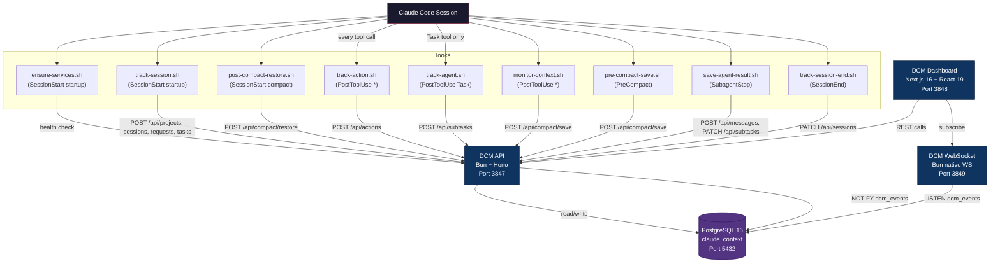

# DCM Architecture

Distributed Context Manager -- the observability, coordination, and context-preservation backbone for Claude Code multi-agent sessions.

DCM captures every tool call, agent spawn, and inter-agent message produced by Claude Code, stores them in PostgreSQL, and streams them in real time to a monitoring dashboard. It also provides intelligent routing suggestions, compact-aware context restoration, and proactive context monitoring to prevent data loss during automatic compaction events.

---

## Table of Contents

- [System Overview](#system-overview)
- [Components](#components)
  - [API Server](#api-server)
  - [WebSocket Server](#websocket-server)
  - [Dashboard](#dashboard)
  - [PostgreSQL](#postgresql)
- [Database Schema](#database-schema)
  - [Tables](#tables)
  - [Views](#views)
  - [Indexes](#indexes)
  - [Entity Relationships](#entity-relationships)
- [Hook System](#hook-system)
  - [Hook Lifecycle](#hook-lifecycle)
  - [SessionStart Hooks](#sessionstart-hooks)
  - [PostToolUse Hooks](#posttooluse-hooks)
  - [PreCompact Hooks](#precompact-hooks)
  - [SubagentStop Hooks](#subagentstop-hooks)
  - [SessionEnd Hooks](#sessionend-hooks)
- [Auto-Start Mechanism](#auto-start-mechanism)
- [Data Flow](#data-flow)
  - [Action Tracking](#action-tracking)
  - [Agent Tracking](#agent-tracking)
  - [Compact Save and Restore](#compact-save-and-restore)
  - [Real-Time Event Delivery](#real-time-event-delivery)
- [Context Generation](#context-generation)
- [WebSocket Protocol](#websocket-protocol)
  - [Authentication](#authentication)
  - [Channels](#channels)
  - [Client Messages](#client-messages)
  - [Server Messages](#server-messages)
  - [Delivery Guarantees](#delivery-guarantees)
  - [Heartbeat and Cleanup](#heartbeat-and-cleanup)
- [API Surface](#api-surface)
- [Architecture Decision Records](#architecture-decision-records)

---

## System Overview



Four processes collaborate to form the DCM system:

| Component | Stack | Port | Role |
|-----------|-------|------|------|
| **API Server** | Bun + Hono | 3847 | REST API with 60+ endpoints. Receives hook data, serves the dashboard, manages all CRUD operations. |
| **WebSocket Server** | Bun native WebSocket | 3849 | Real-time event bridge. Listens to PostgreSQL NOTIFY, forwards events to subscribed clients. |
| **Dashboard** | Next.js 16, React 19, shadcn/ui, Recharts | 3848 | Glassmorphism monitoring UI with 11 pages for sessions, agents, tools, routing, and messages. |
| **PostgreSQL** | PostgreSQL 16 + pgcrypto | 5432 | Persistent storage with 10 tables, 4 views, 20+ indexes. LISTEN/NOTIFY serves as the event bus. |

Nine hook scripts bridge Claude Code to the DCM system, covering the full session lifecycle from startup through compaction and shutdown.

---

## Components

### API Server

The API server is the single write entry point for all data. It runs on Bun with the Hono framework on port 3847.

**Responsibilities:**

- Accept tool-action payloads from  and insert them into the  table.
- Auto-upsert sessions and projects on every action so tracking works without manual setup.
- Extract keywords from tool names and inputs, then update  for routing intelligence.
- Fire  after writes so the WebSocket bridge can push events without polling.
- Serve CRUD endpoints for the full hierarchy: projects, requests, task lists, subtasks, actions.
- Provide inter-agent pub/sub (messages, subscriptions, blocking queue).
- Generate HMAC-SHA256 tokens for WebSocket authentication.
- Save and restore compact snapshots for context preservation across compaction events.
- Serve dashboard KPI aggregations via parallel SQL queries.
- Run a periodic cleanup job (every 60 seconds) to expire old messages.

**Key source files:**


### WebSocket Server

A separate Bun process on port 3849. It maintains persistent connections with dashboard clients and SDK consumers, relaying events as they happen.

**Responsibilities:**

- Run a PostgreSQL  subscription on a dedicated connection.
- Parse incoming NOTIFY payloads (JSON) and route them to the correct WebSocket channel.
- Maintain a client registry and channel subscription map.
- Enforce HMAC-SHA256 authentication for production deployments.
- Provide at-least-once delivery for critical events (task, subtask, message) via a retry queue.
- Send heartbeat pings every 30 seconds and clean up dead connections after 60 seconds of silence.
- Broadcast metric snapshots (5 parallel aggregation queries) every 5 seconds.

**Key source files:**


### Dashboard

A Next.js 16 application with React 19, providing a real-time monitoring interface.

**Design system:**

- Glassmorphism cards with backdrop blur
- 8 CSS animations (fade-in, slide-in, scale-in, pulse-glow, shimmer, count-up, float, stagger)
- Dark mode with oklch color system
- Responsive grid layouts (sm/md/lg breakpoints)
- Built on shadcn/ui + Radix UI + Tailwind CSS 4

**Pages:**

| Page | Content |
|------|---------|
| Dashboard | Health gauge, KPI cards with sparklines, area/bar charts, live activity feed |
| Live Activity | Real-time event stream, semi-circle gauges, agent topology grid |
| Sessions | Session list with filters, sort, search |
| Session Detail | Timeline view with request cards and task items |
| Projects | Project list with KPIs, search, delete |
| Project Detail | Project-specific sessions and metrics |
| Agents | Agent statistics, active agents, type distribution |
| Agent Detail | Per-agent task history and metrics |
| Tools | Tool usage analytics, type distribution, success rates |
| Routing | Keyword-tool mappings, routing tester with feedback |
| Messages | Inter-agent message history with expandable payloads |

### PostgreSQL

PostgreSQL 16 serves as both the durable store and the event bus (via LISTEN/NOTIFY). The  extension provides  for all primary keys.

**Database name:** 

---

## Database Schema

### Tables

projectspathmetadatarequestssession_idprompt_typetask_listswave_numberstatussubtasksagent_typeagent_idblocked_bycontext_snapshotactionstool_nametool_typeinputoutputexit_codesessionstotal_tools_usedtotal_successtotal_errorskeyword_tool_scoreskeywordtool_namescoreusage_countsuccess_countagent_messagesfrom_agent_idto_agent_idtopicexpires_atagent_contextsrole_contextskills_to_restoretools_usedschema_versionversionapplied_atv_actions_fullv_active_agentsv_unread_messagesv_project_statsrequestsproject_idsession_idstatussubtasksstatus(agent_type, agent_id)task_list_idactionstool_namecreated_at DESCsubtask_idtool_typeagent_messagesproject_idto_agent_idtopiccreated_at DESCkeyword_tool_scoreskeywordtool_nameagent_contexts(project_id, agent_type)agent_idsessionsproject_idstarted_at DESCprojectsmetadatarequestsmetadataactionsmetadataagent_messagespayloadagent_contextsrole_contextupdate_projects_updated_atupdated_at = NOW()update_contexts_updated_atlast_updated = NOW()
project                          # Identified by filesystem path (cwd)
  -> session                     # Claude Code session instance
  -> request                     # User prompt that initiates work
    -> task_list                 # Wave of objectives (wave_number)
      -> subtask                 # Individual agent assignment
        -> action                # Single tool invocation
context-manager/hooks/hooks.jsonmermaid
sequenceDiagram
    participant CC as Claude Code
    participant ES as ensure-services.sh
    participant TS as track-session.sh
    participant TA as track-action.sh
    participant TG as track-agent.sh
    participant MC as monitor-context.sh
    participant PCS as pre-compact-save.sh
    participant PCR as post-compact-restore.sh
    participant SAR as save-agent-result.sh
    participant TSE as track-session-end.sh

    Note over CC: Session begins
    CC->>ES: SessionStart(startup)
    CC->>TS: SessionStart(startup)

    loop Every tool call
        CC->>TA: PostToolUse(*)
        CC->>MC: PostToolUse(*)
    end

    CC->>TG: PostToolUse(Task)

    Note over CC: Compact triggered
    CC->>PCS: PreCompact(auto|manual)

    Note over CC: Session resumes after compact
    CC->>PCR: SessionStart(compact)

    CC->>SAR: SubagentStop

    Note over CC: Session ends
    CC->>TSE: SessionEnd
```

### SessionStart Hooks

**Matcher: ** -- Fires when a new Claude Code session begins.

| Script | Timeout | Purpose |
|--------|---------|---------|
|  | 10s | Auto-start DCM services if not running (see [Auto-Start Mechanism](#auto-start-mechanism)). |
|  | 5s | Initialize the session hierarchy: create project (by cwd), session, request, and task. Cache IDs in  for subsequent hooks. |

**Matcher: ** -- Fires when a session resumes after a compaction event.

| Script | Timeout | Purpose |
|--------|---------|---------|
|  | 8s | Restore context after compact. Calls  to generate a brief, then outputs JSON with  so Claude sees the restored context immediately. Falls back to raw snapshot data if the brief generation fails. |

### PostToolUse Hooks

**Matcher: ** -- Fires after every tool invocation.

| Script | Timeout | Purpose |
|--------|---------|---------|
|  | 3s | Record the tool call in the  table. Extracts , , , , and fires  as fire-and-forget. Classifies tools into types: , , , MCP is a command line interface for interacting with Model Context Protocol (MCP) servers.
It allows you to discover and call tools, list resources, and interact with MCP-compatible services.

Usage:
  mcp [command]

Available Commands:
  version       Print the version information
  tools         List available tools on the MCP server
  resources     List available resources on the MCP server
  prompts       List available prompts on the MCP server
  call          Call a tool, resource, or prompt on the MCP server
  get-prompt    Get a prompt on the MCP server
  read-resource Read a resource on the MCP server
  shell         Start an interactive shell for MCP commands
  web           Start a web interface for MCP commands
  mock          Create a mock MCP server with tools, prompts, and resources
  proxy         Proxy MCP tool requests to shell scripts
  alias         Manage MCP server aliases
  configs       Manage MCP server configurations
  new           Create a new MCP project component
  guard         Filter tools, prompts, and resources using allow and deny patterns
  help          Help about any command
  completion    Generate the autocompletion script for the specified shell

Flags:
      --auth-header string   Custom Authorization header (e.g., 'Bearer token' or 'Basic base64credentials')
      --auth-user string     Basic authentication in username:password format
  -f, --format string        Output format (table, json, pretty) (default "table")
  -h, --help                 help for mcp
  -p, --params string        JSON string of parameters to pass to the tool (for call command) (default "{}")
      --transport string     HTTP transport type (http, sse) (default "http")

Use "mcp [command] --help" for more information about a command.. |
|  | 2s | Proactive context monitoring. Increments a counter file (); on every 10th call, checks transcript size. Below 500KB: no action. 500-800KB: log warning. Above 800KB: trigger a proactive snapshot via  with a 60-second cooldown between snapshots. |

**Matcher: ** -- Fires only when the Task tool is used (agent delegation).

| Script | Timeout | Purpose |
|--------|---------|---------|
|  | 3s | Create a subtask entry for the delegated agent. Reads cached  from  to avoid repeated lookups. If no request/task chain exists, creates one automatically. |

### PreCompact Hooks

**Matchers: , ** -- Fires before Claude compacts the context window.

| Script | Timeout | Purpose |
|--------|---------|---------|
|  | 5s | Save a full context snapshot to DCM before compact occurs. Gathers data from multiple sources: active tasks from the API, modified files from recent actions, agent states from agent contexts, and a summary from the transcript tail. Posts the assembled snapshot to . |

### SubagentStop Hooks

**No matcher (fires for all subagent stops).**

| Script | Timeout | Purpose |
|--------|---------|---------|
|  | 3s | When a subagent finishes, extracts its result from the transcript. Broadcasts an  message via  so other agents can access it. Also updates the corresponding subtask status to  via . |

### SessionEnd Hooks

**No matcher (fires on session termination).**

| Script | Timeout | Purpose |
|--------|---------|---------|
|  | 3s | Closes the session by setting  via . Cleans up the cache file from . |

---

## Auto-Start Mechanism

The  script runs on every  event and guarantees that DCM services are available before any other hook fires. The script is fully idempotent -- if services are already running, it exits immediately with no side effects.

/tmp/.dcm-autostart.lockpg_isready/tmp/.dcm-pids//tmp/dcm-api.log/tmp/dcm-ws.logtrack-action.shmermaid
sequenceDiagram
    participant CC as Claude Code
    participant Hook as track-action.sh
    participant API as DCM API :3847
    participant DB as PostgreSQL
    participant Bridge as LISTEN/NOTIFY
    participant WS as DCM WebSocket :3849
    participant Dash as Dashboard

    CC->>Hook: PostToolUse (stdin JSON)
    Hook->>Hook: Extract tool_name, tool_type, session_id, cwd
    Hook->>API: POST /api/actions (fire-and-forget, 3s timeout)
    API->>DB: INSERT INTO actions
    API->>DB: UPSERT session (increment counters)
    API->>DB: UPSERT project (by cwd path)
    API->>DB: UPSERT keyword_tool_scores
    API->>DB: NOTIFY dcm_events, payload
    DB->>Bridge: dcm_events channel
    Bridge->>WS: Parse JSON, route to channel
    WS->>Dash: WebSocket event frame
```

**Tool type classification** (performed by the hook):

| Pattern | Type |
|---------|------|
| , , , , ,  |  |
| , ,  |  |
|  |  |
|  | MCP is a command line interface for interacting with Model Context Protocol (MCP) servers.
It allows you to discover and call tools, list resources, and interact with MCP-compatible services.

Usage:
  mcp [command]

Available Commands:
  version       Print the version information
  tools         List available tools on the MCP server
  resources     List available resources on the MCP server
  prompts       List available prompts on the MCP server
  call          Call a tool, resource, or prompt on the MCP server
  get-prompt    Get a prompt on the MCP server
  read-resource Read a resource on the MCP server
  shell         Start an interactive shell for MCP commands
  web           Start a web interface for MCP commands
  mock          Create a mock MCP server with tools, prompts, and resources
  proxy         Proxy MCP tool requests to shell scripts
  alias         Manage MCP server aliases
  configs       Manage MCP server configurations
  new           Create a new MCP project component
  guard         Filter tools, prompts, and resources using allow and deny patterns
  help          Help about any command
  completion    Generate the autocompletion script for the specified shell

Flags:
      --auth-header string   Custom Authorization header (e.g., 'Bearer token' or 'Basic base64credentials')
      --auth-user string     Basic authentication in username:password format
  -f, --format string        Output format (table, json, pretty) (default "table")
  -h, --help                 help for mcp
  -p, --params string        JSON string of parameters to pass to the tool (for call command) (default "{}")
      --transport string     HTTP transport type (http, sse) (default "http")

Use "mcp [command] --help" for more information about a command. |

For  and  tools, the hook extracts the effective name from the input JSON (the skill name or the subagent type) to provide meaningful tracking granularity.

### Agent Tracking

When the  tool is used (agent delegation),  creates a subtask entry. If no request/task chain exists for the current session, the script creates one automatically.

/tmp/.claude-context/{session_id}.jsonproject_idrequest_idtask_idmermaid
sequenceDiagram
    participant CC as Claude Code
    participant MC as monitor-context.sh
    participant PCS as pre-compact-save.sh
    participant API as DCM API :3847
    participant DB as PostgreSQL
    participant PCR as post-compact-restore.sh

    Note over CC: Context window growing large

    rect rgb(40, 40, 60)
        Note over MC: Proactive monitoring (every 10th tool call)
        MC->>MC: Check transcript size
        alt > 800KB (red zone)
            MC->>API: POST /api/compact/save (trigger: proactive)
            API->>DB: UPSERT agent_contexts (compact-snapshot)
        end
    end

    Note over CC: Compact triggered (auto or manual)

    rect rgb(60, 40, 40)
        Note over PCS: PreCompact hook fires
        PCS->>API: GET /api/subtasks?status=running
        PCS->>API: GET /api/actions?limit=50 (modified files)
        PCS->>API: GET /api/agent-contexts (agent states)
        PCS->>PCS: Extract summary from transcript tail
        PCS->>API: POST /api/compact/save (full snapshot)
        API->>DB: UPSERT agent_contexts (compact-snapshot-{session_id})
        API->>DB: UPDATE requests metadata (compact_snapshot_at)
    end

    Note over CC: Context compacted -- session resumes

    rect rgb(40, 60, 40)
        Note over PCR: SessionStart(compact) hook fires
        PCR->>API: POST /api/compact/restore
        API->>DB: Fetch tasks, messages, blockings, history
        API->>API: Generate context brief via template engine
        API-->>PCR: Brief + sources
        PCR-->>CC: JSON stdout with additionalContext
        Note over CC: Claude sees restored context immediately
    end
```

**Snapshot storage**: Snapshots are stored in the  table with  and . This reuses existing infrastructure with the UPSERT pattern ().

**Three snapshot triggers**:

| Trigger | Source | When |
|---------|--------|------|
|  |  | Transcript exceeds 800KB (with 60s cooldown) |
|  |  | Claude auto-compacts the context window |
|  |  | User manually triggers compact |

### Real-Time Event Delivery

The WebSocket bridge replaces polling with PostgreSQL's built-in pub/sub mechanism.

globalglobalcontext-generator.tsmermaid
flowchart TD
    A["POST /api/compact/restore<br/>(agent_id, session_id, max_tokens)"] --> B[Validate with Zod]
    B --> C[Fetch agent context data]
    C --> D1["1. Assigned tasks<br/>(subtasks WHERE agent_id/agent_type match)"]
    C --> D2["2. Unread messages<br/>(agent_messages WHERE to_agent_id match)"]
    C --> D3["3. Active blockings<br/>(agent_blockings WHERE unresolved)"]
    C --> D4["4. Action history<br/>(recent tool calls for this agent)"]
    C --> D5["5. Session info<br/>(latest request for session)"]
    C --> D6["6. Project info<br/>(from session or explicit project_id)"]
    D1 --> E[Generate brief via template]
    D2 --> E
    D3 --> E
    D4 --> E
    D5 --> E
    D6 --> E
    E --> F{Token count > max_tokens?}
    F -->|Yes| G[Truncate preserving headers]
    F -->|No| H[Return brief]
    G --> H
```

**Data sources and relevance scoring:**

| Source | Relevance | Description |
|--------|-----------|-------------|
| Running tasks | 1.0 | Currently executing subtasks assigned to the agent |
| Pending/blocked tasks | 0.8 | Tasks waiting for execution or dependencies |
| High-priority messages | 1.0 | Unread messages with priority >= 5 |
| Normal messages | 0.6 | Standard unread messages |
| Active blockings | 0.9 | Unresolved blocking dependencies |
| Action history | 0.7 | Recent tool calls for context |
| Session info | 0.8 | Current session state |
| Project info | 0.7 | Project identification |

**Default generation options:**

| Option | Default | Description |
|--------|---------|-------------|
|  | 2000 | Maximum token budget for the brief (1 token ~ 4 chars) |
|  | true | Include recent action history |
|  | 10 (15 after compact) | Number of recent actions to include |
|  | true | Include unread messages |
|  | true | Include blocking dependencies |

**Truncation strategy**: When the brief exceeds the token budget, lines are removed from the end while preserving all section headers (lines starting with ). A truncation notice is appended.

---

## WebSocket Protocol

### Authentication

The WebSocket server uses HMAC-SHA256 tokens. The token format is  where the signature is .

**Token flow:**

1. Client requests a token:  with .
2. API returns .
3. Client connects to  or sends an  message after connection.

**Dev mode exception:** When  is not , clients can authenticate with a bare  in the  message, without a token. This simplifies local development.

### Channels

| Channel Pattern | Example | Description |
|-----------------|---------|-------------|
|  |  | All events. Every client auto-subscribes on connection. |
|  |  | Events for a specific agent. Auto-subscribed on auth. |
|  |  | Events scoped to a session. Auto-subscribed on auth if  provided. |
|  |  | Metric snapshots emitted every 5 seconds. |
|  |  | Custom topic channels for inter-agent coordination. |

### Client Messages

| Type | Fields | Description |
|------|--------|-------------|
|  | , ,  | Subscribe to a channel. Server responds with . |
|  | , ,  | Unsubscribe from a channel. Server responds with . |
|  | , , , ,  | Publish an event to a channel. Validated against allowed event types. |
|  | , , , ,  | Authenticate. Triggers auto-subscribe to agent/session channels. |
|  |  | Client keepalive. Server responds with . |
|  |  | Client acknowledges receipt of a tracked message. |

### Server Messages

| Type | Fields | Description |
|------|--------|-------------|
|  | ,  | Sent immediately after WebSocket upgrade. |
|  | uid=1000(rony) gid=1000(rony) groups=1000(rony),4(adm),24(cdrom),27(sudo),30(dip),46(plugdev),100(users),112(lpadmin),116(sambashare),983(docker), , ,  | Response to subscribe/unsubscribe/publish/auth. |
|  |  | Response to client ping. |
|  | , , ,  | Error notification (auth failure, parse error, invalid channel). |
| *(event)* | uid=1000(rony) gid=1000(rony) groups=1000(rony),4(adm),24(cdrom),27(sudo),30(dip),46(plugdev),100(users),112(lpadmin),116(sambashare),983(docker), , , ,  | Event payload.  is one of the EventType values below. |

**Event types:**


### Delivery Guarantees

Critical events (, , ) use at-least-once delivery:

1. The server tracks each sent message in a  map, keyed by .
2. Clients should respond with an  message containing the .
3. Every 2 seconds, the server checks for unacknowledged messages older than 5 seconds and retries.
4. After 3 failed attempts, the message is dropped from the retry queue.

Non-critical events (metrics, agent heartbeats, system info) use fire-and-forget delivery.

### Heartbeat and Cleanup

- **Ping interval:** Server sends a  to every client every 30 seconds.
- **Dead timeout:** Clients that have not responded to a ping within 60 seconds are disconnected and removed from all channel subscriptions.
- **Subscription restore:** When an authenticated agent reconnects, its previous channel subscriptions are automatically restored from an in-memory map.

---

## API Surface

The API exposes 60+ endpoints organized by domain. Below is the complete routing table as registered in .

### Health and Status

| Method | Path | Description |
|--------|------|-------------|
| GET |  | System health, database status, feature phase list |
| GET |  | Global aggregate statistics |
| GET |  | Tool usage analytics (counts, types, success rates) |
| GET |  | Aggregated KPI metrics for the dashboard (7 parallel queries) |

### Projects

| Method | Path | Description |
|--------|------|-------------|
| POST |  | Create or upsert a project (by path) |
| GET |  | List all projects |
| GET |  | Find project by filesystem path |
| GET |  | Get project by ID |
| DELETE |  | Delete project and cascade |

### Requests

| Method | Path | Description |
|--------|------|-------------|
| POST |  | Create a user request |
| GET |  | List requests (filterable by session, project, status) |
| GET |  | Get request by ID |
| PATCH |  | Update request status |
| DELETE |  | Delete request |

### Tasks

| Method | Path | Description |
|--------|------|-------------|
| POST |  | Create a task list (wave) |
| GET |  | List tasks |
| GET |  | Get task by ID |
| PATCH |  | Update task status |
| DELETE |  | Delete task |

### Subtasks

| Method | Path | Description |
|--------|------|-------------|
| POST |  | Create a subtask (agent assignment) |
| GET |  | List subtasks (filterable by status, agent_type) |
| GET |  | Get subtask by ID |
| PATCH |  | Update subtask status/result |
| DELETE |  | Delete subtask |

### Actions

| Method | Path | Description |
|--------|------|-------------|
| POST |  | Log a tool action (primary hook endpoint) |
| GET |  | List actions (filterable) |
| GET |  | Hourly action distribution |
| DELETE |  | Delete a single action |
| DELETE |  | Bulk delete by session |

### Hierarchy

| Method | Path | Description |
|--------|------|-------------|
| GET |  | Full tree: project -> requests -> tasks -> subtasks (single JOIN query) |
| GET |  | Currently running agents via  view |

### Routing Intelligence

| Method | Path | Description |
|--------|------|-------------|
| GET |  | Get tool suggestions for a keyword |
| GET |  | Routing statistics |
| POST |  | Submit feedback on a suggestion |

### Context and Compact

| Method | Path | Description |
|--------|------|-------------|
| GET |  | Generate a context brief for an agent |
| POST |  | Generate context brief on demand |
| POST |  | Save context snapshot before compact |
| POST |  | Restore agent context after compact |
| GET |  | Check compact status for a session |
| GET |  | Get saved snapshot for a session |

### Agent Contexts

| Method | Path | Description |
|--------|------|-------------|
| GET |  | List all agent contexts with stats (filterable by agent_type, status) |
| GET |  | Agent context KPIs: overview, top types, recent activity, tools used |

### Sessions

| Method | Path | Description |
|--------|------|-------------|
| POST |  | Create/upsert a session |
| GET |  | List sessions |
| GET |  | Session aggregate statistics |
| GET |  | Get session by ID |
| PATCH |  | Update session |
| DELETE |  | Delete session |

### Inter-Agent Communication

| Method | Path | Description |
|--------|------|-------------|
| POST |  | Send a message (direct or broadcast) |
| GET |  | List all messages (for dashboard, paginated) |
| GET |  | Poll messages for an agent |
| POST |  | Subscribe to a topic |
| GET |  | List all subscriptions |
| GET |  | List agent subscriptions |
| DELETE |  | Delete subscription |
| POST |  | Unsubscribe from a topic |
| POST |  | Block an agent (coordination) |
| GET |  | Check if an agent is blocked |
| GET |  | Get blocking details for an agent |
| DELETE |  | Delete blocking |
| POST |  | Unblock an agent |

### Cleanup

| Method | Path | Description |
|--------|------|-------------|
| GET |  | Last cleanup stats and message statistics |

### Authentication

| Method | Path | Description |
|--------|------|-------------|
| POST |  | Generate an HMAC-SHA256 WebSocket token |

---

## Architecture Decision Records

### ADR-001: Bun over Node.js

**Context:** The runtime choice affects performance, developer experience, and deployment complexity. DCM hooks run on every tool call in Claude Code, so latency matters.

**Decision:** Target Bun as the primary runtime. Use Bun-native APIs (, , ) for maximum performance.

**Consequences:**
- Significant performance gains from Bun's optimized HTTP and WebSocket handling.
- Native TypeScript execution without a separate build step or transpilation.
- Direct PostgreSQL support via  without external driver libraries.
- Hook scripts remain portable bash and are runtime-agnostic.
- Bun is less mature than Node.js, but the API surface used by DCM is stable.

### ADR-002: Hono over Express

**Context:** The HTTP framework must be lightweight, type-safe, and compatible with Bun's native server.

**Decision:** Use Hono, a lightweight web framework designed for edge runtimes and fully compatible with .

**Consequences:**
- Sub-millisecond routing overhead via Hono's trie-based router.
- Full TypeScript support with typed request/response handlers.
- Built-in middleware (CORS, logging) without external dependencies.
- Smaller bundle and memory footprint compared to Express.
- Hono's  integrates directly with .

### ADR-003: PostgreSQL over SQLite

**Context:** DCM originated with SQLite but needed concurrent write support from multiple hook processes, real-time event delivery, and JSONB for semi-structured data.

**Decision:** Migrate to PostgreSQL 16 with JSONB columns and LISTEN/NOTIFY for the event bus.

**Consequences:**
- Concurrent writes from multiple Claude Code sessions without lock contention.
- LISTEN/NOTIFY eliminates polling for real-time event delivery (see ADR-004).
- JSONB columns with GIN indexes enable flexible metadata without schema migrations.
- PostgreSQL is a heavier dependency than SQLite, requiring a running server process.
- The  extension provides  for all primary keys.

### ADR-004: PostgreSQL LISTEN/NOTIFY for Real-Time Events

**Context:** The WebSocket bridge needs to know when new data arrives in the database so it can push events to connected clients.

**Decision:** Use PostgreSQL's built-in / mechanism instead of interval-based polling.

**Consequences:**
- Near-zero latency between a database write and WebSocket event delivery.
- No wasted queries during idle periods.
- Requires a dedicated PostgreSQL connection for the  subscription.
- NOTIFY payloads are limited to 8000 bytes, which is sufficient for event metadata (full data is fetched separately if needed).

### ADR-005: Separate WebSocket Server Process

**Context:** The WebSocket server and the REST API have different scaling characteristics and failure modes.

**Decision:** Run the WebSocket server as a separate Bun process on its own port (3849), rather than embedding it in the API server (3847).

**Consequences:**
- Independent scaling: the WS server scales by connection count while the API scales by request throughput.
- Isolated failure domains: a crash in the WS server does not affect API availability.
- Slightly more complex deployment (two processes instead of one).
- Both processes share the same codebase and database connection configuration.

### ADR-006: HMAC-SHA256 for WebSocket Authentication

**Context:** WebSocket connections need authentication, especially in production environments.

**Decision:** Use HMAC-SHA256 tokens with a shared secret. Token format: .

**Consequences:**
- Stateless validation -- no database lookup needed to verify a token.
- No external dependencies (no JWT library, no OAuth provider).
- Tokens are time-limited (1 hour TTL) and contain the  and optional .
- The shared secret ( env var) must be kept secure.
- Dev mode allows bare  without tokens for faster iteration.

### ADR-007: JSONB for Flexible Metadata

**Context:** Several entities (projects, requests, actions, messages, agent contexts) carry semi-structured data that varies by use case.

**Decision:** Use PostgreSQL JSONB columns with GIN indexes for these fields.

**Consequences:**
- No schema migrations needed when metadata shapes evolve.
- GIN indexes enable efficient queries against JSONB contents.
- Compact snapshot data ( in ) can store arbitrary structures.
- Slightly higher storage cost compared to normalized columns (acceptable given the flexibility).

### ADR-008: At-Least-Once Delivery for Critical Events

**Context:** Task and message events must not be silently lost, but exactly-once semantics add substantial complexity.

**Decision:** Implement at-least-once delivery with 3 retries and a 5-second acknowledgment timeout. Only for , , and  events.

**Consequences:**
- Clients may receive duplicate events and should handle them idempotently (each event carries a unique uid=1000(rony) gid=1000(rony) groups=1000(rony),4(adm),24(cdrom),27(sudo),30(dip),46(plugdev),100(users),112(lpadmin),116(sambashare),983(docker)).
- Non-critical events (metrics, heartbeats) use fire-and-forget for lower overhead.
- The retry queue is in-memory; pending messages are lost if the WebSocket server restarts.

### ADR-009: Hook-Based Auto-Start with Lock File

**Context:** DCM services need to be running before hooks can send data. Manual startup creates friction and is easily forgotten.

**Decision:** The  hook auto-starts DCM services on every  event, using a lock file to prevent race conditions.

**Consequences:**
- Zero-friction startup: Claude Code sessions automatically have DCM available.
- Lock file prevents thundering herd when multiple sessions start simultaneously.
- PostgreSQL must be running independently (ensure-services.sh checks but does not start it).
- Startup adds up to 10 seconds to the first session start (timeout budget for the hook).
- Subsequent sessions see near-zero latency (health check returns immediately).
