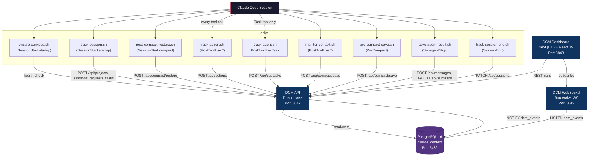
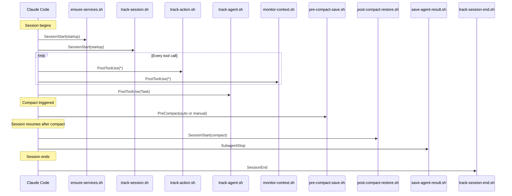
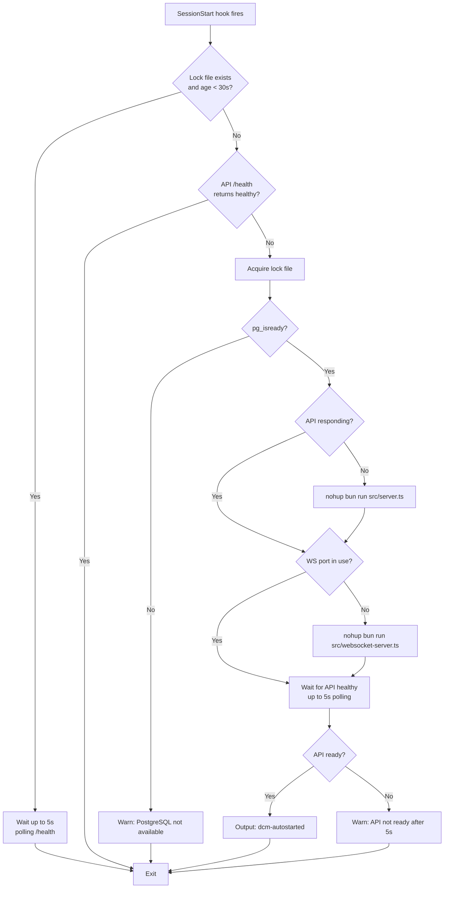
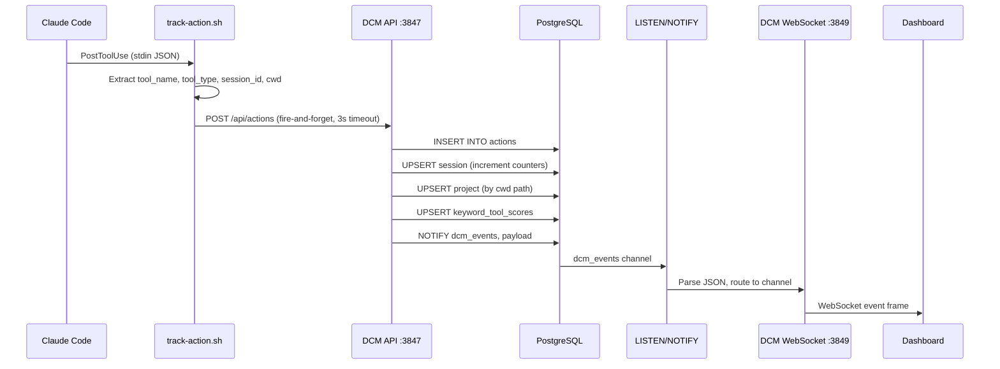
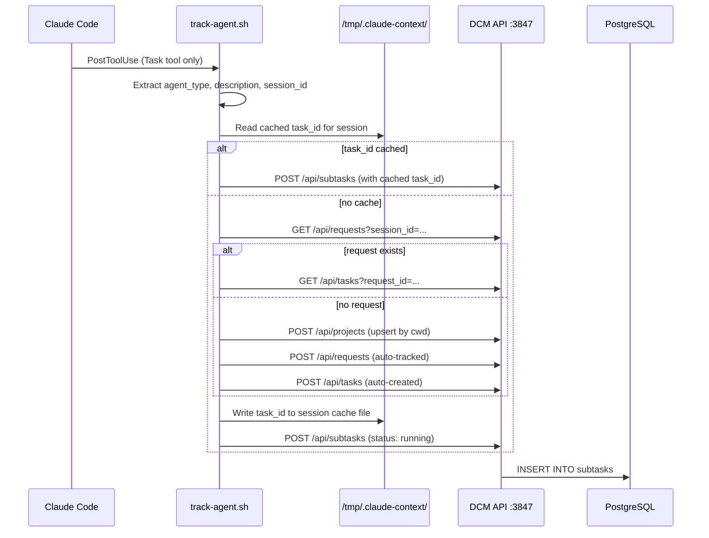
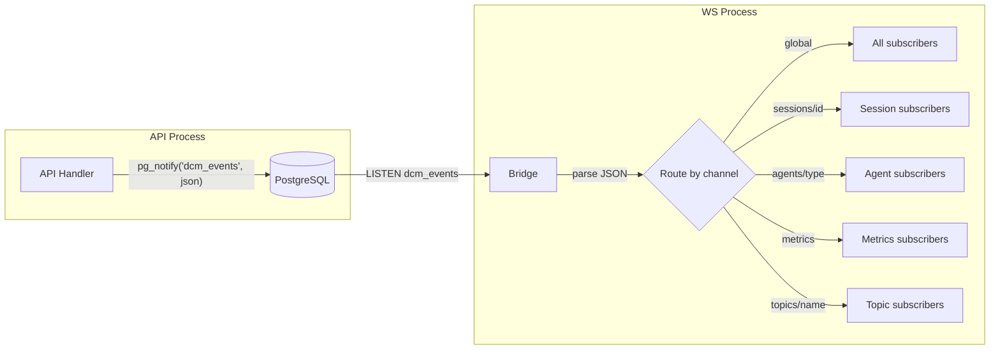
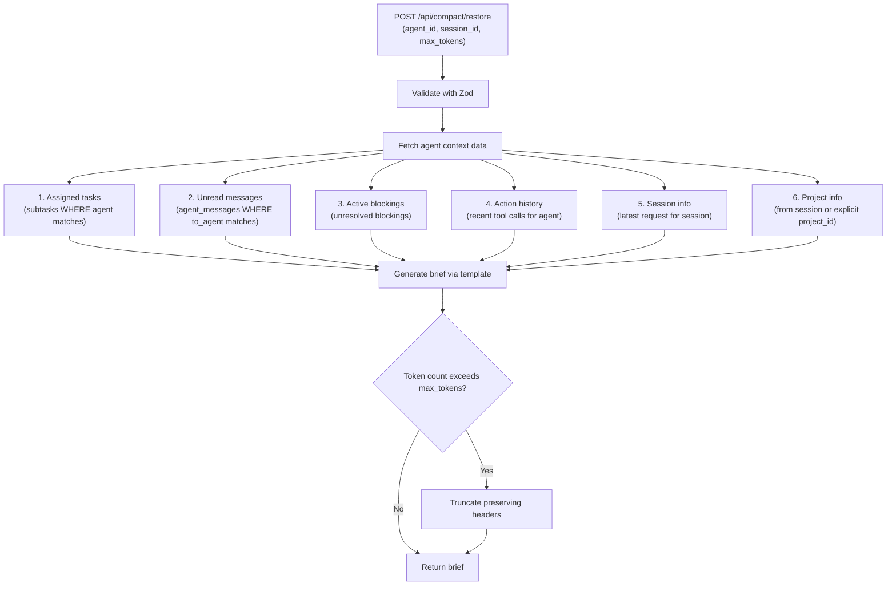

# DCM Architecture

Distributed Context Manager -- the observability, coordination, and context-preservation backbone for Claude Code multi-agent sessions.

DCM captures every tool call, agent spawn, and inter-agent message produced by Claude Code, stores them in PostgreSQL, and streams them in real time to a monitoring dashboard. It also provides intelligent routing suggestions, compact-aware context restoration, and proactive context monitoring to prevent data loss during automatic compaction events.

---

## Table of Contents

- [System Overview](#system-overview)
- [Components](#components)
  - [API Server](#api-server)
  - [WebSocket Server](#websocket-server)
  - [Dashboard](#dashboard)
  - [PostgreSQL](#postgresql)
- [Database Schema](#database-schema)
  - [Tables](#tables)
  - [Views](#views)
  - [Indexes](#indexes)
  - [Entity Relationships](#entity-relationships)
- [Hook System](#hook-system)
  - [Hook Lifecycle](#hook-lifecycle)
  - [SessionStart Hooks](#sessionstart-hooks)
  - [PostToolUse Hooks](#posttooluse-hooks)
  - [PreCompact Hooks](#precompact-hooks)
  - [SubagentStop Hooks](#subagentstop-hooks)
  - [SessionEnd Hooks](#sessionend-hooks)
- [Auto-Start Mechanism](#auto-start-mechanism)
- [Data Flow](#data-flow)
  - [Action Tracking](#action-tracking)
  - [Agent Tracking](#agent-tracking)
  - [Compact Save and Restore](#compact-save-and-restore)
  - [Real-Time Event Delivery](#real-time-event-delivery)
- [Context Generation](#context-generation)
- [WebSocket Protocol](#websocket-protocol)
  - [Authentication](#authentication)
  - [Channels](#channels)
  - [Client Messages](#client-messages)
  - [Server Messages](#server-messages)
  - [Delivery Guarantees](#delivery-guarantees)
  - [Heartbeat and Cleanup](#heartbeat-and-cleanup)
- [API Surface](#api-surface)
- [Architecture Decision Records](#architecture-decision-records)

---

## System Overview



Four processes collaborate to form the DCM system:

| Component | Stack | Port | Role |
|-----------|-------|------|------|
| **API Server** | Bun + Hono | 3847 | REST API with 60+ endpoints. Receives hook data, serves the dashboard, manages all CRUD operations. |
| **WebSocket Server** | Bun native WebSocket | 3849 | Real-time event bridge. Listens to PostgreSQL NOTIFY, forwards events to subscribed clients. |
| **Dashboard** | Next.js 16, React 19, shadcn/ui, Recharts | 3848 | Glassmorphism monitoring UI with 11 pages for sessions, agents, tools, routing, and messages. |
| **PostgreSQL** | PostgreSQL 16 + pgcrypto | 5432 | Persistent storage with 10 tables, 4 views, 20+ indexes. LISTEN/NOTIFY serves as the event bus. |

Nine hook scripts bridge Claude Code to the DCM system, covering the full session lifecycle from startup through compaction and shutdown.

---

## Components

### API Server

The API server is the single write entry point for all data. It runs on Bun with the Hono framework on port 3847.

**Responsibilities:**

- Accept tool-action payloads from `track-action.sh` and insert them into the `actions` table.
- Auto-upsert sessions and projects on every action so tracking works without manual setup.
- Extract keywords from tool names and inputs, then update `keyword_tool_scores` for routing intelligence.
- Fire `NOTIFY dcm_events` after writes so the WebSocket bridge can push events without polling.
- Serve CRUD endpoints for the full hierarchy: projects, requests, task lists, subtasks, actions.
- Provide inter-agent pub/sub (messages, subscriptions, blocking queue).
- Generate HMAC-SHA256 tokens for WebSocket authentication.
- Save and restore compact snapshots for context preservation across compaction events.
- Serve dashboard KPI aggregations via parallel SQL queries.
- Run a periodic cleanup job (every 60 seconds) to expire old messages.

**Key source files:**

```
context-manager/src/
  server.ts              # Hono app, route registration, Bun.serve()
  config.ts              # Env-based configuration
  context-generator.ts   # Context brief generation engine
  cleanup.ts             # Periodic message expiry
  db/client.ts           # PostgreSQL connection (Bun.sql)
  db/schema.sql          # Full schema definition
  api/actions.ts         # POST/GET/DELETE actions
  api/projects.ts        # Project CRUD
  api/requests.ts        # Request CRUD
  api/tasks.ts           # Task list CRUD
  api/subtasks.ts        # Subtask CRUD
  api/messages.ts        # Inter-agent messaging
  api/subscriptions.ts   # Topic subscriptions
  api/blocking.ts        # Agent blocking coordination
  api/routing.ts         # Keyword-tool suggestion engine
  api/sessions.ts        # Session management
  api/context.ts         # Context brief endpoints
  api/compact.ts         # Compact save/restore endpoints
  api/tools-summary.ts   # Tool usage analytics
  websocket/auth.ts      # HMAC-SHA256 token generation
```

### WebSocket Server

A separate Bun process on port 3849. It maintains persistent connections with dashboard clients and SDK consumers, relaying events as they happen.

**Responsibilities:**

- Run a PostgreSQL `LISTEN dcm_events` subscription on a dedicated connection.
- Parse incoming NOTIFY payloads (JSON) and route them to the correct WebSocket channel.
- Maintain a client registry and channel subscription map.
- Enforce HMAC-SHA256 authentication for production deployments.
- Provide at-least-once delivery for critical events (task, subtask, message) via a retry queue.
- Send heartbeat pings every 30 seconds and clean up dead connections after 60 seconds of silence.
- Broadcast metric snapshots (5 parallel aggregation queries) every 5 seconds.

**Key source files:**

```
context-manager/src/
  websocket-server.ts    # Entry point (separate process)
  websocket/server.ts    # Bun.serve() with WS handlers
  websocket/bridge.ts    # PostgreSQL LISTEN/NOTIFY bridge + metrics
  websocket/handlers.ts  # Message routing, channel management, delivery retry
  websocket/auth.ts      # HMAC-SHA256 token generation and validation
  websocket/types.ts     # TypeScript types for all WS message shapes
```

### Dashboard

A Next.js 16 application with React 19, providing a real-time monitoring interface.

**Design system:**

- Glassmorphism cards with backdrop blur
- 8 CSS animations (fade-in, slide-in, scale-in, pulse-glow, shimmer, count-up, float, stagger)
- Dark mode with oklch color system
- Responsive grid layouts (sm/md/lg breakpoints)
- Built on shadcn/ui + Radix UI + Tailwind CSS 4

**Pages:**

| Page | Content |
|------|---------|
| Dashboard | Health gauge, KPI cards with sparklines, area/bar charts, live activity feed |
| Live Activity | Real-time event stream, semi-circle gauges, agent topology grid |
| Sessions | Session list with filters, sort, search |
| Session Detail | Timeline view with request cards and task items |
| Projects | Project list with KPIs, search, delete |
| Project Detail | Project-specific sessions and metrics |
| Agents | Agent statistics, active agents, type distribution |
| Agent Detail | Per-agent task history and metrics |
| Tools | Tool usage analytics, type distribution, success rates |
| Routing | Keyword-tool mappings, routing tester with feedback |
| Messages | Inter-agent message history with expandable payloads |

### PostgreSQL

PostgreSQL 16 serves as both the durable store and the event bus (via LISTEN/NOTIFY). The `pgcrypto` extension provides `gen_random_uuid()` for all primary keys.

**Database name:** `claude_context`

---

## Database Schema

### Tables


**Table descriptions:**

| # | Table | Purpose | Key Columns |
|---|-------|---------|-------------|
| 1 | `projects` | Project registry, keyed by filesystem path | `path` (unique), `metadata` (JSONB) |
| 2 | `requests` | User prompts that initiate work | `session_id`, `prompt_type` (feature, debug, explain, search) |
| 3 | `task_lists` | Waves of objectives within a request | `wave_number`, `status` |
| 4 | `subtasks` | Individual agent assignments | `agent_type`, `agent_id`, `blocked_by` (UUID array), `context_snapshot` |
| 5 | `actions` | Every tool invocation recorded by hooks | `tool_name`, `tool_type`, `input`/`output` (compressed bytea), `exit_code` |
| 6 | `sessions` | Claude Code session metadata and counters | `total_tools_used`, `total_success`, `total_errors` |
| 7 | `keyword_tool_scores` | Routing intelligence: keyword-tool correlations | `keyword` + `tool_name` (unique), `score`, `usage_count`, `success_count` |
| 8 | `agent_messages` | Inter-agent pub/sub messages | `from_agent_id`, `to_agent_id` (null = broadcast), `topic`, `expires_at` |
| 9 | `agent_contexts` | Agent context snapshots for recovery after compacts | `role_context` (JSONB), `skills_to_restore`, `tools_used` |
| 10 | `schema_version` | Tracks applied schema migrations | `version`, `applied_at` |

### Views

| View | Purpose | Key Joins |
|------|---------|-----------|
| `v_actions_full` | Full hierarchy JOIN from action up to project. Used by the dashboard for drill-down. | actions - subtasks - task_lists - requests - projects |
| `v_active_agents` | Currently running agents with action counts. Powers the live activity page. | subtasks (status IN running/paused/blocked) - task_lists - requests - projects - actions |
| `v_unread_messages` | Non-expired messages ordered by recency. Used for message polling. | agent_messages - projects (WHERE expires_at IS NULL OR > NOW()) |
| `v_project_stats` | Aggregate statistics per project: request count, action count, success rate, avg duration. | projects - requests - task_lists - subtasks - actions (GROUP BY project) |

### Indexes

The schema defines 20+ indexes across three categories:

**B-tree indexes** for foreign keys and common filters:

| Table | Indexed Columns |
|-------|----------------|
| `requests` | `project_id`, `session_id`, `status` |
| `subtasks` | `status`, `(agent_type, agent_id)`, `task_list_id` |
| `actions` | `tool_name`, `created_at DESC`, `subtask_id`, `tool_type` |
| `agent_messages` | `project_id`, `to_agent_id`, `topic`, `created_at DESC` |
| `keyword_tool_scores` | `keyword`, `tool_name` |
| `agent_contexts` | `(project_id, agent_type)`, `agent_id` |
| `sessions` | `project_id`, `started_at DESC` |

**GIN indexes** for JSONB queries:

| Table | Indexed Column |
|-------|----------------|
| `projects` | `metadata` |
| `requests` | `metadata` |
| `actions` | `metadata` |
| `agent_messages` | `payload` |
| `agent_contexts` | `role_context` |

**Triggers:**

- `update_projects_updated_at` -- automatically sets `updated_at = NOW()` on project row updates.
- `update_contexts_updated_at` -- automatically sets `last_updated = NOW()` on agent context row updates.

Both triggers use the shared `update_updated_at_column()` PL/pgSQL function.

### Entity Relationships

The core hierarchy follows a strict tree that mirrors the Claude Code execution model:

```
project                          # Identified by filesystem path (cwd)
  -> session                     # Claude Code session instance
  -> request                     # User prompt that initiates work
    -> task_list                 # Wave of objectives (wave_number)
      -> subtask                 # Individual agent assignment
        -> action                # Single tool invocation
```

A user prompt triggers work, work is organized into waves, each wave delegates to agents, and each agent executes tool calls. Sessions span the full lifecycle and are linked to a project. Messages and contexts exist alongside this tree, scoped by project.

---

## Hook System

DCM integrates with Claude Code through nine hook scripts across five lifecycle events. All hooks are defined in `context-manager/hooks/hooks.json` and use the plugin variable `${CLAUDE_PLUGIN_ROOT}` for portable paths.

### Hook Lifecycle



### SessionStart Hooks

**Matcher: `startup`** -- Fires when a new Claude Code session begins.

| Script | Timeout | Purpose |
|--------|---------|---------|
| `ensure-services.sh` | 10s | Auto-start DCM services if not running. See [Auto-Start Mechanism](#auto-start-mechanism). |
| `track-session.sh` | 5s | Initialize the session hierarchy: create project (by cwd), session, request, and task. Cache IDs in `/tmp/.claude-context/{session_id}.json` for subsequent hooks. |

**Matcher: `compact`** -- Fires when a session resumes after a compaction event.

| Script | Timeout | Purpose |
|--------|---------|---------|
| `post-compact-restore.sh` | 8s | Restore context after compact. Calls `POST /api/compact/restore` to generate a brief, then outputs JSON with `hookSpecificOutput.additionalContext` so Claude sees the restored context immediately. Falls back to raw snapshot data if brief generation fails. |

### PostToolUse Hooks

**Matcher: `*`** -- Fires after every tool invocation.

| Script | Timeout | Purpose |
|--------|---------|---------|
| `track-action.sh` | 3s | Record the tool call in the `actions` table. Extracts `tool_name`, `tool_type`, `session_id`, `cwd`, and fires `POST /api/actions` as fire-and-forget. Classifies tools into types: `builtin`, `agent`, `skill`, `mcp`. |
| `monitor-context.sh` | 2s | Proactive context monitoring. Increments a counter file (`/tmp/.dcm-monitor-counter`); on every 10th call, checks transcript size. Below 500KB: no action. 500-800KB: log warning. Above 800KB: trigger proactive snapshot via `POST /api/compact/save` with 60-second cooldown. |

**Matcher: `Task`** -- Fires only when the Task tool is used (agent delegation).

| Script | Timeout | Purpose |
|--------|---------|---------|
| `track-agent.sh` | 3s | Create a subtask entry for the delegated agent. Reads cached `task_id` from `/tmp/.claude-context/` to avoid repeated lookups. If no request/task chain exists, creates one automatically. |

### PreCompact Hooks

**Matchers: `auto`, `manual`** -- Fires before Claude compacts the context window.

| Script | Timeout | Purpose |
|--------|---------|---------|
| `pre-compact-save.sh` | 5s | Save a full context snapshot to DCM before compact occurs. Gathers data from multiple sources: active tasks from the API, modified files from recent actions, agent states from agent contexts, and a summary from the transcript tail. Posts the assembled snapshot to `POST /api/compact/save`. |

### SubagentStop Hooks

**No matcher** -- Fires for all subagent stops.

| Script | Timeout | Purpose |
|--------|---------|---------|
| `save-agent-result.sh` | 3s | When a subagent finishes, extracts its result from the transcript. Broadcasts an `agent.completed` message via `POST /api/messages` so other agents can access it. Also updates the corresponding subtask status to `completed` via `PATCH /api/subtasks/:id`. |

### SessionEnd Hooks

**No matcher** -- Fires on session termination.

| Script | Timeout | Purpose |
|--------|---------|---------|
| `track-session-end.sh` | 3s | Closes the session by setting `ended_at` via `PATCH /api/sessions/:id`. Cleans up the cache file from `/tmp/.claude-context/`. |

---

## Auto-Start Mechanism

The `ensure-services.sh` script runs on every `SessionStart(startup)` event and guarantees that DCM services are available before any other hook fires. The script is fully idempotent -- if services are already running, it exits immediately with no side effects.



**Key design decisions:**

- **Lock file** (`/tmp/.dcm-autostart.lock`): prevents race conditions when multiple Claude sessions start simultaneously. Stale locks older than 30 seconds are automatically removed.
- **PostgreSQL prerequisite**: the script checks `pg_isready` before attempting to start any DCM process. If PostgreSQL is unavailable, the script exits cleanly with a warning.
- **PID tracking**: process IDs are stored in `/tmp/.dcm-pids/` for external management.
- **Log files**: server output goes to `/tmp/dcm-api.log` and `/tmp/dcm-ws.log`.
- **Startup timeout**: the script waits up to 5 seconds (10 polling cycles at 500ms) for the API to report healthy before returning.

---

## Data Flow

### Action Tracking

Every tool call in a Claude Code session triggers the `track-action.sh` hook. This is the highest-volume data path.



**Tool type classification** (performed by the hook):

| Pattern | Type |
|---------|------|
| `Bash`, `Read`, `Write`, `Edit`, `Glob`, `Grep` | `builtin` |
| `Task`, `TaskCreate`, `TaskUpdate` | `agent` |
| `Skill` | `skill` |
| `mcp__*` | `mcp` |

For `Skill` and `Task` tools, the hook extracts the effective name from the input JSON (the skill name or the subagent type) to provide meaningful tracking granularity.

### Agent Tracking

When the `Task` tool is used (agent delegation), `track-agent.sh` creates a subtask entry. If no request/task chain exists for the current session, the script creates one automatically.



The cache in `/tmp/.claude-context/{session_id}.json` stores `project_id`, `request_id`, and `task_id` to avoid repeated lookups within the same session.

### Compact Save and Restore

The compact lifecycle preserves context across Claude Code compaction events. This is a critical path for maintaining session continuity in long-running multi-agent workflows.

```mermaid
sequenceDiagram
    participant CC as Claude Code
    participant MC as monitor-context.sh
    participant PCS as pre-compact-save.sh
    participant API as DCM API :3847
    participant DB as PostgreSQL
    participant PCR as post-compact-restore.sh

    Note over CC: Context window growing large

    rect rgb(40, 40, 60)
        Note over MC: Proactive monitoring (every 10th tool call)
        MC->>MC: Check transcript size
        alt Above 800KB (red zone)
            MC->>API: POST /api/compact/save (trigger: proactive)
            API->>DB: UPSERT agent_contexts (compact-snapshot)
        end
    end

    Note over CC: Compact triggered (auto or manual)

    rect rgb(60, 40, 40)
        Note over PCS: PreCompact hook fires
        PCS->>API: GET /api/subtasks?status=running
        PCS->>API: GET /api/actions?limit=50 (modified files)
        PCS->>API: GET /api/agent-contexts (agent states)
        PCS->>PCS: Extract summary from transcript tail
        PCS->>API: POST /api/compact/save (full snapshot)
        API->>DB: UPSERT agent_contexts (compact-snapshot-session_id)
        API->>DB: UPDATE requests metadata (compact_snapshot_at)
    end

    Note over CC: Context compacted -- session resumes

    rect rgb(40, 60, 40)
        Note over PCR: SessionStart(compact) hook fires
        PCR->>API: POST /api/compact/restore
        API->>DB: Fetch tasks, messages, blockings, history
        API->>API: Generate context brief via template engine
        API-->>PCR: Brief + sources
        PCR-->>CC: JSON stdout with additionalContext
        Note over CC: Claude sees restored context immediately
    end
```



**Snapshot storage**: Snapshots are stored in the `agent_contexts` table with `agent_type = 'compact-snapshot'` and `agent_id = 'compact-snapshot-{session_id}'`. This reuses existing infrastructure with the UPSERT pattern (`ON CONFLICT (project_id, agent_id) DO UPDATE`).

**Three snapshot triggers**:

| Trigger | Source | When |
|---------|--------|------|
| `proactive` | `monitor-context.sh` | Transcript exceeds 800KB (with 60s cooldown) |
| `auto` | `pre-compact-save.sh` | Claude auto-compacts the context window |
| `manual` | `pre-compact-save.sh` | User manually triggers compact |

### Real-Time Event Delivery

The WebSocket bridge replaces polling with PostgreSQL's built-in pub/sub mechanism.



Events published to a specific channel are also broadcast to `global`, so dashboard clients subscribed to `global` receive everything.

Metrics are broadcast on a separate 5-second interval via direct SQL queries (not through NOTIFY), aggregating: active sessions, active agents, pending/running tasks, messages in the last hour, actions per minute, and average task duration.

---

## Context Generation

The context generator (`context-generator.ts`) produces structured briefs that are injected into Claude Code after compact events. Briefs are tailored to the requesting agent and assembled from multiple data sources.

**Generation pipeline:**



**Data sources and relevance scoring:**

| Source | Relevance | Description |
|--------|-----------|-------------|
| Running tasks | 1.0 | Currently executing subtasks assigned to the agent |
| Pending/blocked tasks | 0.8 | Tasks waiting for execution or dependencies |
| High-priority messages | 1.0 | Unread messages with priority >= 5 |
| Normal messages | 0.6 | Standard unread messages |
| Active blockings | 0.9 | Unresolved blocking dependencies |
| Action history | 0.7 | Recent tool calls for context |
| Session info | 0.8 | Current session state |
| Project info | 0.7 | Project identification |

**Default generation options:**

| Option | Default | Description |
|--------|---------|-------------|
| `maxTokens` | 2000 | Maximum token budget for the brief (1 token approx 4 chars) |
| `includeHistory` | true | Include recent action history |
| `historyLimit` | 10 (15 after compact) | Number of recent actions to include |
| `includeMessages` | true | Include unread messages |
| `includeBlocking` | true | Include blocking dependencies |

**Truncation strategy**: When the brief exceeds the token budget, lines are removed from the end while preserving all section headers (lines starting with `#`). A truncation notice is appended.

---

## WebSocket Protocol

### Authentication

The WebSocket server uses HMAC-SHA256 tokens. The token format is `base64url(payload).hex(signature)` where the signature is `SHA256(secret + json_payload)`.

**Token flow:**

1. Client requests a token: `POST /api/auth/token` with `{ "agent_id": "my-agent" }`.
2. API returns `{ "token": "eyJ...", "expires_in": 3600 }`.
3. Client connects to `ws://host:3849?token=TOKEN` or sends an `auth` message after connection.

**Dev mode exception:** When `NODE_ENV` is not `production`, clients can authenticate with a bare `agent_id` in the `auth` message, without a token. This simplifies local development.

### Channels

| Channel Pattern | Example | Description |
|-----------------|---------|-------------|
| `global` | `global` | All events. Every client auto-subscribes on connection. |
| `agents/{id}` | `agents/backend-laravel` | Events for a specific agent. Auto-subscribed on auth. |
| `sessions/{id}` | `sessions/abc123` | Events scoped to a session. Auto-subscribed on auth if `session_id` provided. |
| `metrics` | `metrics` | Metric snapshots emitted every 5 seconds. |
| `topics/{name}` | `topics/schema_updated` | Custom topic channels for inter-agent coordination. |

### Client Messages

| Type | Fields | Description |
|------|--------|-------------|
| `subscribe` | `channel`, `id?`, `timestamp` | Subscribe to a channel. Server responds with `ack`. |
| `unsubscribe` | `channel`, `id?`, `timestamp` | Unsubscribe from a channel. Server responds with `ack`. |
| `publish` | `channel`, `event`, `data`, `id?`, `timestamp` | Publish an event to a channel. Validated against allowed event types. |
| `auth` | `token?`, `agent_id?`, `session_id?`, `id?`, `timestamp` | Authenticate. Triggers auto-subscribe to agent/session channels. |
| `ping` | `timestamp` | Client keepalive. Server responds with `pong`. |
| `ack` | `message_id` | Client acknowledges receipt of a tracked message. |

### Server Messages

| Type | Fields | Description |
|------|--------|-------------|
| `connected` | `client_id`, `timestamp` | Sent immediately after WebSocket upgrade. |
| `ack` | `id`, `success`, `error?`, `timestamp` | Response to subscribe/unsubscribe/publish/auth. |
| `pong` | `timestamp` | Response to client ping. |
| `error` | `error`, `code`, `details?`, `timestamp` | Error notification (auth failure, parse error, invalid channel). |
| *(event)* | `id`, `channel`, `event`, `data`, `timestamp` | Event payload. `event` is one of the EventType values below. |

**Event types:**

```
task.created    task.updated    task.completed    task.failed
subtask.created subtask.updated subtask.completed subtask.failed subtask.running
message.new     message.read    message.expired
agent.connected agent.disconnected agent.heartbeat agent.blocked agent.unblocked
session.created session.ended
metric.update   system.error    system.info
```

### Delivery Guarantees

Critical events (`task.*`, `subtask.*`, `message.*`) use at-least-once delivery:

1. The server tracks each sent message in a `pendingMessages` map, keyed by `{message_id}:{client_id}`.
2. Clients should respond with an `ack` message containing the `message_id`.
3. Every 2 seconds, the server checks for unacknowledged messages older than 5 seconds and retries.
4. After 3 failed attempts, the message is dropped from the retry queue.

Non-critical events (metrics, agent heartbeats, system info) use fire-and-forget delivery.

### Heartbeat and Cleanup

- **Ping interval:** Server sends a `ping` to every client every 30 seconds.
- **Dead timeout:** Clients that have not responded to a ping within 60 seconds are disconnected and removed from all channel subscriptions.
- **Subscription restore:** When an authenticated agent reconnects, its previous channel subscriptions are automatically restored from an in-memory map.

---

## API Surface

The API exposes 60+ endpoints organized by domain. Below is the complete routing table as registered in `server.ts`.

### Health and Status

| Method | Path | Description |
|--------|------|-------------|
| GET | `/health` | System health, database status, feature phase list |
| GET | `/stats` | Global aggregate statistics |
| GET | `/stats/tools-summary` | Tool usage analytics (counts, types, success rates) |
| GET | `/api/dashboard/kpis` | Aggregated KPI metrics for the dashboard (7 parallel queries) |

### Projects

| Method | Path | Description |
|--------|------|-------------|
| POST | `/api/projects` | Create or upsert a project (by path) |
| GET | `/api/projects` | List all projects |
| GET | `/api/projects/by-path` | Find project by filesystem path |
| GET | `/api/projects/:id` | Get project by ID |
| DELETE | `/api/projects/:id` | Delete project and cascade |

### Requests

| Method | Path | Description |
|--------|------|-------------|
| POST | `/api/requests` | Create a user request |
| GET | `/api/requests` | List requests (filterable by session, project, status) |
| GET | `/api/requests/:id` | Get request by ID |
| PATCH | `/api/requests/:id` | Update request status |
| DELETE | `/api/requests/:id` | Delete request |

### Tasks

| Method | Path | Description |
|--------|------|-------------|
| POST | `/api/tasks` | Create a task list (wave) |
| GET | `/api/tasks` | List tasks |
| GET | `/api/tasks/:id` | Get task by ID |
| PATCH | `/api/tasks/:id` | Update task status |
| DELETE | `/api/tasks/:id` | Delete task |

### Subtasks

| Method | Path | Description |
|--------|------|-------------|
| POST | `/api/subtasks` | Create a subtask (agent assignment) |
| GET | `/api/subtasks` | List subtasks (filterable by status, agent_type) |
| GET | `/api/subtasks/:id` | Get subtask by ID |
| PATCH | `/api/subtasks/:id` | Update subtask status/result |
| DELETE | `/api/subtasks/:id` | Delete subtask |

### Actions

| Method | Path | Description |
|--------|------|-------------|
| POST | `/api/actions` | Log a tool action (primary hook endpoint) |
| GET | `/api/actions` | List actions (filterable) |
| GET | `/api/actions/hourly` | Hourly action distribution |
| DELETE | `/api/actions/:id` | Delete a single action |
| DELETE | `/api/actions/by-session/:session_id` | Bulk delete by session |

### Hierarchy

| Method | Path | Description |
|--------|------|-------------|
| GET | `/api/hierarchy/:project_id` | Full tree: project to requests to tasks to subtasks (single JOIN query) |
| GET | `/api/active-sessions` | Currently running agents via `v_active_agents` view |

### Routing Intelligence

| Method | Path | Description |
|--------|------|-------------|
| GET | `/api/routing/suggest` | Get tool suggestions for a keyword |
| GET | `/api/routing/stats` | Routing statistics |
| POST | `/api/routing/feedback` | Submit feedback on a suggestion |

### Context and Compact

| Method | Path | Description |
|--------|------|-------------|
| GET | `/api/context/:agent_id` | Generate a context brief for an agent |
| POST | `/api/context/generate` | Generate context brief on demand |
| POST | `/api/compact/save` | Save context snapshot before compact |
| POST | `/api/compact/restore` | Restore agent context after compact |
| GET | `/api/compact/status/:session_id` | Check compact status for a session |
| GET | `/api/compact/snapshot/:session_id` | Get saved snapshot for a session |

### Agent Contexts

| Method | Path | Description |
|--------|------|-------------|
| GET | `/api/agent-contexts` | List all agent contexts with stats (filterable by agent_type, status) |
| GET | `/api/agent-contexts/stats` | Agent context KPIs: overview, top types, recent activity, tools used |

### Sessions

| Method | Path | Description |
|--------|------|-------------|
| POST | `/api/sessions` | Create/upsert a session |
| GET | `/api/sessions` | List sessions |
| GET | `/api/sessions/stats` | Session aggregate statistics |
| GET | `/api/sessions/:id` | Get session by ID |
| PATCH | `/api/sessions/:id` | Update session |
| DELETE | `/api/sessions/:id` | Delete session |

### Inter-Agent Communication

| Method | Path | Description |
|--------|------|-------------|
| POST | `/api/messages` | Send a message (direct or broadcast) |
| GET | `/api/messages` | List all messages (for dashboard, paginated) |
| GET | `/api/messages/:agent_id` | Poll messages for an agent |
| POST | `/api/subscribe` | Subscribe to a topic |
| GET | `/api/subscriptions` | List all subscriptions |
| GET | `/api/subscriptions/:agent_id` | List agent subscriptions |
| DELETE | `/api/subscriptions/:id` | Delete subscription |
| POST | `/api/unsubscribe` | Unsubscribe from a topic |
| POST | `/api/blocking` | Block an agent (coordination) |
| GET | `/api/blocking/check` | Check if an agent is blocked |
| GET | `/api/blocking/:agent_id` | Get blocking details for an agent |
| DELETE | `/api/blocking/:blocked_id` | Delete blocking |
| POST | `/api/unblock` | Unblock an agent |

### Cleanup

| Method | Path | Description |
|--------|------|-------------|
| GET | `/api/cleanup/stats` | Last cleanup stats and message statistics |

### Authentication

| Method | Path | Description |
|--------|------|-------------|
| POST | `/api/auth/token` | Generate an HMAC-SHA256 WebSocket token |

---

## Architecture Decision Records

### ADR-001: Bun over Node.js

**Context:** The runtime choice affects performance, developer experience, and deployment complexity. DCM hooks run on every tool call in Claude Code, so latency matters.

**Decision:** Target Bun as the primary runtime. Use Bun-native APIs (`Bun.serve()`, `Bun.CryptoHasher`, `Bun.sql`) for maximum performance.

**Consequences:**
- Significant performance gains from Bun's optimized HTTP and WebSocket handling.
- Native TypeScript execution without a separate build step or transpilation.
- Direct PostgreSQL support via `Bun.sql` without external driver libraries.
- Hook scripts remain portable bash and are runtime-agnostic.
- Bun is less mature than Node.js, but the API surface used by DCM is stable.

### ADR-002: Hono over Express

**Context:** The HTTP framework must be lightweight, type-safe, and compatible with Bun's native server.

**Decision:** Use Hono, a lightweight web framework designed for edge runtimes and fully compatible with `Bun.serve()`.

**Consequences:**
- Sub-millisecond routing overhead via Hono's trie-based router.
- Full TypeScript support with typed request/response handlers.
- Built-in middleware (CORS, logging) without external dependencies.
- Smaller bundle and memory footprint compared to Express.
- Hono's `app.fetch` integrates directly with `Bun.serve()`.

### ADR-003: PostgreSQL over SQLite

**Context:** DCM originated with SQLite but needed concurrent write support from multiple hook processes, real-time event delivery, and JSONB for semi-structured data.

**Decision:** Migrate to PostgreSQL 16 with JSONB columns and LISTEN/NOTIFY for the event bus.

**Consequences:**
- Concurrent writes from multiple Claude Code sessions without lock contention.
- LISTEN/NOTIFY eliminates polling for real-time event delivery (see ADR-004).
- JSONB columns with GIN indexes enable flexible metadata without schema migrations.
- PostgreSQL is a heavier dependency than SQLite, requiring a running server process.
- The `pgcrypto` extension provides `gen_random_uuid()` for all primary keys.

### ADR-004: PostgreSQL LISTEN/NOTIFY for Real-Time Events

**Context:** The WebSocket bridge needs to know when new data arrives in the database so it can push events to connected clients.

**Decision:** Use PostgreSQL's built-in `LISTEN`/`NOTIFY` mechanism instead of interval-based polling.

**Consequences:**
- Near-zero latency between a database write and WebSocket event delivery.
- No wasted queries during idle periods.
- Requires a dedicated PostgreSQL connection for the `LISTEN` subscription.
- NOTIFY payloads are limited to 8000 bytes, which is sufficient for event metadata (full data is fetched separately if needed).

### ADR-005: Separate WebSocket Server Process

**Context:** The WebSocket server and the REST API have different scaling characteristics and failure modes.

**Decision:** Run the WebSocket server as a separate Bun process on its own port (3849), rather than embedding it in the API server (3847).

**Consequences:**
- Independent scaling: the WS server scales by connection count while the API scales by request throughput.
- Isolated failure domains: a crash in the WS server does not affect API availability.
- Slightly more complex deployment (two processes instead of one).
- Both processes share the same codebase and database connection configuration.

### ADR-006: HMAC-SHA256 for WebSocket Authentication

**Context:** WebSocket connections need authentication, especially in production environments.

**Decision:** Use HMAC-SHA256 tokens with a shared secret. Token format: `base64url(payload).hex(sha256(secret + payload))`.

**Consequences:**
- Stateless validation -- no database lookup needed to verify a token.
- No external dependencies (no JWT library, no OAuth provider).
- Tokens are time-limited (1 hour TTL) and contain the `agent_id` and optional `session_id`.
- The shared secret (`WS_AUTH_SECRET` env var) must be kept secure.
- Dev mode allows bare `agent_id` without tokens for faster iteration.

### ADR-007: JSONB for Flexible Metadata

**Context:** Several entities (projects, requests, actions, messages, agent contexts) carry semi-structured data that varies by use case.

**Decision:** Use PostgreSQL JSONB columns with GIN indexes for these fields.

**Consequences:**
- No schema migrations needed when metadata shapes evolve.
- GIN indexes enable efficient queries against JSONB contents.
- Compact snapshot data (`role_context` in `agent_contexts`) can store arbitrary structures.
- Slightly higher storage cost compared to normalized columns (acceptable given the flexibility).

### ADR-008: At-Least-Once Delivery for Critical Events

**Context:** Task and message events must not be silently lost, but exactly-once semantics add substantial complexity.

**Decision:** Implement at-least-once delivery with 3 retries and a 5-second acknowledgment timeout. Only for `task.*`, `subtask.*`, and `message.*` events.

**Consequences:**
- Clients may receive duplicate events and should handle them idempotently (each event carries a unique `id`).
- Non-critical events (metrics, heartbeats) use fire-and-forget for lower overhead.
- The retry queue is in-memory; pending messages are lost if the WebSocket server restarts.

### ADR-009: Hook-Based Auto-Start with Lock File

**Context:** DCM services need to be running before hooks can send data. Manual startup creates friction and is easily forgotten.

**Decision:** The `ensure-services.sh` hook auto-starts DCM services on every `SessionStart(startup)` event, using a lock file to prevent race conditions.

**Consequences:**
- Zero-friction startup: Claude Code sessions automatically have DCM available.
- Lock file prevents thundering herd when multiple sessions start simultaneously.
- PostgreSQL must be running independently (ensure-services.sh checks but does not start it).
- Startup adds up to 10 seconds to the first session start (timeout budget for the hook).
- Subsequent sessions see near-zero latency (health check returns immediately).
