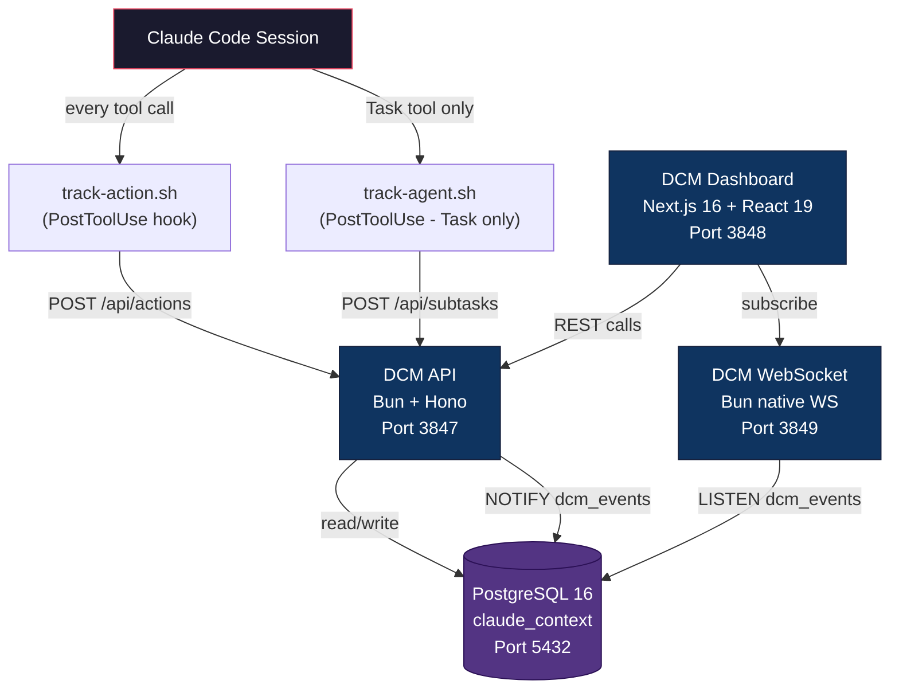
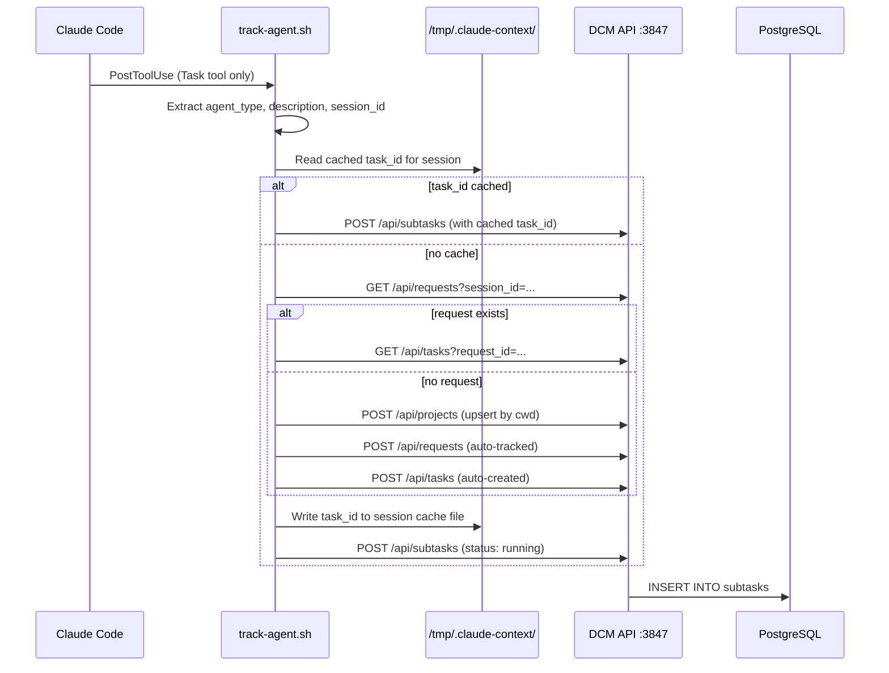
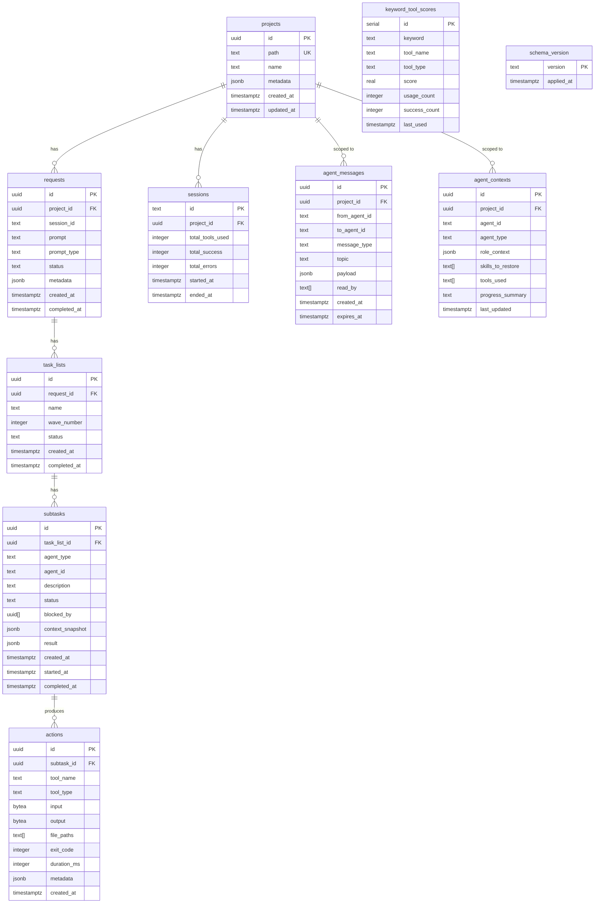

# DCM Architecture

Distributed Context Manager -- the observability and coordination backbone for Claude Code multi-agent sessions.

DCM captures every tool call, agent spawn, and inter-agent message produced by Claude Code, stores them in PostgreSQL, and streams them in real time to a monitoring dashboard. It also provides intelligent routing suggestions based on accumulated keyword-tool correlations.

This document covers the four components, their interactions, the database schema, the WebSocket protocol, and the architectural decisions behind each.

---

## Table of Contents

- [System Overview](#system-overview)
- [Components](#components)
  - [DCM API](#dcm-api)
  - [DCM WebSocket](#dcm-websocket)
  - [DCM Dashboard](#dcm-dashboard)
  - [PostgreSQL](#postgresql)
- [Data Flow](#data-flow)
  - [Action Tracking](#action-tracking)
  - [Agent Tracking](#agent-tracking)
  - [Real-Time Event Delivery](#real-time-event-delivery)
- [Database Schema](#database-schema)
  - [Tables](#tables)
  - [Views](#views)
  - [Indexes](#indexes)
  - [Entity Relationships](#entity-relationships)
- [WebSocket Protocol](#websocket-protocol)
  - [Authentication](#authentication)
  - [Channels](#channels)
  - [Client Messages](#client-messages)
  - [Server Messages](#server-messages)
  - [Delivery Guarantees](#delivery-guarantees)
  - [Heartbeat and Cleanup](#heartbeat-and-cleanup)
- [API Surface](#api-surface)
- [Architecture Decision Records](#architecture-decision-records)
- [Feature Phases](#feature-phases)
- [Deployment](#deployment)

---

## System Overview



Four processes collaborate:

| Component | Stack | Port | Role |
|-----------|-------|------|------|
| **DCM API** | Bun + Hono | 3847 | REST API with 50+ endpoints. Receives hook data, serves the dashboard, manages all CRUD. |
| **DCM WebSocket** | Bun native WebSocket | 3849 | Real-time event bridge. Listens to PostgreSQL NOTIFY, forwards to subscribed clients. |
| **DCM Dashboard** | Next.js 16, React 19, shadcn/ui, Recharts | 3848 | Premium glassmorphism monitoring UI with 11 pages. |
| **PostgreSQL** | PostgreSQL 16 + pgcrypto | 5432 | Persistent storage. 12 tables, 4 views, 20+ indexes. LISTEN/NOTIFY for event bus. |

---

## Components

### DCM API

The API server is the single write entry point for all data. It runs on Bun with the Hono framework.

**Responsibilities:**

- Accept tool-action payloads from `track-action.sh` and insert them into the `actions` table.
- Auto-upsert sessions and projects on every action (so tracking works without manual setup).
- Extract keywords from tool names and inputs, then update `keyword_tool_scores` for routing intelligence.
- Fire `NOTIFY dcm_events` after writes so the WebSocket bridge can push events without polling.
- Serve CRUD endpoints for the full hierarchy: projects, requests, task lists, subtasks, actions.
- Provide inter-agent pub/sub (messages, subscriptions, blocking queue).
- Generate HMAC-SHA256 tokens for WebSocket authentication.
- Run a periodic cleanup job (every 60 seconds) to expire old messages.

**Key files:**

```
context-manager/src/
  server.ts              # Hono app, route registration, Bun.serve()
  config.ts              # Env-based configuration
  db/client.ts           # PostgreSQL connection (Bun.sql)
  db/schema.sql          # Full schema definition
  api/actions.ts         # POST/GET/DELETE actions
  api/projects.ts        # Project CRUD
  api/requests.ts        # Request CRUD
  api/tasks.ts           # Task list CRUD
  api/subtasks.ts        # Subtask CRUD
  api/messages.ts        # Inter-agent messaging
  api/subscriptions.ts   # Topic subscriptions
  api/blocking.ts        # Agent blocking coordination
  api/routing.ts         # Keyword-tool suggestion engine
  api/sessions.ts        # Session management
  api/context.ts         # Context brief generation
  api/compact.ts         # Compact restore support
  api/tools-summary.ts   # Tool usage analytics
  cleanup.ts             # Periodic message expiry
```

### DCM WebSocket

A separate Bun process on port 3849. It maintains persistent connections with dashboard clients (and potentially SDK clients), relaying events as they happen.

**Responsibilities:**

- Run a PostgreSQL `LISTEN dcm_events` subscription on a dedicated connection.
- Parse incoming NOTIFY payloads (JSON) and route them to the correct WebSocket channel.
- Maintain a client registry and channel subscription map.
- Enforce HMAC-SHA256 authentication for production deployments.
- Provide at-least-once delivery for critical events (task/subtask/message) via a retry queue.
- Send heartbeat pings every 30 seconds and clean up dead connections after 60 seconds of silence.
- Broadcast metric snapshots (5 parallel aggregation queries) every 5 seconds.

**Key files:**

```
context-manager/src/
  websocket-server.ts    # Entry point (separate process)
  websocket/server.ts    # Bun.serve() with WS handlers
  websocket/bridge.ts    # PostgreSQL LISTEN/NOTIFY bridge
  websocket/handlers.ts  # Message routing, channel management, delivery retry
  websocket/auth.ts      # HMAC-SHA256 token generation and validation
  websocket/types.ts     # TypeScript types for all WS message shapes
```

### DCM Dashboard

A Next.js 16 application with React 19, providing a real-time monitoring interface.

**Design system:**

- Glassmorphism cards with backdrop blur
- 8 CSS animations (fade-in, slide-in, scale-in, pulse-glow, shimmer, count-up, float, stagger)
- Dark mode with oklch color system
- Responsive grid layouts (sm/md/lg breakpoints)
- Built on shadcn/ui + Radix UI + Tailwind CSS 4

**Pages:**

| Page | Content |
|------|---------|
| Dashboard | Health gauge, KPI cards with sparklines, area/bar charts, live activity feed |
| Live Activity | Real-time event stream, semi-circle gauges, agent topology grid |
| Sessions | Session list with filters, sort, search |
| Session Detail | Timeline view with request cards and task items |
| Projects | Project list with KPIs, search, delete |
| Project Detail | Project-specific sessions and metrics |
| Agents | Agent statistics, active agents, type distribution |
| Agent Detail | Per-agent task history and metrics |
| Tools | Tool usage analytics, type distribution, success rates |
| Routing | Keyword-tool mappings, routing tester with feedback |
| Messages | Inter-agent message history with expandable payloads |

### PostgreSQL

PostgreSQL 16 serves as both the durable store and the event bus (via LISTEN/NOTIFY). The `pgcrypto` extension provides `gen_random_uuid()` for all primary keys.

**Database name:** `claude_context`

---

## Data Flow

### Action Tracking

Every tool call in a Claude Code session triggers the `track-action.sh` hook. This is the highest-volume data path.


**Tool type classification** (performed by the hook):

| Pattern | Type |
|---------|------|
| `Bash`, `Read`, `Write`, `Edit`, `Glob`, `Grep`, ... | `builtin` |
| `Task`, `TaskCreate`, `TaskUpdate`, ... | `agent` |
| `Skill` | `skill` |
| `mcp__*` | `mcp` |

For `Skill` and `Task` tools, the hook extracts the effective name from the input JSON (the skill name or the subagent type) to provide meaningful tracking granularity.

### Agent Tracking

When the `Task` tool is used (agent delegation), a second hook creates a subtask entry. If no request/task chain exists for the current session, it creates one automatically.



The cache in `/tmp/.claude-context/{session_id}.json` avoids repeated lookups within the same session.

### Real-Time Event Delivery

The WebSocket bridge replaces polling with PostgreSQL's built-in pub/sub mechanism.


Events published to a specific channel are also broadcast to `global`, so dashboard clients subscribed to `global` receive everything.

---

## Database Schema

### Tables



**Table details:**

| Table | Purpose | Key Columns |
|-------|---------|-------------|
| `projects` | Project registry, keyed by filesystem path | `path` (unique), `metadata` (JSONB) |
| `requests` | User prompts that initiate work | `session_id`, `prompt_type` (feature/debug/explain/...) |
| `task_lists` | Waves of objectives within a request | `wave_number`, `status` |
| `subtasks` | Individual agent assignments | `agent_type`, `agent_id`, `blocked_by` (UUID array), `context_snapshot` |
| `actions` | Every tool invocation | `tool_name`, `tool_type`, `input`/`output` (compressed bytea), `exit_code` |
| `sessions` | Claude Code session metadata | Counters: `total_tools_used`, `total_success`, `total_errors` |
| `keyword_tool_scores` | Routing intelligence. Accumulates keyword-tool correlations. | `keyword` + `tool_name` (unique), `score`, `usage_count`, `success_count` |
| `agent_messages` | Inter-agent pub/sub messages | `from_agent_id`, `to_agent_id` (null = broadcast), `topic`, `expires_at` |
| `agent_contexts` | Agent context snapshots for recovery after compacts | `role_context` (JSONB), `skills_to_restore`, `tools_used` |
| `schema_version` | Tracks applied schema migrations | `version` |

Two additional logical tables are referenced in the API but share storage with the above:
- **subscriptions** -- tracked via the `agent_messages` topic subscriptions API
- **blocking_queue** -- agent blocking coordination, managed through dedicated API endpoints

### Views

| View | Purpose |
|------|---------|
| `v_actions_full` | Full hierarchy JOIN from action up to project. Used by the dashboard for drill-down. |
| `v_active_agents` | Currently running agents with action counts. Powers the live activity page. |
| `v_unread_messages` | Non-expired messages, ordered by recency. Used for message polling. |
| `v_project_stats` | Aggregate statistics per project (request count, action count, success rate, avg duration). |

### Indexes

The schema defines 20+ indexes across three categories:

**B-tree indexes** for foreign keys and common filters:
- `requests(project_id)`, `requests(session_id)`, `requests(status)`
- `subtasks(status)`, `subtasks(agent_type, agent_id)`, `subtasks(task_list_id)`
- `actions(tool_name)`, `actions(created_at DESC)`, `actions(subtask_id)`, `actions(tool_type)`
- `agent_messages(project_id)`, `agent_messages(to_agent_id)`, `agent_messages(topic)`, `agent_messages(created_at DESC)`
- `keyword_tool_scores(keyword)`, `keyword_tool_scores(tool_name)`
- `agent_contexts(project_id, agent_type)`, `agent_contexts(agent_id)`
- `sessions(project_id)`, `sessions(started_at DESC)`

**GIN indexes** for JSONB queries:
- `projects(metadata)`, `requests(metadata)`, `actions(metadata)`, `agent_messages(payload)`, `agent_contexts(role_context)`

### Entity Relationships

The core hierarchy follows a strict tree:

```
project
  -> request (user prompt)
    -> task_list (wave)
      -> subtask (agent assignment)
        -> action (tool call)
```

This mirrors the Claude Code execution model: a user prompt triggers work, work is organized into waves, each wave delegates to agents, and each agent executes tool calls.

---

## WebSocket Protocol

### Authentication

The WebSocket server uses HMAC-SHA256 tokens. The token format is `base64url(payload).hex(signature)` where the signature is `SHA256(secret + json_payload)`.

**Token flow:**

1. Client requests a token: `POST /api/auth/token` with `{ "agent_id": "my-agent" }`.
2. API returns `{ "token": "eyJ...", "expires_in": 3600 }`.
3. Client connects to `ws://host:3849?token=TOKEN` or sends an `auth` message after connection.

**Dev mode exception (ADR-006):** When `NODE_ENV` is not `production`, clients can authenticate with a bare `agent_id` in the `auth` message, without a token. This simplifies local development.

### Channels

| Channel Pattern | Example | Description |
|-----------------|---------|-------------|
| `global` | `global` | All events. Every client auto-subscribes on connection. |
| `agents/{id}` | `agents/backend-laravel` | Events for a specific agent. Auto-subscribed on auth. |
| `sessions/{id}` | `sessions/abc123` | Events scoped to a session. Auto-subscribed on auth if `session_id` provided. |
| `metrics` | `metrics` | Metric snapshots emitted every 5 seconds. |
| `topics/{name}` | `topics/schema_updated` | Custom topic channels for inter-agent coordination. |

### Client Messages

| Type | Fields | Description |
|------|--------|-------------|
| `subscribe` | `channel`, `id?`, `timestamp` | Subscribe to a channel. Server responds with `ack`. |
| `unsubscribe` | `channel`, `id?`, `timestamp` | Unsubscribe from a channel. Server responds with `ack`. |
| `publish` | `channel`, `event`, `data`, `id?`, `timestamp` | Publish an event to a channel. Validated against allowed event types. |
| `auth` | `token?`, `agent_id?`, `session_id?`, `id?`, `timestamp` | Authenticate. Triggers auto-subscribe to agent/session channels. |
| `ping` | `timestamp` | Client keepalive. Server responds with `pong`. |
| `ack` | `message_id` | Client acknowledges receipt of a tracked message. |

### Server Messages

| Type | Fields | Description |
|------|--------|-------------|
| `connected` | `client_id`, `timestamp` | Sent immediately after WebSocket upgrade. |
| `ack` | `id`, `success`, `error?`, `timestamp` | Response to subscribe/unsubscribe/publish/auth. |
| `pong` | `timestamp` | Response to client ping. |
| `error` | `error`, `code`, `details?`, `timestamp` | Error notification (auth failure, parse error, invalid channel). |
| *(event)* | `id`, `channel`, `event`, `data`, `timestamp` | Event payload. `event` is one of the EventType values below. |

**Event types:**

```
task.created    task.updated    task.completed    task.failed
subtask.created subtask.updated subtask.completed subtask.failed
message.new     message.read    message.expired
agent.connected agent.disconnected agent.heartbeat agent.blocked agent.unblocked
session.created session.ended
metric.update   system.error    system.info
```

### Delivery Guarantees

Critical events (`task.*`, `subtask.*`, `message.*`) use at-least-once delivery:

1. The server tracks each sent message in a `pendingMessages` map, keyed by `{message_id}:{client_id}`.
2. Clients should respond with an `ack` message containing the `message_id`.
3. Every 2 seconds, the server checks for unacknowledged messages older than 5 seconds and retries.
4. After 3 failed attempts, the message is dropped from the retry queue.

Non-critical events (metrics, agent heartbeats, system info) use fire-and-forget delivery.

### Heartbeat and Cleanup

- **Ping interval:** Server sends a `ping` to every client every 30 seconds.
- **Dead timeout:** Clients that have not responded to a ping within 60 seconds are disconnected and removed from all channel subscriptions.
- **Subscription restore:** When an authenticated agent reconnects, its previous channel subscriptions are automatically restored from an in-memory map.

---

## API Surface

The API exposes 50+ endpoints organized by domain. Here are the key groups:

### Health and Statistics

| Method | Path | Description |
|--------|------|-------------|
| GET | `/health` | System health, database status, feature phase list |
| GET | `/stats` | Global aggregate statistics |
| GET | `/stats/tools-summary` | Tool usage analytics (counts, types, success rates) |

### Projects

| Method | Path | Description |
|--------|------|-------------|
| POST | `/api/projects` | Create or upsert a project (by path) |
| GET | `/api/projects` | List all projects |
| GET | `/api/projects/:id` | Get project by ID |
| GET | `/api/projects/by-path` | Find project by filesystem path |
| DELETE | `/api/projects/:id` | Delete project and cascade |

### Requests

| Method | Path | Description |
|--------|------|-------------|
| POST | `/api/requests` | Create a user request |
| GET | `/api/requests` | List requests (filterable by session, project, status) |
| GET | `/api/requests/:id` | Get request by ID |
| PATCH | `/api/requests/:id` | Update request status |
| DELETE | `/api/requests/:id` | Delete request |

### Tasks and Subtasks

| Method | Path | Description |
|--------|------|-------------|
| POST | `/api/tasks` | Create a task list (wave) |
| GET | `/api/tasks` | List tasks |
| PATCH | `/api/tasks/:id` | Update task status |
| POST | `/api/subtasks` | Create a subtask (agent assignment) |
| GET | `/api/subtasks` | List subtasks |
| PATCH | `/api/subtasks/:id` | Update subtask status/result |

### Actions

| Method | Path | Description |
|--------|------|-------------|
| POST | `/api/actions` | Log a tool action (primary hook endpoint) |
| GET | `/api/actions` | List actions (filterable) |
| GET | `/api/actions/hourly` | Hourly action distribution |
| DELETE | `/api/actions/:id` | Delete a single action |
| DELETE | `/api/actions/by-session/:session_id` | Bulk delete by session |

### Hierarchy

| Method | Path | Description |
|--------|------|-------------|
| GET | `/api/hierarchy/:project_id` | Full tree: project -> requests -> tasks -> subtasks (single JOIN query) |
| GET | `/api/active-sessions` | Currently running agents via `v_active_agents` view |

### Routing Intelligence

| Method | Path | Description |
|--------|------|-------------|
| GET | `/api/routing/suggest` | Get tool suggestions for a keyword |
| GET | `/api/routing/stats` | Routing statistics |
| POST | `/api/routing/feedback` | Submit feedback on a suggestion |

### Inter-Agent Communication

| Method | Path | Description |
|--------|------|-------------|
| POST | `/api/messages` | Send a message (direct or broadcast) |
| GET | `/api/messages/:agent_id` | Poll messages for an agent |
| POST | `/api/subscribe` | Subscribe to a topic |
| GET | `/api/subscriptions/:agent_id` | List agent subscriptions |
| POST | `/api/unsubscribe` | Unsubscribe from a topic |
| POST | `/api/blocking` | Block an agent (coordination) |
| POST | `/api/unblock` | Unblock an agent |
| GET | `/api/blocking/check` | Check if an agent is blocked |

### Sessions

| Method | Path | Description |
|--------|------|-------------|
| POST | `/api/sessions` | Create/upsert a session |
| GET | `/api/sessions` | List sessions |
| GET | `/api/sessions/stats` | Session aggregate statistics |
| GET | `/api/sessions/:id` | Get session by ID |
| PATCH | `/api/sessions/:id` | Update session |
| DELETE | `/api/sessions/:id` | Delete session |

### Context and Compact

| Method | Path | Description |
|--------|------|-------------|
| GET | `/api/context/:agent_id` | Generate a context brief for an agent |
| POST | `/api/context/generate` | Generate context brief on demand |
| POST | `/api/compact/restore` | Restore agent context after a compact |
| GET | `/api/compact/status/:session_id` | Check compact status for a session |

### Authentication

| Method | Path | Description |
|--------|------|-------------|
| POST | `/api/auth/token` | Generate an HMAC-SHA256 WebSocket token |

---

## Architecture Decision Records

### ADR-001: PostgreSQL LISTEN/NOTIFY over Polling

**Context:** The WebSocket bridge needs to know when new data arrives in the database so it can push events to connected clients.

**Decision:** Use PostgreSQL's built-in `LISTEN`/`NOTIFY` mechanism instead of interval-based polling.

**Consequences:**
- Near-zero latency between a database write and the WebSocket event delivery.
- No wasted queries during idle periods.
- Requires a dedicated PostgreSQL connection for the `LISTEN` subscription.
- NOTIFY payloads are limited to 8000 bytes, which is sufficient for event metadata (the full data is fetched separately if needed).

### ADR-002: HMAC-SHA256 for WebSocket Authentication

**Context:** WebSocket connections need to be authenticated, especially in production.

**Decision:** Use HMAC-SHA256 tokens with a shared secret. Token format: `base64url(payload).hex(sha256(secret + payload))`.

**Consequences:**
- Stateless validation -- no database lookup needed to verify a token.
- No external dependencies (no JWT library, no OAuth provider).
- Tokens are time-limited (1 hour TTL) and contain the `agent_id` and optional `session_id`.
- The shared secret (`WS_AUTH_SECRET` env var) must be kept secure.

### ADR-003: Single npm Package for SDK

**Context:** Consumers need a TypeScript client for both REST and WebSocket interactions.

**Decision:** Ship a single package (`src/sdk/`) containing both `DCMClient` (REST) and `DCMWebSocketClient` (WS) classes.

**Consequences:**
- Simpler versioning -- one package version covers both protocols.
- Consumers import from a single source.
- Slightly larger bundle if only one protocol is needed (acceptable tradeoff).

### ADR-004: Bun-First, Node.js Compatible

**Context:** The runtime choice affects performance, developer experience, and deployment options.

**Decision:** Target Bun as the primary runtime. Use Bun-native APIs (`Bun.serve()`, `Bun.CryptoHasher`, `Bun.sql`) but avoid Bun-only features that would prevent Node.js fallback.

**Consequences:**
- Significant performance gains from Bun's optimized HTTP and WebSocket handling.
- Native TypeScript execution without a separate build step.
- The SDK and hook scripts remain Node.js compatible.

### ADR-005: At-Least-Once Delivery for Critical Events

**Context:** Task and message events must not be silently lost, but exactly-once semantics add substantial complexity.

**Decision:** Implement at-least-once delivery with 3 retries and a 5-second acknowledgment timeout. Only for `task.*`, `subtask.*`, and `message.*` events.

**Consequences:**
- Clients may receive duplicate events and should handle them idempotently (each event carries a unique `id`).
- Non-critical events (metrics, heartbeats) use fire-and-forget for lower overhead.
- The retry queue is in-memory; pending messages are lost if the WebSocket server restarts.

### ADR-006: Dev Mode Allows Bare agent_id

**Context:** Requiring HMAC tokens for every local development connection adds friction.

**Decision:** When `NODE_ENV` is not `production`, allow authentication with just an `agent_id` in the `auth` message, without a token.

**Consequences:**
- Faster iteration during development.
- Production deployments enforce token-based auth.
- Clear separation between development convenience and production security.

### ADR-007: JSONB for Flexible Metadata

**Context:** Several entities (projects, requests, actions, messages, agent contexts) carry semi-structured data that varies by use case.

**Decision:** Use PostgreSQL JSONB columns with GIN indexes for these fields.

**Consequences:**
- No schema migrations needed when metadata shapes evolve.
- GIN indexes enable efficient queries against JSONB contents.
- Slightly higher storage cost compared to normalized columns (acceptable given the flexibility).

### ADR-008: Separate WebSocket Server Process

**Context:** The WebSocket server and the REST API have different scaling characteristics and failure modes.

**Decision:** Run the WebSocket server as a separate Bun process on its own port (3849), rather than embedding it in the API server.

**Consequences:**
- Independent scaling: the WS server can be scaled based on connection count while the API scales based on request throughput.
- Isolated failure domains: a crash in the WS server does not affect API availability.
- Slightly more complex deployment (two processes instead of one).
- Both processes share the same codebase and database connection configuration.

---

## Feature Phases

DCM was built in 8 incremental phases. All phases are complete.

| Phase | Name | What It Delivers |
|-------|------|-----------------|
| 1 | PostgreSQL Schema | Database tables, views, indexes, triggers. Migration from earlier SQLite prototype. |
| 2 | Action Tracking + Routing | `POST /api/actions` endpoint, keyword extraction, `keyword_tool_scores` accumulation, routing suggestion API. |
| 3 | Hierarchy | Full CRUD for projects, requests, task lists, subtasks. Single-query hierarchical view. |
| 4 | Pub/Sub + Blocking | Inter-agent messaging, topic subscriptions, agent blocking queue, periodic message cleanup. |
| 5 | Context Agent Integration | Context brief generation, compact restore support, agent context snapshots. |
| 6 | Session Management | Session CRUD, session statistics, auto-upsert from action tracking. |
| 7 | Tools Summary | Aggregated tool usage analytics (counts by type, success rates, time distributions). |
| 8 | WebSocket Auth + Delivery | HMAC-SHA256 authentication, at-least-once delivery, heartbeat, dead connection cleanup, subscription restore. |

---

## Deployment

### Docker Compose (recommended)

The `docker-compose.yml` at the project root defines four services:

```
postgres       -> PostgreSQL 16 Alpine, port 5432
dcm-api        -> Bun API server, port 3847
dcm-ws         -> Bun WebSocket server, port 3849
dcm-dashboard  -> Next.js dashboard, port 3848
```

All services depend on PostgreSQL's health check. The schema is applied automatically via Docker's init scripts.

### Systemd (bare metal)

Service files are provided for each component:

```
context-manager-api.service     -> bun run src/server.ts
context-manager-ws.service      -> bun run src/websocket-server.ts
context-dashboard.service       -> npm start (Next.js)
```

### Environment Variables

| Variable | Default | Required | Description |
|----------|---------|----------|-------------|
| `DB_HOST` | `localhost` | | PostgreSQL host |
| `DB_PORT` | `5432` | | PostgreSQL port |
| `DB_NAME` | `claude_context` | | Database name |
| `DB_USER` | `dcm` | | Database user |
| `DB_PASSWORD` | -- | Yes | Database password |
| `PORT` | `3847` | | API server port |
| `WS_PORT` | `3849` | | WebSocket server port |
| `WS_AUTH_SECRET` | -- | Production | HMAC secret for WebSocket auth tokens |
| `DASHBOARD_PORT` | `3848` | | Dashboard port |
| `DCM_HOST` | `127.0.0.1` | | External host for dashboard API/WS URLs |
| `NODE_ENV` | `production` | | Environment (`production` enforces token auth) |

### Claude Code Integration

Add these hooks to `~/.claude/settings.json`:

```json
{
  "hooks": {
    "PostToolUse": [
      {
        "matcher": "*",
        "command": "/path/to/context-manager/hooks/track-action.sh"
      },
      {
        "matcher": "Task",
        "command": "/path/to/context-manager/hooks/track-agent.sh"
      }
    ]
  }
}
```

Both hooks are fire-and-forget (they do not block Claude Code). Timeouts are set to 1 second for connection and 2 seconds for response.
