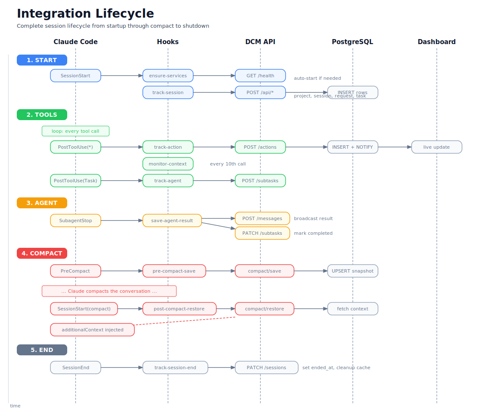

# Integration Guide

DCM integrates with Claude Code through its **hook system**, intercepting session lifecycle events to track tool usage, manage compact recovery, share agent results, and proactively monitor context size. This guide covers every aspect of the integration: installation, hook behavior, data flow, CLI usage, and troubleshooting.

---

## Table of Contents

- [Overview](#overview)
- [Prerequisites](#prerequisites)
- [Installation Modes](#installation-modes)
  - [Plugin Mode (Recommended)](#plugin-mode-recommended)
  - [Global Hooks Mode](#global-hooks-mode)
- [Auto-Start](#auto-start)
- [Hook Reference Table](#hook-reference-table)
- [Hook Details](#hook-details)
  - [ensure-services.sh](#ensure-servicessh)
  - [track-session.sh](#track-sessionsh)
  - [track-action.sh](#track-actionsh)
  - [track-agent.sh](#track-agentsh)
  - [monitor-context.sh](#monitor-contextsh)
  - [pre-compact-save.sh](#pre-compact-savesh)
  - [post-compact-restore.sh](#post-compact-restoresh)
  - [save-agent-result.sh](#save-agent-resultsh)
  - [track-session-end.sh](#track-session-endsh)
- [Complete Data Flow](#complete-data-flow)
- [Plugin Structure](#plugin-structure)
- [DCM CLI](#dcm-cli)
- [Environment Variables](#environment-variables)
- [Troubleshooting](#troubleshooting)

---

## Overview

Claude Code exposes five hook event types that fire at specific points during a session. DCM registers shell scripts against each event to build a persistent record of everything that happens:

| Event Type | When It Fires | DCM Purpose |
|------------|---------------|-------------|
| `SessionStart` | Session begins (startup or post-compact) | Auto-start services, register session, restore context |
| `PostToolUse` | After every tool invocation | Track actions, track agent spawns, monitor transcript size |
| `PreCompact` | Before conversation compaction (auto or manual) | Save context snapshot |
| `SubagentStop` | After a subagent finishes | Broadcast result, mark subtask completed |
| `SessionEnd` | Session terminates | Mark session ended, clean up cache |

All hooks follow a **fire-and-forget** pattern: short connect timeouts, bounded execution times, errors silently ignored. They never block Claude Code.

---

## Prerequisites

- **PostgreSQL 16+** running and accessible
- **Bun** runtime installed (for the API and WebSocket servers)
- **jq** installed on the host (`sudo apt install jq` or `brew install jq`)
- **curl** available in PATH
- **Claude Code** installed and configured

---

## Installation Modes

DCM offers two ways to register its hooks with Claude Code. Both produce the same result: nine hook scripts responding to five event types.

### Plugin Mode (Recommended)

The plugin approach uses Claude Code's auto-discovery mechanism. Hook script paths resolve automatically through the `${CLAUDE_PLUGIN_ROOT}` variable, so no hard-coded absolute paths are needed.

**How it works.** Claude Code scans for `.claude-plugin/plugin.json` manifests and loads the corresponding `hooks/hooks.json` file. All hook definitions use `${CLAUDE_PLUGIN_ROOT}` as a path prefix, which Claude Code replaces with the actual plugin directory at runtime.

**Installation:**

```bash
# From the Claude Code plugin marketplace
/plugin marketplace add /path/to/Claude-DCM
/plugin install dcm@dcm-marketplace
```

Once installed, Claude Code discovers all hooks automatically. No manual editing of `settings.json` is required.

**When to use plugin mode:**
- You want Claude Code to manage hook lifecycle automatically.
- You want zero-touch setup with no changes to `~/.claude/settings.json`.
- You run multiple projects and prefer isolated plugin management.

### Global Hooks Mode

The global approach injects hook definitions directly into `~/.claude/settings.json` using the `setup-hooks.sh` script. Hook commands reference absolute paths to the scripts on disk.

**Installation:**

```bash
cd context-manager
bash scripts/setup-hooks.sh
```

The script performs these steps:

1. Verifies that `jq` is installed.
2. Creates `~/.claude/settings.json` if it does not exist.
3. Checks whether DCM hooks are already present. If so, exits unless `--force` is passed.
4. Backs up the current settings file to `~/.claude/settings.json.bak.<timestamp>`.
5. Builds the complete hook configuration with absolute paths to every hook script.
6. Merges the hooks into existing settings using jq. The merge strategy strips any pre-existing DCM entries (matched by script name regex) before appending the new ones, preventing duplicates.
7. Validates the resulting JSON. If validation fails, the backup is restored automatically.

**Force re-injection** (after updating DCM):

```bash
bash scripts/setup-hooks.sh --force
```

**Remove hooks:**

```bash
# Via setup script
./dcm unhook

# Manual restore
cp ~/.claude/settings.json.bak.<timestamp> ~/.claude/settings.json
```

**When to use global mode:**
- You need fine-grained control over hook configuration.
- You want to customize individual timeouts or matchers.
- You prefer explicit management of `~/.claude/settings.json`.

After any hook change in either mode, **restart Claude Code** for the new configuration to take effect.

---

## Auto-Start

Starting with DCM v2.1.0, the `ensure-services.sh` hook automatically launches the DCM API and WebSocket servers when a Claude Code session starts. This eliminates the need to manually run `dcm start` before using Claude Code.

**How it works.** The hook is registered under `SessionStart` with the `startup` matcher. It runs before `track-session.sh` (which depends on the API being available). On every session start:

1. **Health check** -- Calls `GET /health` on the API. If the response contains `"healthy"`, the hook exits immediately (services already running).
2. **PostgreSQL check** -- Runs `pg_isready` to verify the database is accessible. If PostgreSQL is down, the hook exits with a warning and does not attempt to start services.
3. **Lock acquisition** -- Creates `/tmp/.dcm-autostart.lock` to prevent race conditions when multiple Claude Code sessions start simultaneously. A stale lock older than 30 seconds is automatically removed.
4. **Service launch** -- Starts the API server (`bun run src/server.ts`) and WebSocket server (`bun run src/websocket-server.ts`) as background processes via `nohup`. PIDs are written to `/tmp/.dcm-pids/`.
5. **Readiness wait** -- Polls the health endpoint for up to 5 seconds until the API responds as healthy.

**Configuration.** The hook reads its configuration from the `.env` file (if present) and the following environment variables:

| Variable | Default | Description |
|----------|---------|-------------|
| `PORT` | `3847` | API server port |
| `WS_PORT` | `3849` | WebSocket server port |
| `DB_USER` | `dcm` | PostgreSQL user |
| `DB_NAME` | `claude_context` | PostgreSQL database name |
| `DB_HOST` | `127.0.0.1` | PostgreSQL host |
| `DB_PORT` | `5432` | PostgreSQL port |

**Logs.** Service output is written to `/tmp/dcm-api.log` and `/tmp/dcm-ws.log`. If the API does not become healthy within 5 seconds, a warning is emitted to stderr.

**Idempotency.** The hook is fully idempotent. Running it when services are already up adds no overhead beyond a single health check (1-2 second timeout).

---

## Hook Reference Table

Every hook script registered by DCM, listed in execution order within each event type:

| Script | Event | Matcher | Timeout | Description |
|--------|-------|---------|---------|-------------|
| `ensure-services.sh` | SessionStart | `startup` | 10s | Auto-starts DCM API and WebSocket if not running |
| `track-session.sh` | SessionStart | `startup` | 5s | Creates project/session/request/task hierarchy |
| `post-compact-restore.sh` | SessionStart | `compact` | 8s | Restores context after conversation compaction |
| `track-action.sh` | PostToolUse | `*` | 3s | Records every tool invocation to the API |
| `track-agent.sh` | PostToolUse | `Task` | 3s | Tracks Task tool spawns as subtasks |
| `monitor-context.sh` | PostToolUse | `*` | 2s | Proactive transcript size monitoring (every 10th call) |
| `pre-compact-save.sh` | PreCompact | `auto` | 5s | Saves context snapshot before auto-compact |
| `pre-compact-save.sh` | PreCompact | `manual` | 5s | Saves context snapshot before manual `/compact` |
| `save-agent-result.sh` | SubagentStop | -- | 3s | Broadcasts agent results, marks subtask completed |
| `track-session-end.sh` | SessionEnd | -- | 3s | Marks session ended, cleans up cache files |

---

## Hook Details

### ensure-services.sh

**Event:** SessionStart (matcher: `startup`)
**Timeout:** 10 seconds
**Purpose:** Auto-start DCM services if they are not already running.

This hook guarantees that the DCM API and WebSocket server are available before any other hook attempts to call them. It is the first hook to fire on session startup.

**Execution flow:**

```
SessionStart(startup)
  |
  +-- Quick health check: GET /health
  |     \-- If healthy -> exit 0 (nothing to do)
  |
  +-- Lock: /tmp/.dcm-autostart.lock
  |     \-- If locked < 30s -> poll health for 5s -> exit
  |     \-- If locked > 30s -> stale, remove and proceed
  |
  +-- PostgreSQL: pg_isready
  |     \-- If not ready -> warn on stderr -> exit 0
  |
  +-- Start API: nohup bun run src/server.ts
  +-- Start WS:  nohup bun run src/websocket-server.ts
  |
  +-- Poll health for up to 5s
  |     \-- If healthy -> log success on stderr
  |     \-- If timeout -> log warning on stderr
  |
  \-- Release lock (trap on EXIT)
```

**Race condition handling.** When multiple Claude Code sessions start at the same time, only the first acquires the lock. Others wait up to 5 seconds for the API to become healthy, then proceed regardless.

**Temporary files:**

| File | Purpose |
|------|---------|
| `/tmp/.dcm-autostart.lock` | Prevents concurrent auto-starts |
| `/tmp/.dcm-pids/api.pid` | API server process ID |
| `/tmp/.dcm-pids/ws.pid` | WebSocket server process ID |
| `/tmp/dcm-api.log` | API server stdout/stderr |
| `/tmp/dcm-ws.log` | WebSocket server stdout/stderr |

---

### track-session.sh

**Event:** SessionStart (matcher: `startup`)
**Timeout:** 5 seconds
**Purpose:** Initialize the full resource hierarchy for a new session.

This hook fires once per session start and creates the entire chain of resources that other hooks depend on. It runs after `ensure-services.sh` has confirmed the API is available.

**Resource creation order:**

1. **Project** -- Created or fetched by filesystem path via `POST /api/projects`.
2. **Session** -- Registered with the Claude Code session ID via `POST /api/sessions`.
3. **Request** -- Initial request record with `prompt_type: "other"` via `POST /api/requests`.
4. **Task** -- Wave 0 task in `running` status via `POST /api/tasks`.

**ID caching.** All resource IDs are written to `/tmp/.claude-context/{session_id}.json` so that subsequent hooks (`track-agent.sh`, `pre-compact-save.sh`, `save-agent-result.sh`) can locate them without extra API calls.

**Cache file format:**

```json
{
  "session_id": "abc-123",
  "project_id": "uuid-...",
  "request_id": "uuid-...",
  "task_id": "uuid-...",
  "created_at": "2025-01-15T10:30:00+00:00"
}
```

**Idempotency.** If the cache file already exists for the session, the hook exits immediately without creating duplicate resources.

---

### track-action.sh

**Event:** PostToolUse (matcher: `*`)
**Timeout:** 3 seconds
**Purpose:** Record every tool invocation in the DCM database.

This hook fires after every tool call Claude makes. It classifies the tool, resolves an effective name, and sends the data to the API.

**Tool type detection:**

| Type | Matched Tools |
|------|---------------|
| `builtin` | Read, Write, Edit, MultiEdit, Bash, Glob, Grep, NotebookEdit, WebFetch, WebSearch, EnterPlanMode, ExitPlanMode, AskUserQuestion, TaskCreate, TaskUpdate, TaskGet, TaskList, TaskOutput, TaskStop, ToolSearch, and all unrecognized tools |
| `agent` | Task |
| `skill` | Skill |
| `mcp` | Any tool prefixed with `mcp__` |

**Effective name resolution.** For `Skill` tools, the hook extracts the skill name from `tool_input.skill`. For `Task` tools, it uses `tool_input.subagent_type`. This means the API receives the specific agent or skill name (e.g., `backend-laravel`, `clean-code`) rather than a generic tool label.

**API payload:**

```
POST /api/actions
{
  "tool_name": "<effective name>",
  "tool_type": "builtin | agent | skill | mcp",
  "input": "<tool_input, truncated to 2 KB>",
  "exit_code": 0,
  "session_id": "<session_id>",
  "project_path": "<cwd>"
}
```

Sessions and projects are auto-created by the API if they do not exist yet (upsert behavior). Timeouts: 1-second connect, 2-second max for the request.

---

### track-agent.sh

**Event:** PostToolUse (matcher: `Task`)
**Timeout:** 3 seconds
**Purpose:** Create a subtask entry when an agent is spawned via the Task tool.

This hook fires only for Task tool calls. It represents each spawned agent as a subtask within the session's task hierarchy.

**Initialization chain.** If no task exists for the current session (e.g., `track-session.sh` did not run or the cache was lost), the hook auto-creates the full hierarchy:

1. Finds or creates a project from the current working directory.
2. Creates a request with `prompt_type: "other"`.
3. Creates a task in `running` status.
4. Caches the resulting `task_id` in `/tmp/.claude-context/{session_id}.json`.

**Subtask creation.** Once a `task_id` is available:

```
POST /api/subtasks
{
  "task_id": "<cached or resolved task_id>",
  "agent_type": "<from tool_input.subagent_type>",
  "agent_id": "agent-<timestamp>-<random hex>",
  "description": "<from tool_input.description, max 500 chars>",
  "status": "running" | "completed"
}
```

**Status logic.** If `tool_input.run_in_background` is `true`, the subtask is created with status `running` (it will be updated later by `save-agent-result.sh`). Otherwise it is created with status `completed` (synchronous agent call).

---

### monitor-context.sh

**Event:** PostToolUse (matcher: `*`)
**Timeout:** 2 seconds
**Purpose:** Proactively monitor transcript size and trigger snapshots before auto-compact.

This hook fires on every tool use but only performs a full check every 10th invocation to minimize overhead.

**Counter mechanism.** A persistent counter lives in `/tmp/.dcm-monitor-counter`. On each invocation the hook increments the counter and exits immediately unless the count is a multiple of 10.

**Transcript size thresholds.** On every 10th call, the hook measures the transcript file size:

| Zone | Threshold | Action |
|------|-----------|--------|
| Green | Under 500 KB | No action |
| Yellow | 500 KB -- 800 KB | Logs a warning to `/tmp/dcm-monitor.log` |
| Red | Over 800 KB | Triggers a proactive context snapshot |

**Proactive snapshot.** In the red zone, the hook calls `POST /api/compact/save` with `trigger: "proactive"` and a context summary extracted from the last 50 lines of the transcript (capped at 500 characters). This ensures that if Claude auto-compacts shortly after, `post-compact-restore.sh` has fresh data to restore from.

**Cooldown.** A 60-second cooldown prevents repeated snapshots. The timestamp of the last proactive snapshot is stored in `/tmp/.dcm-last-proactive`. If fewer than 60 seconds have elapsed, the hook skips the save.

**Temporary files:**

| File | Purpose |
|------|---------|
| `/tmp/.dcm-monitor-counter` | Invocation counter |
| `/tmp/.dcm-last-proactive` | Timestamp of last proactive snapshot |
| `/tmp/dcm-monitor.log` | Warnings, alerts, and error messages |

---

### pre-compact-save.sh

**Event:** PreCompact (matcher: `auto`, `manual`)
**Timeout:** 5 seconds
**Purpose:** Save a complete context snapshot before Claude compacts the conversation.

This hook fires for both automatic compaction (when the transcript grows too large) and manual compaction (when the user types `/compact`). It gathers state from multiple sources and posts a consolidated snapshot.

**Data gathered:**

1. **Active tasks** -- `GET /api/subtasks?status=running&limit=20`
2. **Modified files** -- `GET /api/actions?limit=50&session_id=...` then filters for Edit and Write actions to extract file paths.
3. **Agent states** -- `GET /api/agent-contexts?limit=20`
4. **Context summary** -- Reads the last 50 lines of the transcript file and extracts assistant messages (capped at 500 characters).
5. **Cached project ID** -- Reads from `/tmp/.claude-context/{session_id}.json`.

**API payload:**

```
POST /api/compact/save
{
  "session_id": "<session_id>",
  "trigger": "auto" | "manual",
  "context_summary": "<extracted from transcript>",
  "active_tasks": [...],
  "modified_files": [...],
  "key_decisions": [...],
  "agent_states": [...]
}
```

Timeouts: 1-second connect, 3-second max for the save request. Errors are silently ignored.

---

### post-compact-restore.sh

**Event:** SessionStart (matcher: `compact`)
**Timeout:** 8 seconds
**Purpose:** Restore context after Claude compacts the conversation.

This is the counterpart to `pre-compact-save.sh`. It fires when a session resumes after compaction and injects essential context back into the conversation.

**Restore strategy (two-tier):**

1. **Full restore** -- `POST /api/compact/restore` with `session_id`, `agent_id: "orchestrator"`, `agent_type: "orchestrator"`, and `max_tokens: 3000`. The server generates a comprehensive context brief from the saved snapshot plus recent activity.
2. **Fallback** -- If the first call returns no brief, the hook tries `GET /api/compact/snapshot/{session_id}` and builds a minimal brief locally from the raw snapshot data (active tasks, modified files, agent states, key decisions).

**Context injection.** If a brief is obtained, the hook writes JSON to stdout in the format Claude Code expects:

```json
{
  "hookSpecificOutput": {
    "hookEventName": "SessionStart",
    "additionalContext": "<restored context brief>"
  }
}
```

Claude Code reads this output and injects the `additionalContext` string into the conversation. The model sees the restored state immediately after compact, preventing loss of critical session state.

If neither restore call succeeds, the hook exits silently and Claude continues without injected context.

Timeouts: 2-second connect, 5-second max for the restore call, 3-second max for the snapshot fallback.

---

### save-agent-result.sh

**Event:** SubagentStop (matcher: none / all)
**Timeout:** 3 seconds
**Purpose:** Broadcast agent results for cross-agent sharing and mark subtasks as completed.

This hook fires after a subagent finishes execution. It reads the transcript to extract the agent's output and performs two actions in parallel.

**Data extraction.** The hook reads the transcript file (JSONL format) to find:
- The last Task tool result (the subagent's output, capped at 1000 characters then truncated to 500 for storage).
- The last Task tool call to identify the `agent_type` and `description`.

**Action 1 -- Broadcast message:**

```
POST /api/messages
{
  "from_agent_id": "<agent_type>",
  "to_agent_id": null,
  "message_type": "agent.completed",
  "topic": "agent.completed",
  "payload": {
    "agent_type": "<agent_type>",
    "description": "<task description>",
    "result_summary": "<truncated result>"
  },
  "priority": 3
}
```

This makes the result available to other agents through the messaging API and WebSocket server.

**Action 2 -- Update subtask:**

1. Queries `GET /api/subtasks?agent_type=...&status=running&limit=1` to find the matching subtask.
2. Calls `PATCH /api/subtasks/{id}` with `status: "completed"` and the result summary.

Both requests fire in parallel via background processes and complete independently. Timeouts: 1-second connect, 2-second max per request.

---

### track-session-end.sh

**Event:** SessionEnd (matcher: none / all)
**Timeout:** 3 seconds
**Purpose:** Mark the session as ended and clean up temporary files.

This hook fires when Claude Code terminates a session.

**What it does:**

1. Extracts `session_id` from stdin JSON. If unavailable, falls back to the most recent cache file in `/tmp/.claude-context/`.
2. Calls `PATCH /api/sessions/{session_id}` with `ended_at` set to the current UTC timestamp.
3. Removes the session cache file (`/tmp/.claude-context/{session_id}.json`).

---

## Complete Data Flow

```
Claude Code Session Lifecycle
==========================================================================

[1] SESSION START
    |
    | SessionStart(startup) fires
    |
    +-- ensure-services.sh               [timeout: 10s]
    |     +-- GET /health
    |     |     \-- If healthy -> exit (services already up)
    |     +-- pg_isready
    |     |     \-- If down -> warn, exit
    |     +-- nohup bun run src/server.ts        -> /tmp/dcm-api.log
    |     +-- nohup bun run src/websocket-server.ts -> /tmp/dcm-ws.log
    |     \-- Poll /health until ready (max 5s)
    |
    +-- track-session.sh                  [timeout: 5s]
    |     +-- POST /api/projects    (find or create project by path)
    |     +-- POST /api/sessions    (register session ID)
    |     +-- POST /api/requests    (initial request, prompt_type: "other")
    |     +-- POST /api/tasks       (wave 0 task, status: running)
    |     \-- Cache IDs -> /tmp/.claude-context/{session_id}.json
    |
    v
[2] TOOL USAGE (repeats for every tool call)
    |
    | PostToolUse(*) fires
    |
    +-- track-action.sh                   [timeout: 3s]
    |     \-- POST /api/actions
    |           { tool_name, tool_type, input (2KB), session_id, project_path }
    |
    +-- track-agent.sh  (only for Task)   [timeout: 3s]
    |     +-- Read task_id from cache (or auto-create hierarchy)
    |     \-- POST /api/subtasks
    |           { task_id, agent_type, agent_id, description, status }
    |
    +-- monitor-context.sh                [timeout: 2s]
    |     +-- Increment /tmp/.dcm-monitor-counter
    |     +-- Every 10th call: check transcript size
    |     |     +-- < 500KB  -> green, do nothing
    |     |     +-- 500-800KB -> yellow, log warning
    |     |     \-- > 800KB  -> red, trigger proactive snapshot
    |     \-- Proactive: POST /api/compact/save (trigger: proactive)
    |           (60s cooldown via /tmp/.dcm-last-proactive)
    |
    \-- Server-side effects:
          +-- Row inserted in PostgreSQL
          +-- Session counters updated
          +-- Keywords extracted for routing intelligence
          \-- NOTIFY -> WebSocket server -> Dashboard
    |
    v
[3] SUBAGENT COMPLETES
    |
    | SubagentStop fires
    |
    \-- save-agent-result.sh              [timeout: 3s]
          +-- Read transcript for last Task result
          +-- POST /api/messages (topic: agent.completed)  [background]
          \-- PATCH /api/subtasks/{id} (status: completed) [background]
    |
    v
[4] COMPACT (auto or /compact)
    |
    | PreCompact(auto|manual) fires
    |
    +-- pre-compact-save.sh               [timeout: 5s]
    |     +-- GET /api/subtasks?status=running     (active tasks)
    |     +-- GET /api/actions?limit=50            (modified files)
    |     +-- GET /api/agent-contexts              (agent states)
    |     +-- Read last 50 lines of transcript     (context summary)
    |     \-- POST /api/compact/save               (full snapshot)
    |
    | ... Claude compacts the conversation ...
    |
    | SessionStart(compact) fires
    |
    \-- post-compact-restore.sh            [timeout: 8s]
          +-- POST /api/compact/restore
          |     { session_id, agent_id, agent_type, max_tokens: 3000 }
          +-- Fallback: GET /api/compact/snapshot/{session_id}
          \-- Output JSON to stdout:
                {
                  "hookSpecificOutput": {
                    "hookEventName": "SessionStart",
                    "additionalContext": "<restored brief>"
                  }
                }
                -> Claude sees restored context immediately
    |
    v
[5] SESSION END
    |
    | SessionEnd fires
    |
    \-- track-session-end.sh              [timeout: 3s]
          +-- PATCH /api/sessions/{id} (ended_at: now)
          \-- rm /tmp/.claude-context/{session_id}.json
```

### Sequence Diagram

<p align="center">
  
</p>

---

## Plugin Structure

When installed as a Claude Code plugin, DCM uses this directory layout:

```
context-manager/
  .claude-plugin/
    plugin.json             Plugin manifest
  hooks/
    hooks.json              Plugin-native hook definitions
    ensure-services.sh      Auto-start DCM services
    track-session.sh        Session initialization
    track-action.sh         Tool usage tracking
    track-agent.sh          Agent spawn tracking
    monitor-context.sh      Proactive context monitoring
    pre-compact-save.sh     Pre-compact snapshot
    post-compact-restore.sh Post-compact restore
    save-agent-result.sh    Agent result broadcasting
    track-session-end.sh    Session cleanup
  agents/
    context-keeper.md       Agent for manual context inspection
  src/
    server.ts               API server (Hono + Bun)
    websocket-server.ts     WebSocket server (Bun native)
    ...
```

### plugin.json

The plugin manifest declares the package identity:

```json
{
  "name": "dcm",
  "version": "2.1.0",
  "description": "Distributed Context Manager - Persistent context, cross-agent sharing, and compact recovery for Claude Code multi-agent sessions",
  "author": { "name": "DCM Project" },
  "repository": "https://github.com/ronylicha/Claude-DCM",
  "license": "MIT"
}
```

### hooks.json

The plugin hook definitions use `${CLAUDE_PLUGIN_ROOT}` so paths resolve automatically:

```json
{
  "hooks": {
    "SessionStart": [
      {
        "matcher": "startup",
        "hooks": [
          { "type": "command", "command": "bash ${CLAUDE_PLUGIN_ROOT}/hooks/ensure-services.sh", "timeout": 10 },
          { "type": "command", "command": "bash ${CLAUDE_PLUGIN_ROOT}/hooks/track-session.sh", "timeout": 5 }
        ]
      },
      {
        "matcher": "compact",
        "hooks": [
          { "type": "command", "command": "bash ${CLAUDE_PLUGIN_ROOT}/hooks/post-compact-restore.sh", "timeout": 8 }
        ]
      }
    ]
  }
}
```

### context-keeper Agent

The plugin also exposes the `context-keeper` agent, which can:
- Query DCM state for the current session
- Trigger manual context snapshots
- Display restored context on demand
- Check cross-agent message history

Invoke it from Claude Code when you need to inspect or manage DCM state manually.

---

## DCM CLI

The `dcm` wrapper script (`context-manager/dcm`) provides a single entry point for all DCM operations. Run it from the `context-manager/` directory or add it to your PATH.

```bash
cd context-manager
./dcm <command> [options]
```

### Commands

| Command | Description |
|---------|-------------|
| `install` | Full first-time setup: check prerequisites (bun, psql, jq, curl), install dependencies, configure `.env`, set up database, inject hooks |
| `start` | Start all DCM services (API on port 3847, WS on port 3849, Dashboard on port 3848) |
| `stop` | Stop all DCM services (by PID file, then by port as fallback) |
| `restart` | Stop then start all services |
| `status` | Show health status of API, WebSocket, Dashboard, PostgreSQL, and hook installation |
| `hooks [--force]` | Install or update Claude Code hooks (delegates to `scripts/setup-hooks.sh`) |
| `unhook` | Remove all DCM hooks from `~/.claude/settings.json` (backs up first) |
| `health` | Quick JSON health check against the API |
| `logs <service>` | Tail logs for a service: `api`, `ws`, or `dashboard` |
| `snapshot [session_id]` | Trigger a manual context snapshot. Uses the most recent cached session if no ID is provided |
| `context [agent_id] [session_id]` | Get the context brief for an agent. Defaults to `orchestrator` if no agent ID is given |
| `db:setup` | Initialize the database schema |
| `db:reset` | Drop and recreate the database (prompts for confirmation) |
| `version` | Print DCM version (currently v2.1.0) |

### Examples

```bash
./dcm install                        # First-time setup (deps + db + hooks)
./dcm start                          # Start all services
./dcm status                         # Check what is running
./dcm health                         # Raw JSON health check
./dcm context backend-laravel        # Get context brief for an agent
./dcm snapshot abc-123               # Manual snapshot for a specific session
./dcm logs api                       # Tail API server logs
./dcm hooks --force                  # Re-inject hooks after DCM update
./dcm unhook                         # Remove all DCM hooks
./dcm db:reset                       # Drop and recreate database
```

---

## Environment Variables

### Hook Configuration

| Variable | Default | Used By | Description |
|----------|---------|---------|-------------|
| `CONTEXT_MANAGER_URL` | `http://127.0.0.1:3847` | All hooks except `ensure-services.sh` | Base URL for API calls |
| `CLAUDE_PLUGIN_ROOT` | (auto-set by Claude Code) | Plugin mode only | Resolved to the plugin install directory |

### Service Configuration (ensure-services.sh and dcm CLI)

| Variable | Default | Description |
|----------|---------|-------------|
| `PORT` | `3847` | API server port |
| `WS_PORT` | `3849` | WebSocket server port |
| `DASHBOARD_PORT` | `3848` | Dashboard port (CLI only) |
| `DB_USER` | `dcm` | PostgreSQL username |
| `DB_NAME` | `claude_context` | PostgreSQL database name |
| `DB_HOST` | `127.0.0.1` | PostgreSQL host |
| `DB_PORT` | `5432` | PostgreSQL port |

### Setting a Custom API URL

If the DCM API runs on a non-default host or port, set `CONTEXT_MANAGER_URL` in your shell profile:

```bash
export CONTEXT_MANAGER_URL="http://192.168.1.50:3847"
```

All hooks read this variable at runtime. For the `ensure-services.sh` hook, configure the `PORT` and `WS_PORT` variables in the `.env` file instead (it manages service startup directly).

---

## Troubleshooting

### Services not starting automatically

If `ensure-services.sh` does not launch the services on session start:

1. **Check PostgreSQL:** The hook requires PostgreSQL to be running. Verify: `pg_isready -h 127.0.0.1 -p 5432 -U dcm`
2. **Check the lock file:** A stale lock at `/tmp/.dcm-autostart.lock` (older than 30 seconds) should be auto-removed, but you can delete it manually: `rm -f /tmp/.dcm-autostart.lock`
3. **Check logs:** Review `/tmp/dcm-api.log` and `/tmp/dcm-ws.log` for startup errors.
4. **Check the .env file:** Ensure `context-manager/.env` has correct database credentials.
5. **Check Bun:** Verify Bun is installed and in PATH: `bun --version`

### Hooks not sending data

1. Verify the API is running: `curl http://localhost:3847/health`
2. Check that hook scripts are executable: `ls -la context-manager/hooks/*.sh`
3. Run a hook manually to see errors:
   ```bash
   echo '{"tool_name":"Read","tool_input":{},"session_id":"test","cwd":"/tmp"}' | \
     bash context-manager/hooks/track-action.sh 0
   ```
4. Confirm jq is installed: `jq --version`
5. If using global mode, verify hooks are in `~/.claude/settings.json`:
   ```bash
   jq '.hooks' ~/.claude/settings.json
   ```

### Actions appear in the API but not on the dashboard

The dashboard receives events through the WebSocket server. Verify the WebSocket process is running and that PostgreSQL LISTEN/NOTIFY is functioning:

```bash
# Check WebSocket server
lsof -i :3849

# Check via health endpoint
curl -s http://localhost:3847/health | jq .websocket

# Test WebSocket connection
npx wscat -c ws://localhost:3849
```

### Agent subtasks not tracked

`track-agent.sh` only fires for `Task` tool calls. Check:

1. The matcher in settings.json is `"Task"` (case-sensitive).
2. The cache directory `/tmp/.claude-context/` exists and is writable.
3. The Task tool input includes `subagent_type` (required for subtask creation).

### Context not restored after compact

1. Verify `pre-compact-save.sh` ran before compact. Check for a snapshot:
   ```bash
   curl http://localhost:3847/api/compact/snapshot/<session_id>
   ```
2. Confirm `post-compact-restore.sh` is registered under `SessionStart` with matcher `"compact"`.
3. Test the restore endpoint directly:
   ```bash
   curl -s -X POST http://localhost:3847/api/compact/restore \
     -H "Content-Type: application/json" \
     -d '{"session_id":"<session_id>","agent_id":"orchestrator","agent_type":"orchestrator","max_tokens":3000}'
   ```
4. If the API returns no brief, the snapshot may not have been saved. Check `/tmp/dcm-monitor.log` for errors.

### Monitor hook not triggering snapshots

The monitor only runs a full check every 10th tool call. Verify it is counting:

```bash
cat /tmp/.dcm-monitor-counter
```

If the counter is not incrementing, the hook is not receiving input. Check that the PostToolUse matcher is set to `"*"` for `monitor-context.sh`.

The 60-second cooldown may also prevent repeated snapshots. Check the last trigger time:

```bash
cat /tmp/.dcm-last-proactive
```

Review the monitor log:

```bash
cat /tmp/dcm-monitor.log
```

### Agent results not shared

`save-agent-result.sh` fires on SubagentStop. It reads the transcript file to find the last Task tool result. If the transcript is not accessible or contains no Task results, the hook exits silently. Verify:

1. The hook is registered under `SubagentStop` in settings.json or hooks.json.
2. The transcript path is valid and readable.
3. The transcript contains Task tool entries (JSONL with `type: "tool_result"` and `tool_name: "Task"`).

### Resetting all temporary state

To clear all DCM hook state and start fresh:

```bash
rm -rf /tmp/.claude-context/
rm -f /tmp/.dcm-monitor-counter
rm -f /tmp/.dcm-last-proactive
rm -f /tmp/.dcm-autostart.lock
rm -rf /tmp/.dcm-pids/
rm -f /tmp/dcm-monitor.log
```

This does not affect data stored in PostgreSQL. To reset the database as well:

```bash
./dcm db:reset
```
