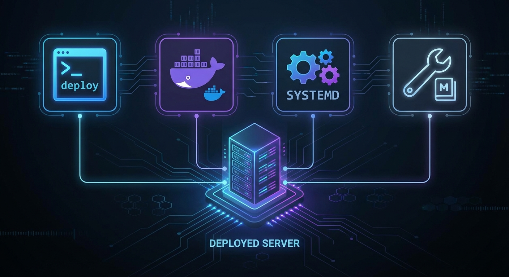

# How to Deploy DCM



Four methods for deploying the Distributed Context Manager, from simplest to most robust.

---

## Method 1 -- DCM CLI (recommended for development)

The `dcm` CLI script manages the full lifecycle: install, start, stop, status.

### Install and start

```bash
cd Claude-DCM/context-manager
./dcm install
./dcm start
```

### Verify

```bash
./dcm status
```

### Stop

```bash
./dcm stop
```

### Where things live

| Artifact | Location |
|----------|----------|
| PID files | `/tmp/.dcm-pids/api.pid`, `ws.pid`, `dashboard.pid` |
| API logs | `/tmp/dcm-api.log` |
| WebSocket logs | `/tmp/dcm-ws.log` |
| Dashboard logs | `/tmp/dcm-dashboard.log` |
| Lock file | `/tmp/.dcm-autostart.lock` |

### Auto-start on session

DCM can start automatically when a Claude Code session begins. The `ensure-services.sh` hook fires on `SessionStart` and launches services if they are not already running.

For this to work, PostgreSQL must be available at boot:

```bash
sudo systemctl enable postgresql
```

---

## Method 2 -- Docker Compose

Docker Compose brings up all four services (PostgreSQL, API, WebSocket, Dashboard) in containers.

### Configure

Create a `.env` file at the project root:

```bash
cd Claude-DCM
cat > .env << 'EOF'
DB_USER=dcm
DB_PASSWORD=your_secure_password_here
WS_AUTH_SECRET=$(openssl rand -hex 32)
EOF
```

Generate the HMAC secret separately and paste it in:

```bash
openssl rand -hex 32
```

### Start

```bash
docker compose up -d
```

### Verify

```bash
curl http://localhost:3847/health | jq .
```

### Services overview

| Container | Image | Port | Role |
|-----------|-------|------|------|
| `postgres` | postgres:16-alpine | 5432 | Database with auto-schema init |
| `dcm-api` | oven/bun:1 (built) | 3847 | REST API |
| `dcm-ws` | oven/bun:1 (built) | 3849 | WebSocket server |
| `dcm-dashboard` | node:22-alpine (built) | 3848 | Next.js dashboard |

PostgreSQL schema is applied automatically on first boot via the `docker-entrypoint-initdb.d` mount.

### Hooks with Docker

Docker only starts the servers. You still need to configure Claude Code hooks separately:

```bash
cd context-manager
./dcm hooks
```

### Stop

```bash
# Stop services (data persists in the pgdata volume)
docker compose down

# Stop and remove all data
docker compose down -v
```

### Custom port mapping

Override default ports via environment variables:

```bash
PORT=4847 WS_PORT=4849 DASHBOARD_PORT=4848 docker compose up -d
```

---

## Method 3 -- Systemd (recommended for production)

Three unit files provide security hardening, memory limits, automatic restarts, and journal logging.

### Unit file overview

| Unit | Memory limit | Restart policy | Depends on |
|------|-------------|----------------|------------|
| `context-manager-api.service` | 512 MB | on-failure | postgresql.service |
| `context-manager-ws.service` | 128 MB | on-failure | context-manager-api |
| `context-dashboard.service` | 4 GB | always | context-manager-api |

### Install

Before copying, edit the unit files to match your system. The defaults assume:

- Working directory: `/home/rony/.claude/services/context-manager`
- User: `rony`
- Bun binary path from nvm

The dashboard unit uses `ExecStartPre=next build` to build before launch, `ExecStart=next start` for production mode, and `NODE_ENV=production`. The `MemoryMax` for the dashboard is set to 4G to accommodate the build step.

Adjust `WorkingDirectory`, `ExecStart`, `EnvironmentFile`, and `User` as needed.

```bash
# Copy unit files
sudo cp context-manager/context-manager-api.service /etc/systemd/system/
sudo cp context-manager/context-manager-ws.service /etc/systemd/system/
sudo cp context-dashboard/context-dashboard.service /etc/systemd/system/

# Reload, enable, and start
sudo systemctl daemon-reload
sudo systemctl enable --now context-manager-api context-manager-ws context-dashboard
```

### Manage

```bash
# Check status
sudo systemctl status context-manager-api

# View logs (follow mode)
sudo journalctl -u context-manager-api -f

# Restart one service
sudo systemctl restart context-manager-api

# Stop everything
sudo systemctl stop context-manager-api context-manager-ws context-dashboard
```

### Security hardening

The unit files include these restrictions by default:

- `NoNewPrivileges=true`
- `ProtectSystem=strict`
- `PrivateTmp=true`
- `NODE_ENV=production` (dashboard unit)
- Memory limits via `MemoryMax` (4G for dashboard, 512 MB for API, 128 MB for WebSocket)

---

## Method 4 -- Manual

Run each service directly for debugging or custom setups.

### Terminal 1 -- API server

```bash
cd Claude-DCM/context-manager
bun run src/server.ts
```

### Terminal 2 -- WebSocket server

```bash
cd Claude-DCM/context-manager
bun run src/websocket-server.ts
```

### Terminal 3 -- Dashboard

```bash
cd Claude-DCM/context-dashboard
npm install
npm run build
npm start   # runs next start (production mode)
```

### Background mode (without systemd)

```bash
cd Claude-DCM/context-manager
nohup bun run src/server.ts > /tmp/dcm-api.log 2>&1 &
nohup bun run src/websocket-server.ts > /tmp/dcm-ws.log 2>&1 &
```

---

## Environment Variable Configuration

All configuration is done through `context-manager/.env`. Bun loads it automatically at startup.

Copy the example file:

```bash
cp context-manager/.env.example context-manager/.env
```

See the full [Environment Variables Reference](../reference/environment-variables.md) for every available setting.

### Minimum required configuration

```bash
DB_USER=dcm
DB_PASSWORD=your_secure_password
```

### Recommended for production

```bash
DB_USER=dcm
DB_PASSWORD=strong_random_password
WS_AUTH_SECRET=output_of_openssl_rand_hex_32
NODE_ENV=production
HOST=127.0.0.1
```

---

## Production Checklist

Before running DCM in a production environment, verify the following:

### Database

- [ ] PostgreSQL 16+ is running with `systemctl enable postgresql`
- [ ] Database `claude_context` exists with schema applied
- [ ] `DB_USER` and `DB_PASSWORD` are set in `.env`
- [ ] Connection pooling is configured (`DB_MAX_CONNECTIONS=10` or higher)
- [ ] Regular backups are scheduled

### Security

- [ ] `WS_AUTH_SECRET` is set to a strong random value (`openssl rand -hex 32`)
- [ ] `NODE_ENV=production` is set (enforces WebSocket authentication)
- [ ] `HOST=127.0.0.1` (do not bind to `0.0.0.0` unless behind a reverse proxy)
- [ ] `ALLOWED_ORIGINS` is set to your dashboard URL only
- [ ] Firewall restricts access to ports 3847, 3848, 3849

### Monitoring

- [ ] Health check is accessible: `curl http://127.0.0.1:3847/health`
- [ ] Logs are being written (check `/tmp/dcm-api.log` or `journalctl`)
- [ ] Dashboard is accessible at `http://localhost:3848`

### Hooks

- [ ] Claude Code hooks are installed: `./dcm status` shows "hooks: installed"
- [ ] Hook scripts are executable: `ls -la context-manager/hooks/*.sh`

---

## How to Update / Upgrade

### CLI or manual deployment

```bash
cd Claude-DCM

# Pull latest changes
git pull origin main

# Update dependencies
cd context-manager
bun install

# Apply any new migrations
psql -U dcm -d claude_context -h 127.0.0.1 -f src/db/schema.sql

# Restart services
./dcm restart

# Re-install hooks (picks up new hook scripts)
./dcm hooks
```

### Docker deployment

```bash
cd Claude-DCM
git pull origin main

# Rebuild and restart containers
docker compose down
docker compose build --no-cache
docker compose up -d
```

### Systemd deployment

```bash
cd Claude-DCM
git pull origin main
cd context-manager
bun install

# Apply schema
psql -U dcm -d claude_context -h 127.0.0.1 -f src/db/schema.sql

# Restart services
sudo systemctl restart context-manager-api context-manager-ws context-dashboard
```

### Database migrations

New schema additions use `CREATE TABLE IF NOT EXISTS` and `CREATE INDEX IF NOT EXISTS`, making the schema file idempotent. Re-running `schema.sql` is safe:

```bash
psql -U dcm -d claude_context -h 127.0.0.1 -f context-manager/src/db/schema.sql
```

For specific migrations (added between releases), check the `src/db/migrations/` directory:

```bash
ls context-manager/src/db/migrations/
```

Apply individual migrations in order:

```bash
psql -U dcm -d claude_context -h 127.0.0.1 -f context-manager/src/db/migrations/003_proactive_triage.sql
```

---

## Uninstall

### Step 1 -- Remove hooks

```bash
./dcm unhook
```

### Step 2 -- Stop services

```bash
# CLI mode
./dcm stop

# Docker mode
docker compose down -v

# Systemd mode
sudo systemctl stop context-manager-api context-manager-ws context-dashboard
sudo systemctl disable context-manager-api context-manager-ws context-dashboard
sudo rm /etc/systemd/system/context-manager-*.service /etc/systemd/system/context-dashboard.service
sudo systemctl daemon-reload
```

### Step 3 -- Clean up temporary files

```bash
rm -rf /tmp/.dcm-pids /tmp/.dcm-autostart.lock /tmp/.dcm-monitor-counter /tmp/.dcm-last-proactive
rm -f /tmp/dcm-api.log /tmp/dcm-ws.log /tmp/dcm-dashboard.log
rm -rf /tmp/.claude-context/
```

### Step 4 -- Remove database (optional)

```bash
psql -U postgres -c "DROP DATABASE IF EXISTS claude_context;"
psql -U postgres -c "DROP USER IF EXISTS dcm;"
```

### Step 5 -- Remove the repository

```bash
rm -rf /path/to/Claude-DCM
```
