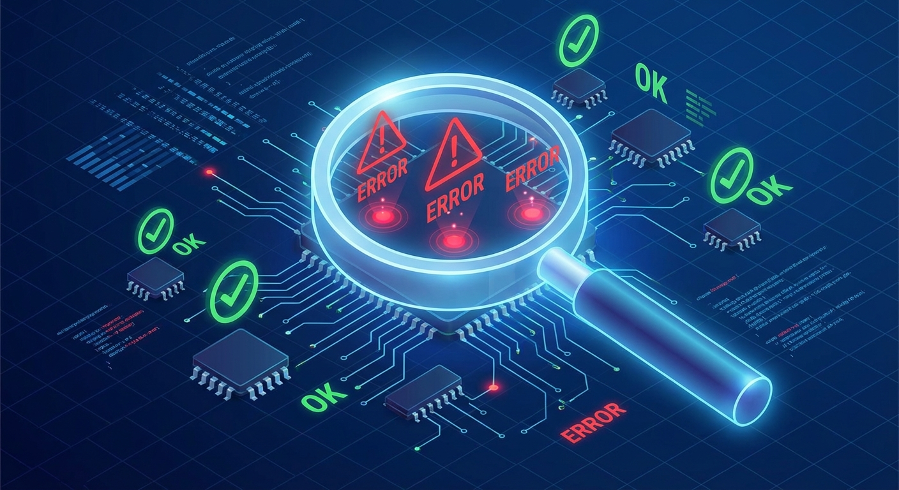

# Troubleshooting DCM



Solutions to the most common problems encountered when running the Distributed Context Manager.

---

## 1. Port already in use

**Symptom:** DCM fails to start with "address already in use" or `EADDRINUSE` error.

**Cause:** Another process is using port 3847, 3848, or 3849.

**Solution:**

Identify what is using the port:

```bash
lsof -i :3847
lsof -i :3848
lsof -i :3849
```

Kill the conflicting process:

```bash
# Kill by PID (replace 12345 with the actual PID from lsof output)
kill 12345

# Or kill all processes on a specific port
lsof -ti :3847 | xargs kill
```

If the conflict is a stale DCM process, stop all services first:

```bash
./dcm stop
```

If the port is genuinely needed by another service, change DCM ports in `.env`:

```bash
PORT=4847
WS_PORT=4849
DASHBOARD_PORT=4848
```

---

## 2. PostgreSQL connection refused

**Symptom:** API fails to start with "connection refused" on port 5432, or `dcm status` shows "PostgreSQL: not connected".

**Cause:** PostgreSQL is not running, or the credentials are wrong.

**Solution:**

Check if PostgreSQL is running:

```bash
sudo systemctl status postgresql
```

If it is not running, start it:

```bash
sudo systemctl start postgresql
```

To make PostgreSQL start at boot:

```bash
sudo systemctl enable postgresql
```

Verify the connection manually:

```bash
psql -U dcm -d claude_context -h 127.0.0.1 -c "SELECT 1;"
```

If you get "authentication failed", check your `.env` credentials match the actual PostgreSQL user/password.

If you get "database does not exist":

```bash
sudo -u postgres createdb -O dcm claude_context
```

If you get "role does not exist":

```bash
sudo -u postgres createuser --pwprompt dcm
```

---

## 3. Hooks not firing

**Symptom:** Claude Code sessions run but DCM receives no data. Dashboard shows zero sessions and zero actions.

**Cause:** Hooks are not installed in Claude Code settings, or hook scripts are not executable.

**Solution:**

First, check if hooks are registered:

```bash
./dcm status
```

Look for "Claude Code hooks: installed". If it says "not installed":

```bash
./dcm hooks
```

Check that hook scripts are executable:

```bash
ls -la hooks/*.sh
```

If permissions are wrong:

```bash
chmod +x hooks/*.sh
```

Test the pipeline manually by sending a synthetic event:

```bash
echo '{"tool_name":"Test","tool_input":"{}","session_id":"test-session","cwd":"/tmp"}' \
  | bash hooks/track-action.sh
```

If the API is running, check for the event:

```bash
curl -s "http://127.0.0.1:3847/api/actions?limit=1" | jq .
```

If you are using Plugin Mode instead of CLI Mode, verify the symlink exists:

```bash
ls -la ~/.claude/plugins/dcm 2>/dev/null || echo "Plugin symlink not found"
```

---

## 4. Dashboard connection refused or blank page

**Symptom:** Browser shows "connection refused" at `http://localhost:3848`, or the page loads but is blank.

**Cause:** The dashboard is not running, needs a rebuild, or the API URL is misconfigured.

**Solution:**

Check if the dashboard is running:

```bash
lsof -i :3848
```

If not running, start it:

```bash
./dcm start
```

If the page is blank or shows 500 errors, rebuild the dashboard:

```bash
cd ../context-dashboard
npm install
npm run build
npm start
```

Verify the API URL is correct in `context-dashboard/.env.local`:

```bash
cat context-dashboard/.env.local
```

It should contain:

```
NEXT_PUBLIC_API_URL=http://127.0.0.1:3847
NEXT_PUBLIC_WS_URL=ws://127.0.0.1:3849
```

If you see "Failed to fetch" errors in the browser console, the API is not reachable from the dashboard. Verify the API is healthy:

```bash
curl http://127.0.0.1:3847/health
```

---

## 5. WebGL context lost (dashboard 3D topology)

**Symptom:** Dashboard shows "WebGL context lost" error on the Flows or topology pages. The 3D visualization breaks.

**Cause:** Too many WebGL contexts are open, the GPU is overloaded, or the device pixel ratio is too high.

**Solution:**

This is a browser limitation, not a DCM bug. DCM v3.1.0+ includes mitigations:

- 3D topology is lazy-loaded on click (not on page load)
- DPR is capped dynamically to reduce GPU load
- SVG fallback replaces WebGL when context loss is detected

If you still see the error:

1. Close other browser tabs that use WebGL (maps, games, 3D viewers)
2. Reduce your display scaling to 100%
3. Use Chrome or Firefox (best WebGL support)
4. Refresh the page -- DCM will recover automatically

To disable 3D topology entirely and use SVG, the dashboard automatically falls back when WebGL is unavailable.

---

## 6. Out of memory on build (OOM)

**Symptom:** `npm run build` or `bun install` crashes with "JavaScript heap out of memory" or the process is killed by the OOM killer.

**Cause:** Insufficient memory for the Next.js build or Bun dependency resolution.

**Solution:**

Increase Node.js memory limit for dashboard builds:

```bash
cd context-dashboard
NODE_OPTIONS="--max-old-space-size=4096" npm run build
```

For Bun operations, ensure swap is available:

```bash
# Check available memory
free -h

# Add 2GB swap if needed
sudo fallocate -l 2G /swapfile
sudo chmod 600 /swapfile
sudo mkswap /swapfile
sudo swapon /swapfile
```

On CI/CD systems, allocate at least 2GB of RAM for the build job.

---

## 7. Session not detected after restart

**Symptom:** After restarting DCM services, existing Claude Code sessions are not tracked. The dashboard shows zero active sessions.

**Cause:** Sessions are considered active based on their `ended_at` field. After a DCM restart, old sessions may appear expired.

**Solution:**

DCM v3.1.0+ handles this automatically: sessions are considered active if `ended_at IS NULL` or `ended_at` is within the last 30 minutes. When a session resumes, `track-session.sh` reactivates it by setting `ended_at = NULL`.

If sessions still do not appear:

1. Start a new Claude Code session (the `SessionStart` hook will register it)
2. Or manually reactivate a session:

```bash
curl -X PATCH http://127.0.0.1:3847/api/sessions/YOUR_SESSION_ID \
  -H "Content-Type: application/json" \
  -d '{"ended_at": null}'
```

---

## 8. Schema errors on startup

**Symptom:** API logs show SQL errors like "relation does not exist" or "column does not exist".

**Cause:** The database schema is outdated or was never applied.

**Solution:**

Re-apply the full schema (idempotent, safe to re-run):

```bash
psql -U dcm -d claude_context -h 127.0.0.1 -f context-manager/src/db/schema.sql
```

If specific migrations were added, apply them in order:

```bash
ls context-manager/src/db/migrations/
```

```bash
psql -U dcm -d claude_context -h 127.0.0.1 -f context-manager/src/db/migrations/003_proactive_triage.sql
psql -U dcm -d claude_context -h 127.0.0.1 -f context-manager/src/db/migrations/004_bugfix_constraints.sql
psql -U dcm -d claude_context -h 127.0.0.1 -f context-manager/src/db/migrations/005_agent_hierarchy.sql
psql -U dcm -d claude_context -h 127.0.0.1 -f context-manager/src/db/migrations/006_agent_turns_tracking.sql
psql -U dcm -d claude_context -h 127.0.0.1 -f context-manager/src/db/migrations/006_v4_context.sql
psql -U dcm -d claude_context -h 127.0.0.1 -f context-manager/src/db/migrations/007_actions_session_id.sql
```

As a last resort, reset the entire database (destructive):

```bash
./dcm db:reset
```

---

## 9. Auto-start fails or times out

**Symptom:** Claude Code starts but DCM services are not running. Log shows "DCM auto-start skipped: PostgreSQL not available" or the hook times out.

**Cause:** PostgreSQL is not running at boot, a stale lock file exists, or the hook exceeds its 10-second timeout.

**Solution:**

Ensure PostgreSQL starts at boot:

```bash
sudo systemctl enable postgresql
```

Remove stale lock file:

```bash
rm -f /tmp/.dcm-autostart.lock
```

Check auto-start logs:

```bash
cat /tmp/dcm-api.log | head -20
```

If the API takes too long to start (cold start), increase Bun's readiness by pre-running:

```bash
cd context-manager && bun run src/server.ts &
```

Then stop and let auto-start handle it going forward.

---

## 10. WebSocket clients connect but receive no events

**Symptom:** Dashboard Live page shows "connected" but no events appear. The activity feed is empty.

**Cause:** PostgreSQL LISTEN/NOTIFY is not active, or the WebSocket server cannot connect to the database.

**Solution:**

Check WebSocket server logs:

```bash
./dcm logs ws
# or
tail -20 /tmp/dcm-ws.log
```

Look for database connection errors. The WebSocket server needs its own connection to run `LISTEN dcm_events`.

Verify the WebSocket server is actually listening:

```bash
lsof -i :3849
```

In production, verify that `WS_AUTH_SECRET` matches between the API and WebSocket configurations. Both read from the same `.env` file, but if you set them differently (e.g., in Docker), authentication will fail silently.

Test the WebSocket connection directly:

```bash
# Install websocat if you don't have it
# https://github.com/vi/websocat
websocat ws://127.0.0.1:3849
```

You should receive a heartbeat ping within 30 seconds.

---

## 11. Dashboard shows "N" dev indicator

**Symptom:** The dashboard UI displays a small "N" badge or "dev" indicator in the corner, signaling it is running in development mode.

**Cause:** The systemd service (or manual launch) is using `bun run dev` or `next dev` instead of `next start`.

**Solution:**

Verify the systemd unit for the dashboard uses the production command:

```bash
sudo systemctl cat context-dashboard.service | grep ExecStart
```

The line should read:

```
ExecStart=/usr/bin/npx next start
```

If it says `next dev` or `bun run dev`, edit the unit file:

```bash
sudo systemctl edit --full context-dashboard.service
```

Change `ExecStart` to use `next start` and make sure `NODE_ENV=production` is set in the `[Service]` section. Then reload and restart:

```bash
sudo systemctl daemon-reload
sudo systemctl restart context-dashboard
```

---

## 12. OOM on dashboard restart

**Symptom:** The dashboard service crashes with an out-of-memory error when restarting, or systemd kills it with signal 9 (SIGKILL).

**Cause:** The `MemoryMax` limit in the systemd unit is too low for the Next.js build step that runs before start.

**Solution:**

Set `MemoryMax=4G` in the dashboard service file:

```bash
sudo systemctl edit --full context-dashboard.service
```

In the `[Service]` section, set or update:

```ini
MemoryMax=4G
```

Then reload and restart:

```bash
sudo systemctl daemon-reload
sudo systemctl restart context-dashboard
```

If you are not using systemd, ensure the host has at least 4 GB of available memory when building the dashboard. You can also increase Node.js heap size explicitly:

```bash
NODE_OPTIONS="--max-old-space-size=4096" npm run build
```

---

## 13. Pipeline steps stuck in "running" forever

**Symptom:** Pipeline steps show `running` in the dashboard but no Claude process is active. The pipeline does not advance.

**Cause:** The DCM API service was restarted (manually, by watchdog, or OOM) while agents were running. The detached systemd scopes may have been killed, and `/tmp/dcm-executor/` was wiped.

**Solution:**

DCM v2.3.0+ handles this automatically. The worker supervisor:
1. Detects orphan `running` steps with no active `claude` process
2. Marks stale `pipeline_jobs` as `lost`
3. Requeues orphan steps (up to 3 retries)
4. Launches new agents for requeued steps

If you need to trigger recovery manually:

```bash
# Check for running claude processes
pgrep -af "claude.*-p"

# Check pipeline steps status via API
curl -s http://127.0.0.1:3847/api/pipelines/PIPELINE_ID/steps \
  | python3 -c "import json,sys; [print(f'W{s[\"wave_number\"]} {s[\"status\"]:10s} {s[\"agent_type\"]}') for s in json.load(sys.stdin)['steps']]"

# Force restart the API to trigger startup recovery
systemctl --user restart dcm-api
```

Check worker logs for recovery activity:

```bash
journalctl --user -u dcm-api --since "5 minutes ago" | grep -iE "orphan|stale|requeue|recovery"
```

---

## 14. Watchdog killing DCM API service

**Symptom:** `journalctl --user -u dcm-api` shows `Watchdog timeout (limit 10min)!` followed by `SIGABRT`.

**Cause:** The systemd unit had `WatchdogSec=600` but the Bun process never sends `sd_notify(WATCHDOG=1)` keepalives.

**Solution:**

DCM v2.3.0 sets `WatchdogSec=0` (disabled). If you still have an older unit file:

```bash
systemctl --user cat dcm-api.service | grep WatchdogSec
```

If it shows a non-zero value, edit the unit:

```bash
systemctl --user edit dcm-api.service
```

Add in the `[Service]` section override:

```ini
WatchdogSec=0
```

Then reload and restart:

```bash
systemctl --user daemon-reload
systemctl --user restart dcm-api
```

---

## General diagnostics

### Full health check

```bash
# All-in-one status
./dcm status

# API health (JSON)
curl -s http://127.0.0.1:3847/health | jq .

# Database statistics
curl -s http://127.0.0.1:3847/stats | jq .

# PostgreSQL connectivity
pg_isready -h 127.0.0.1 -p 5432
```

### View all logs

```bash
# API
tail -50 /tmp/dcm-api.log

# WebSocket
tail -50 /tmp/dcm-ws.log

# Dashboard
tail -50 /tmp/dcm-dashboard.log

# Or with systemd
sudo journalctl -u context-manager-api --no-pager -n 50
```

### Clean temporary files

If things are in a bad state, clean up all DCM temporary files and restart:

```bash
./dcm stop
rm -rf /tmp/.dcm-pids /tmp/.dcm-autostart.lock
rm -f /tmp/.dcm-monitor-counter /tmp/.dcm-last-proactive
rm -rf /tmp/.claude-context/
./dcm start
```

### Check database health

```bash
# Table row counts
curl -s http://127.0.0.1:3847/stats | jq .

# Connection status
psql -U dcm -d claude_context -h 127.0.0.1 -c "SELECT count(*) FROM pg_stat_activity WHERE datname='claude_context';"
```

### Reset to clean state

If all else fails, reset the database and reinstall hooks:

```bash
./dcm stop
./dcm db:reset
./dcm hooks
./dcm start
```

This destroys all stored data but gives you a clean working state.
