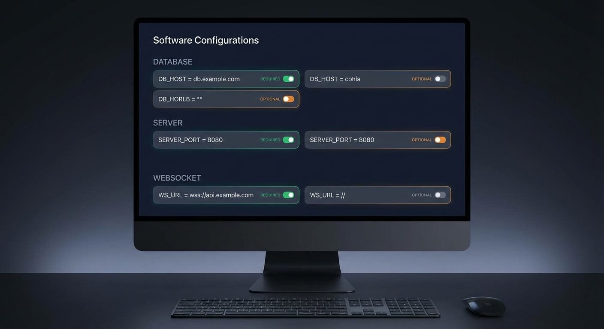

# Environment Variables Reference



Complete list of environment variables used by DCM. All configuration is done through the `context-manager/.env` file. Bun loads it automatically at startup.

Create the file from the template:

```bash
cp context-manager/.env.example context-manager/.env
```

---

## Database

| Variable | Required | Default | Description |
|----------|----------|---------|-------------|
| `DB_HOST` | No | `localhost` | PostgreSQL host address |
| `DB_PORT` | No | `5432` | PostgreSQL port |
| `DB_NAME` | No | `claude_context` | Database name |
| `DB_USER` | **Yes** | -- | Database user (no default, must be set) |
| `DB_PASSWORD` | **Yes** | -- | Database password (no default, must be set) |
| `DB_MAX_CONNECTIONS` | No | `10` | Connection pool size |
| `MAX_DB_RETRIES` | No | `3` | Database connection retry attempts on startup |

---

## API Server

| Variable | Required | Default | Description |
|----------|----------|---------|-------------|
| `HOST` | No | `127.0.0.1` | Bind address for the API server. Use `0.0.0.0` to expose externally. |
| `PORT` | No | `3847` | API server listening port |
| `NODE_ENV` | No | `production` | Environment mode. Set to `production` to enforce WebSocket auth and stricter CORS. |
| `ALLOWED_ORIGINS` | No | `http://localhost:3848,http://127.0.0.1:3848` | Comma-separated list of allowed CORS origins. Set to `*` to allow all (not recommended for production). |

---

## WebSocket Server

| Variable | Required | Default | Description |
|----------|----------|---------|-------------|
| `WS_PORT` | No | `3849` | WebSocket server listening port |
| `WS_AUTH_SECRET` | Production | -- | HMAC-SHA256 secret for WebSocket token authentication. Required when `NODE_ENV=production`. Generate with `openssl rand -hex 32`. |

---

## Application

| Variable | Required | Default | Description |
|----------|----------|---------|-------------|
| `MESSAGE_TTL_MS` | No | `3600000` | Message time-to-live in milliseconds (1 hour). Expired messages are cleaned up automatically. |
| `HEALTHCHECK_INTERVAL_MS` | No | `30000` | Internal health check interval in milliseconds (30 seconds). |
| `LOG_LEVEL` | No | `info` | Minimum log level: `debug`, `info`, `warn`, `error`. |

---

## Cleanup

| Variable | Required | Default | Description |
|----------|----------|---------|-------------|
| `CLEANUP_INTERVAL_MS` | No | `60000` | Cleanup job interval in milliseconds (60 seconds). |
| `CLEANUP_MAX_AGE_ACTIONS_DAYS` | No | `30` | Maximum age for actions before cleanup (days). |
| `CLEANUP_MAX_AGE_MESSAGES_DAYS` | No | `7` | Maximum age for expired messages before cleanup (days). |

---

## Dashboard

The dashboard reads its own environment from `context-dashboard/.env.local`.

| Variable | Required | Default | Description |
|----------|----------|---------|-------------|
| `NEXT_PUBLIC_API_URL` | No | `http://127.0.0.1:3847` | REST API URL for the browser client. Must be reachable from the user's browser. |
| `NEXT_PUBLIC_WS_URL` | No | `ws://127.0.0.1:3849` | WebSocket URL for the browser client. Must be reachable from the user's browser. |

---

## Docker Compose

These variables are used by the `docker-compose.yml` at the project root. They are set in a `.env` file in the project root directory (not `context-manager/.env`).

| Variable | Required | Default | Description |
|----------|----------|---------|-------------|
| `DB_USER` | No | `dcm` | PostgreSQL user for the containerized database |
| `DB_PASSWORD` | **Yes** | -- | PostgreSQL password (required, no default) |
| `DB_PORT` | No | `5432` | Host port mapped to the PostgreSQL container |
| `PORT` | No | `3847` | Host port mapped to the API container |
| `WS_PORT` | No | `3849` | Host port mapped to the WebSocket container |
| `WS_AUTH_SECRET` | No | `change_me` | HMAC secret (change this for production) |
| `DCM_HOST` | No | `127.0.0.1` | Hostname baked into the dashboard build for API/WS URLs |
| `DASHBOARD_PORT` | No | `3848` | Host port mapped to the dashboard container |

---

## Hook Scripts

These variables are used internally by the bash hook scripts. They do not need to be set manually unless running hooks outside of the standard setup.

| Variable | Required | Default | Description |
|----------|----------|---------|-------------|
| `CONTEXT_MANAGER_URL` | No | `http://127.0.0.1:3847` | Base URL for the DCM API. Used by all hook scripts for curl calls. |
| `CLAUDE_PLUGIN_ROOT` | No | -- | Set automatically by Claude Code when running in Plugin Mode. Points to the plugin directory. |

---

## Ports Summary

| Port | Service | Variable | Protocol |
|------|---------|----------|----------|
| 3847 | REST API | `PORT` | HTTP |
| 3848 | Dashboard | `DASHBOARD_PORT` | HTTP |
| 3849 | WebSocket | `WS_PORT` | WS |
| 5432 | PostgreSQL | `DB_PORT` | TCP |

All services bind to `127.0.0.1` by default. Change `HOST` to `0.0.0.0` to expose externally (Docker Compose does this automatically for containerized services).

---

## Minimum configuration

For a basic local development setup, only two variables are required:

```bash
DB_USER=dcm
DB_PASSWORD=your_password
```

## Recommended production configuration

```bash
# Database
DB_HOST=127.0.0.1
DB_PORT=5432
DB_NAME=claude_context
DB_USER=dcm
DB_PASSWORD=strong_random_password
DB_MAX_CONNECTIONS=20

# Server
HOST=127.0.0.1
PORT=3847
NODE_ENV=production

# WebSocket
WS_PORT=3849
WS_AUTH_SECRET=output_of_openssl_rand_hex_32

# Security
ALLOWED_ORIGINS=http://localhost:3848

# Logging
LOG_LEVEL=warn
```

Generate the HMAC secret:

```bash
openssl rand -hex 32
```
