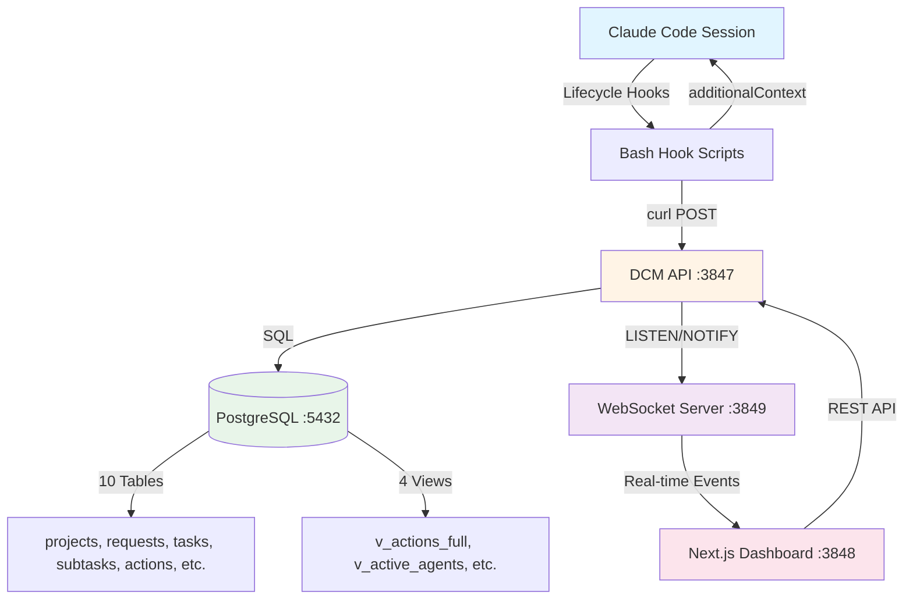
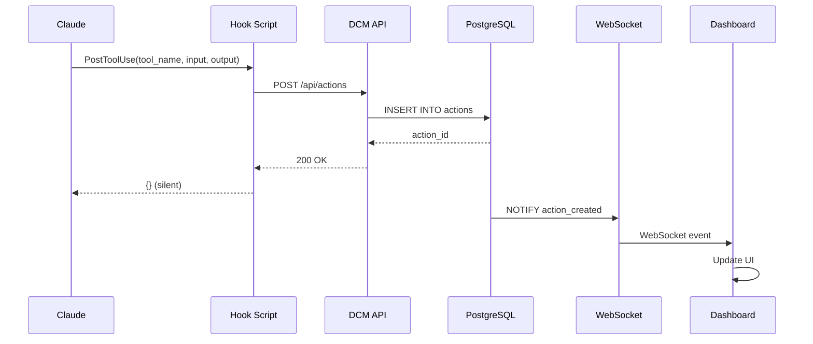

# DCM Project Overview

**Version:** 3.0.0
**Generated:** 2026-02-09
**Status:** Production Ready

## What is DCM?

DCM (Distributed Context Manager) is a sophisticated persistent memory and orchestration system designed specifically for multi-agent Claude Code sessions. It acts as the "brain" that maintains context, coordinates agents, and ensures continuity across compaction events.

## The Problem DCM Solves

Claude Code sessions face a fundamental challenge: the **context window limit**. When a conversation grows too long, Claude must "compact" the conversation, losing valuable context about:

- Active tasks and their state
- Agent decisions and rationale
- Cross-agent coordination
- Modified files and dependencies
- Inter-agent messages and subscriptions

**Without DCM:** Every compact is a reset. Agents lose memory, duplicate work, and lack coordination.

**With DCM:** Context is preserved, restored automatically, and enhanced with cross-agent intelligence.

## Core Features

### 1. **Context Tracking & Recovery**
- Records every tool call, agent action, and decision
- Automatically saves state before compaction (`PreCompact` hook)
- Restores context after compaction (`SessionStart` hook with `compact` matcher)
- Generates token-optimized context briefs on-demand

### 2. **Multi-Agent Orchestration**
- Task decomposition into waves and subtasks
- Dependency management and blocking
- Inter-agent pub/sub messaging
- Batch submission and conflict resolution

### 3. **Context Guardian (4-Layer Protection)**
- **Layer 1:** Ultra-lightweight local file size check (<10ms, every tool call)
- **Layer 2:** Proactive monitoring every 5th call via API
- **Layer 3:** Stop-event guard with blocking capability
- **Layer 4:** PreCompact save + PostCompact restore

### 4. **Intelligent Routing**
- Keyword-to-tool suggestion engine
- Feedback-driven scoring (success rates)
- Tool type detection (builtin, agent, skill, MCP, command)

### 5. **Real-Time Dashboard**
- Next.js 16 + React 19 frontend
- WebSocket-powered live updates
- KPI visualization with Recharts
- Agent registry catalog browser

### 6. **Agent Registry & Templates**
- 66+ registered agents
- 226+ skills catalog
- Role-specific prompt templates (orchestrator, developer, specialist, validator)
- Context enrichment via agent metadata

## Tech Stack

### Backend
- **Runtime:** Bun (JavaScript runtime, faster than Node.js)
- **HTTP Framework:** Hono v4 (lightweight, fast routing)
- **Database:** PostgreSQL 16 with JSONB support
- **WebSocket:** Bun native WebSocket (no external library)
- **Validation:** Zod v4 (TypeScript-first schema validation)
- **Language:** TypeScript with strict mode

### Frontend
- **Framework:** Next.js 16 with App Router
- **UI Library:** React 19
- **Components:** shadcn/ui (Radix UI primitives)
- **Charts:** Recharts v3
- **Styling:** Tailwind CSS v4
- **Data Fetching:** TanStack Query v5
- **Icons:** Lucide React

### Infrastructure
- **Ports:**
  - API Server: `3847`
  - WebSocket Server: `3849`
  - Dashboard: `3848`
  - PostgreSQL: `5432` (default)
- **Deployment:** Docker Compose or systemd services
- **Logs:** `/tmp/dcm-*.log`
- **PID Files:** `/tmp/.dcm-pids/`

## Architecture at a Glance



## Key Concepts

### Projects
Root container identified by working directory path (`cwd`). All sessions, requests, and tasks belong to a project.

### Sessions
A single Claude Code conversation. Tracked from `SessionStart` to `SessionEnd` with tool usage statistics.

### Requests
User prompts submitted to Claude. One request can spawn multiple waves of tasks.

### Waves (Task Lists)
Groups of related subtasks executed in sequence. Waves enable:
- Ordered execution (Wave 0 = migrations, Wave 1 = controllers, etc.)
- Parallel work within a wave
- Clear phase transitions

### Subtasks
Individual objectives assigned to specific agent types. Each subtask has:
- **Status:** pending, running, paused, blocked, completed, failed
- **Agent assignment:** `agent_type` (role) and `agent_id` (instance)
- **Dependencies:** `blocked_by` array
- **Result:** JSONB output

### Actions
Tool invocations (Read, Write, Bash, Task, Skill, etc.) with compressed input/output stored in PostgreSQL.

### Messages
Inter-agent pub/sub messaging with:
- **Topics:** Custom message routing (e.g., "schema_updated")
- **Priority:** 0-10 scale
- **Expiration:** TTL for ephemeral messages
- **Read tracking:** `read_by` array

### Agent Contexts
Saved state for recovery after compaction:
- **Role context:** Agent-specific memory (JSONB)
- **Skills to restore:** List of skills that were active
- **Tools used:** Tool invocation history
- **Progress summary:** Human-readable status

## Data Flow



## Installation Overview

```bash
# Clone and install
git clone <repo-url>
cd context-manager
bun install

# Setup (one command does everything)
./dcm install

# Start services
./dcm start

# Verify health
./dcm status
```

## Use Cases

### 1. Long-Running Development Sessions
DCM preserves context across multiple compacts during complex refactoring or feature development.

### 2. Multi-Agent Coordination
Orchestrator agents delegate work to specialist agents (backend, frontend, database) with real-time message passing.

### 3. Context Debugging
When Claude seems "confused," inspect the context brief via `/api/context/:agent_id` to see what information is available.

### 4. Session Analytics
Dashboard provides visibility into tool usage, success rates, agent activity, and routing effectiveness.

### 5. Proactive Context Management
Guardian hooks monitor context size and trigger snapshots before hitting limits, preventing catastrophic memory loss.

## Phases Implemented

DCM was built in phases:

| Phase | Feature | Status |
|-------|---------|--------|
| Phase 1 | SQLite tracking (legacy) | Deprecated |
| Phase 2 | Actions tracking, Routing intelligence | ✅ Active |
| Phase 3 | Hierarchical structure (projects → requests → tasks → subtasks) | ✅ Active |
| Phase 4 | Inter-agent messaging (pub/sub, blocking) | ✅ Active |
| Phase 5 | Context generation, Compact save/restore | ✅ Active |
| Phase 6 | Sessions management (PostgreSQL migration) | ✅ Active |
| Phase 7 | Tools summary API | ✅ Active |
| Phase 8 | WebSocket auth (HMAC tokens) | ✅ Active |
| Phase 9 | Proactive triage, Agent registry, Orchestration | ✅ Active |

## Performance Characteristics

- **Hook execution:** 2-5ms (fire-and-forget)
- **Context guardian:** <10ms (local file stat)
- **API response time:** 5-50ms (database queries)
- **Compact save:** 500ms-2s (comprehensive snapshot)
- **Compact restore:** 200ms-1s (context brief generation)
- **WebSocket latency:** 1-5ms (real-time events)
- **Dashboard load:** 500ms-1s (first paint)

## Security Features

- **CORS protection:** Configurable allowed origins
- **Rate limiting:** Auth endpoint limited to 10 req/15min
- **HMAC authentication:** WebSocket connections require signed tokens
- **Input validation:** Zod schemas on all endpoints
- **SQL injection prevention:** Parameterized queries only
- **No secrets in logs:** Environment-based configuration
- **Graceful degradation:** Hooks fail silently if API is down

## Monitoring & Observability

### Logs
- **API:** `/tmp/dcm-api.log`
- **WebSocket:** `/tmp/dcm-ws.log`
- **Dashboard:** `/tmp/dcm-dashboard.log`
- **Guardian:** `/tmp/dcm-guardian.log`

### Metrics
- `/health` - API and database health
- `/stats` - Database statistics
- `/api/dashboard/kpis` - Aggregated metrics
- `/api/cleanup/stats` - Message expiration stats

### Dashboard Pages
- `/dashboard` - KPIs and system health
- `/sessions` - Session browser
- `/agents` - Active agent contexts
- `/messages` - Inter-agent messaging
- `/routing` - Tool suggestion stats
- `/waves` - Wave execution tracking
- `/registry` - Agent catalog

## Why PostgreSQL?

DCM migrated from SQLite to PostgreSQL for:
- **JSONB support:** Flexible metadata storage with GIN indexes
- **LISTEN/NOTIFY:** Real-time event streaming to WebSocket clients
- **Concurrent writes:** Multiple hooks writing simultaneously
- **Advanced queries:** CTEs, window functions, full-text search
- **Reliability:** ACID guarantees, replication, point-in-time recovery

## Plugin Architecture

DCM can be installed two ways:

### 1. CLI Installation
```bash
./dcm install
# Modifies ~/.config/ClaudeCode/settings.json manually
```

### 2. Plugin Auto-Discovery
Claude Code reads `.claude-plugin/plugin.json` and auto-installs hooks using `${CLAUDE_PLUGIN_ROOT}` variable.

## Next Steps

- [01-getting-started.md](./01-getting-started.md) - Installation and setup
- [02-architecture.md](./02-architecture.md) - Detailed architecture
- [03-api-reference.md](./03-api-reference.md) - Complete API documentation
- [04-hooks-system.md](./04-hooks-system.md) - Hooks deep dive
- [05-context-guardian.md](./05-context-guardian.md) - Context protection layers

## Contributing

DCM is designed for extensibility. Key extension points:
- Add new agent types to `src/data/catalog.ts`
- Create new prompt templates in `src/templates/`
- Add custom hooks in `hooks/`
- Extend database schema via migrations in `src/db/migrations/`

See [15-contributing.md](./15-contributing.md) for development guidelines.

---

**Status:** All 9 phases implemented. Production-ready since v3.0.0.
