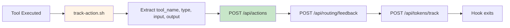
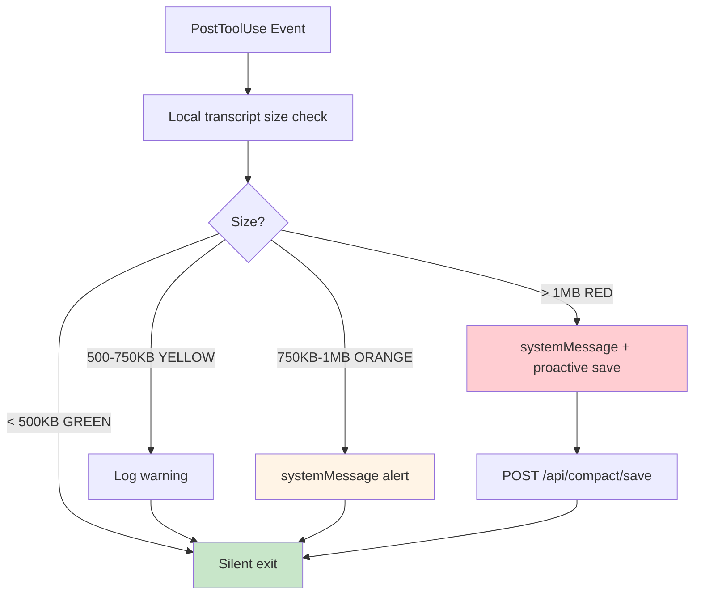
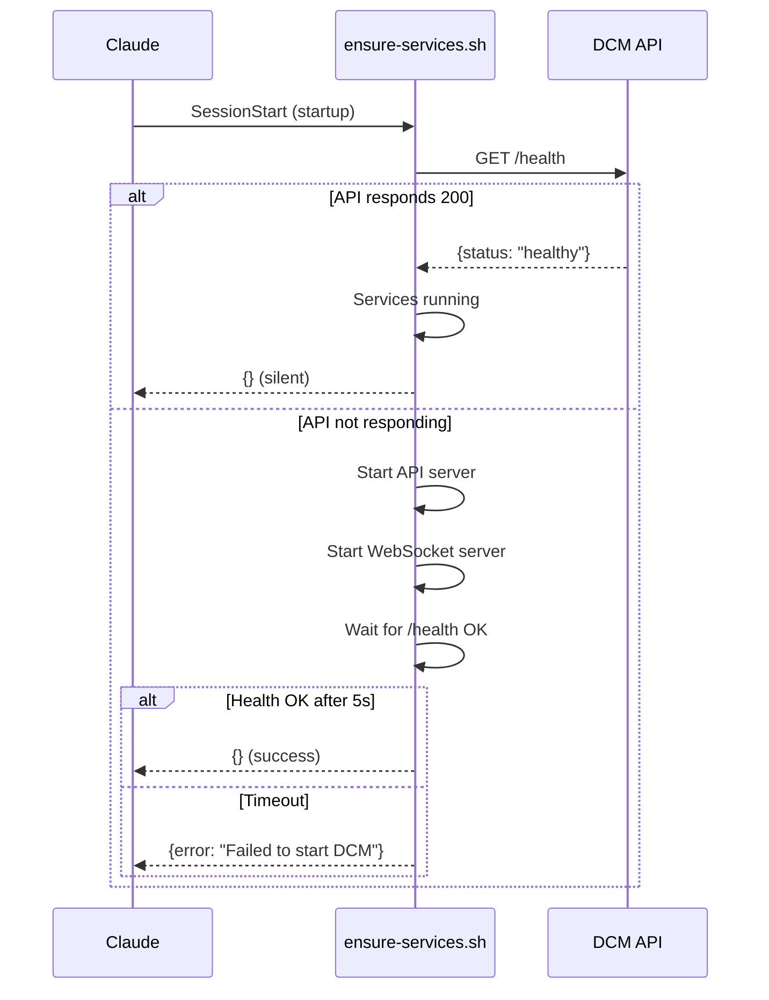
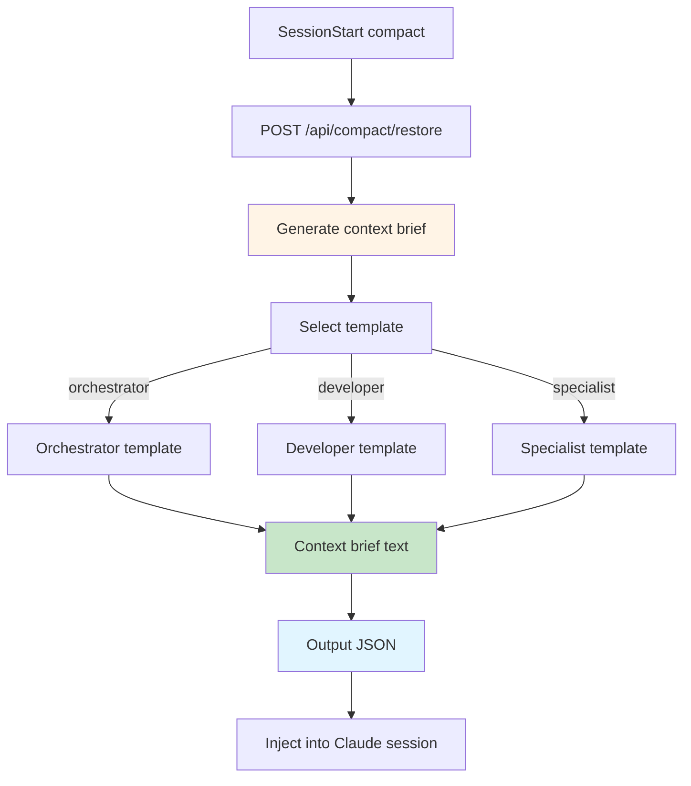

# Hooks System

DCM integrates with Claude Code through its powerful hooks system. This document explains how hooks work, what each hook does, and how to create custom hooks.

## What Are Claude Code Hooks?

Claude Code hooks are lifecycle event handlers that execute scripts at specific points in the conversation. They enable:

- **Pre-processing:** Modify or validate tool inputs before execution
- **Post-processing:** Record, analyze, or act on tool outputs
- **Session management:** Track session lifecycle (start, end, compact)
- **Context injection:** Provide additional context to Claude at session start

## Hook Configuration

Hooks are configured in `hooks/hooks.json`:

```json
{
  "description": "DCM - Context tracking and management",
  "hooks": {
    "PostToolUse": [...],
    "SessionStart": [...],
    "PreCompact": [...],
    "Stop": [...],
    "SubagentStop": [...],
    "SessionEnd": [...]
  }
}
```

## Hook Events

### PostToolUse

**When:** After every tool execution (Read, Write, Bash, Task, etc.)

**Receives:**
```json
{
  "tool_name": "Write",
  "tool_input": {
    "file_path": "/path/to/file.ts",
    "content": "..."
  },
  "tool_output": {
    "success": true
  },
  "session_id": "session-abc123",
  "cwd": "/home/user/project",
  "timestamp": "2026-02-09T10:30:00.000Z",
  "exit_code": 0,
  "transcript_path": "/tmp/claude-transcript-abc123.json"
}
```

### SessionStart

**When:** When Claude Code starts (two matchers: "startup" and "compact")

**Matcher: "startup"**
- Fresh session start
- No previous context

**Matcher: "compact"**
- After compaction operation
- Context was compressed
- DCM can inject restored context

**Receives:**
```json
{
  "session_id": "session-abc123",
  "cwd": "/home/user/project",
  "timestamp": "2026-02-09T10:00:00.000Z",
  "trigger": "startup|compact"
}
```

### PreCompact

**When:** Before Claude compacts the conversation (two matchers: "auto" and "manual")

**Receives:**
```json
{
  "session_id": "session-abc123",
  "cwd": "/home/user/project",
  "timestamp": "2026-02-09T10:30:00.000Z",
  "trigger": "auto|manual",
  "transcript_path": "/tmp/claude-transcript-abc123.json"
}
```

### Stop

**When:** When Claude Code stops (user closes app or ends session)

**Receives:**
```json
{
  "session_id": "session-abc123",
  "cwd": "/home/user/project",
  "timestamp": "2026-02-09T11:00:00.000Z"
}
```

### SubagentStop

**When:** When a subagent (Task tool) completes

**Receives:**
```json
{
  "agent_id": "backend-laravel-123",
  "agent_type": "backend-laravel",
  "session_id": "session-abc123",
  "result": {
    "success": true,
    "files_modified": ["/path/to/file.ts"]
  },
  "timestamp": "2026-02-09T10:45:00.000Z"
}
```

### SessionEnd

**When:** Session ends gracefully

**Receives:**
```json
{
  "session_id": "session-abc123",
  "cwd": "/home/user/project",
  "timestamp": "2026-02-09T11:00:00.000Z",
  "duration_ms": 3600000
}
```

## DCM Hooks

### 1. track-action.sh

**Event:** PostToolUse (matcher: *)
**Timeout:** 3 seconds
**Frequency:** Every tool call



**What it does:**
1. Records tool invocation to `actions` table
2. Updates routing intelligence (`keyword_tool_scores`)
3. Tracks token consumption
4. Detects tool type (builtin, agent, skill, mcp, command)

**Example curl:**
```bash
curl -X POST http://127.0.0.1:3847/api/actions \
  -H "Content-Type: application/json" \
  -d '{
    "tool_name": "Write",
    "tool_type": "builtin",
    "exit_code": 0,
    "duration_ms": 45
  }'
```

### 2. track-agent.sh

**Event:** PostToolUse (matcher: Task)
**Timeout:** 3 seconds
**Frequency:** Only when Task tool is used

**What it does:**
1. Records agent/subagent execution
2. Updates subtask status
3. Links action to subtask

### 3. context-guardian.sh

**Event:** PostToolUse (matcher: *)
**Timeout:** 2 seconds
**Frequency:** Every tool call



**Thresholds:**
- **Green (<500KB):** Silent, no action
- **Yellow (500-750KB):** Log warning to `/tmp/dcm-guardian.log`
- **Orange (750KB-1MB):** Show systemMessage: "Context at XXXkb. Consider running /compact soon."
- **Red (>1MB):** Show systemMessage + trigger proactive save

**Performance:**
- **Local check:** <10ms (file stat only, no HTTP)
- **API call:** Only when threshold exceeded
- **Health cache:** 60s TTL to minimize API calls

### 4. monitor-context.sh

**Event:** PostToolUse (matcher: *)
**Timeout:** 2 seconds
**Frequency:** Every 5th tool call (configurable)

**What it does:**
1. Increments counter in `/tmp/.dcm-monitor-counter`
2. Every 5th call, checks `/health` endpoint
3. If API response indicates high context usage (>800KB), triggers snapshot
4. Cooldown: 120 seconds between proactive snapshots

**Environment variables:**
```bash
CHECK_INTERVAL=5  # Check every 5th call
COOLDOWN_SECONDS=120  # Min time between snapshots
```

### 5. ensure-services.sh

**Event:** SessionStart (matcher: startup)
**Timeout:** 10 seconds
**Frequency:** Once per session start



**What it does:**
1. Checks if API is running on port 3847
2. If not, starts API and WebSocket servers
3. Waits for `/health` to return 200
4. Uses file-based locking to prevent race conditions
5. Logs to `/tmp/dcm-ensure-services.log`

### 6. track-session.sh

**Event:** SessionStart (matcher: startup)
**Timeout:** 5 seconds
**Frequency:** Once per session start

**What it does:**
1. Records new session in `sessions` table
2. Links session to project (by cwd)
3. Initializes session stats

**curl example:**
```bash
curl -X POST http://127.0.0.1:3847/api/sessions \
  -H "Content-Type: application/json" \
  -d '{
    "id": "session-abc123",
    "project_id": "uuid-from-cwd",
    "started_at": "2026-02-09T10:00:00.000Z"
  }'
```

### 7. pre-compact-save.sh

**Event:** PreCompact (matcher: auto | manual)
**Timeout:** 5 seconds
**Frequency:** Before each compaction

```mermaid
flowchart TB
    Start[PreCompact Event] --> Collect[Collect snapshot data]
    Collect --> Hierarchy[GET /api/hierarchy/:project_id]
    Collect --> Contexts[GET /api/agent-contexts]
    Collect --> Sessions[GET /api/sessions/:session_id]

    Hierarchy --> Build[Build snapshot JSON]
    Contexts --> Build
    Sessions --> Build

    Build --> Save[POST /api/compact/save]
    Save --> Response{Success?}

    Response -->|200 OK| Silent[{} silent exit]
    Response -->|Error| Error[Log error, silent exit]

    style Build fill:#fff4e6
    style Save fill:#c8e6c9
```

**What it collects:**
- Active tasks and subtasks
- Modified files (from recent actions)
- Key decisions (from agent messages)
- Agent states (from agent_contexts)
- Session summary (from requests)

**Output:** Silent (no JSON to stdout)

### 8. post-compact-restore.sh

**Event:** SessionStart (matcher: compact)
**Timeout:** 8 seconds
**Frequency:** After each compaction



**Output format:**
```json
{
  "hookSpecificOutput": {
    "additionalContext": "# Restored Context\n\n## Session Summary\n...\n\n## Active Tasks\n..."
  }
}
```

**What it restores:**
- Session objective and progress
- Active tasks with status
- Recent decisions and blockers
- Cross-agent dependencies
- Modified files list

### 9. context-stop-guard.sh

**Event:** Stop
**Timeout:** 3 seconds
**Frequency:** Once per session stop

**What it does:**
1. Final cleanup operations
2. Session finalization
3. Closes open subtasks (optional)

### 10. save-agent-result.sh

**Event:** SubagentStop
**Timeout:** 3 seconds
**Frequency:** When each subagent completes

**What it does:**
1. Broadcasts agent result via `POST /api/messages`
2. Posts final status and artifacts
3. Publishes to subscribed agents

**Example message:**
```json
{
  "from_agent_id": "backend-laravel-123",
  "to_agent_id": null,
  "topic": "agent_completed",
  "payload": {
    "agent_type": "backend-laravel",
    "success": true,
    "files_modified": ["/app/Models/User.php"],
    "summary": "Created User model and migration"
  },
  "priority": 7
}
```

### 11. track-session-end.sh

**Event:** SessionEnd
**Timeout:** 3 seconds
**Frequency:** Once per session end

**What it does:**
1. Records session end time
2. PATCH `/api/sessions/:id` with `ended_at`
3. Calculates total duration

## Hook Output Format

Hooks must output JSON to stdout. Claude Code parses this JSON and acts on it.

### Silent Hook (most hooks)

```json
{}
```

### Hook with System Message

```json
{
  "systemMessage": "[DCM Guardian] Context at 850KB. Run /compact NOW."
}
```

### Hook with Context Injection (SessionStart only)

```json
{
  "hookSpecificOutput": {
    "additionalContext": "# Context Brief\n\nYour restored context here..."
  }
}
```

### Hook with Blocking (rare)

```json
{
  "decision": "block",
  "reason": "DCM database is down. Context tracking unavailable."
}
```

## Hook Timeouts

| Hook | Timeout | Reason |
|------|---------|--------|
| track-action.sh | 3s | Fire-and-forget, quick POST |
| track-agent.sh | 3s | Fire-and-forget |
| context-guardian.sh | 2s | Ultra-lightweight, local check |
| monitor-context.sh | 2s | Quick health check |
| ensure-services.sh | 10s | Starts services if needed |
| track-session.sh | 5s | Session creation |
| pre-compact-save.sh | 5s | Snapshot collection |
| post-compact-restore.sh | 8s | Context brief generation |
| context-stop-guard.sh | 3s | Cleanup |
| save-agent-result.sh | 3s | Message broadcast |
| track-session-end.sh | 3s | Session finalization |

## Creating Custom Hooks

### Step 1: Write Hook Script

```bash
#!/usr/bin/env bash
set -euo pipefail

# Configuration
readonly API_URL="${CONTEXT_MANAGER_URL:-http://127.0.0.1:3847}"

# Read stdin
RAW_INPUT=$(cat 2>/dev/null || echo "")
[[ -z "$RAW_INPUT" ]] && exit 0

# Extract fields
session_id=$(echo "$RAW_INPUT" | jq -r '.session_id // empty' 2>/dev/null)
tool_name=$(echo "$RAW_INPUT" | jq -r '.tool_name // empty' 2>/dev/null)

# Your logic here
if [[ "$tool_name" == "CustomTool" ]]; then
    curl -s -X POST "${API_URL}/api/custom" \
        -H "Content-Type: application/json" \
        -d "{\"session_id\": \"$session_id\"}" \
        > /dev/null 2>&1 || true
fi

# Output (silent)
echo "{}"
exit 0
```

### Step 2: Add to hooks.json

```json
{
  "hooks": {
    "PostToolUse": [
      {
        "matcher": "CustomTool",
        "hooks": [
          {
            "type": "command",
            "command": "bash ${CLAUDE_PLUGIN_ROOT}/hooks/custom-hook.sh",
            "timeout": 3
          }
        ]
      }
    ]
  }
}
```

### Step 3: Test Hook

```bash
# Test with fake input
echo '{"session_id": "test-123", "tool_name": "CustomTool"}' | bash hooks/custom-hook.sh

# Check output
# Expected: {}
```

### Step 4: Install Hooks

```bash
./dcm hooks
```

## Hook Environment Variables

All hooks have access to:

```bash
CONTEXT_MANAGER_URL=http://127.0.0.1:3847  # DCM API URL
CLAUDE_PLUGIN_ROOT=/path/to/context-manager  # Plugin directory
```

## Hook Best Practices

### 1. Always Check Input

```bash
RAW_INPUT=$(cat 2>/dev/null || echo "")
[[ -z "$RAW_INPUT" ]] && exit 0

session_id=$(echo "$RAW_INPUT" | jq -r '.session_id // empty' 2>/dev/null)
[[ -z "$session_id" ]] && exit 0
```

### 2. Fire-and-Forget for Non-Critical Operations

```bash
curl -s -X POST "${API_URL}/api/actions" \
    -H "Content-Type: application/json" \
    -d "$payload" \
    > /dev/null 2>&1 || true  # Don't fail if curl fails
```

### 3. Use Timeouts

```bash
timeout 1s curl -s "${API_URL}/health" || echo "timeout"
```

### 4. Log Errors, Not Success

```bash
if ! curl -s -X POST "${API_URL}/api/actions" ...; then
    echo "ERROR: Failed to record action" >> /tmp/dcm-hook-errors.log
fi
```

### 5. Silent by Default

```bash
# At end of script
echo "{}"  # Silent success
exit 0
```

### 6. Never Block Claude

```bash
# BAD: This blocks Claude
sleep 10

# GOOD: Fire in background
(sleep 10 && do_cleanup) &

# GOOD: Fast operation
stat "$file"
```

## Debugging Hooks

### Enable Hook Logging

```bash
# In your hook script
exec 2>> /tmp/dcm-hook-debug.log
set -x  # Print each command
```

### Test Hook Manually

```bash
cd context-manager/hooks

# Simulate PostToolUse event
echo '{
  "tool_name": "Write",
  "session_id": "test-123",
  "transcript_path": "/tmp/test-transcript.json"
}' | bash track-action.sh

# Check output
# Expected: {}
```

### Validate Hook JSON

```bash
# Test hook output is valid JSON
bash track-action.sh < test-input.json | jq empty

# If valid: no output
# If invalid: jq error message
```

### Check Hook Installation

```bash
cat ~/.config/ClaudeCode/settings.json | jq '.hooks.PostToolUse'
```

## Hook Performance Monitoring

```bash
# Time hook execution
time echo '{"session_id": "test"}' | bash context-guardian.sh

# Should be < 50ms for most hooks
```

## Troubleshooting

### Problem: Hook Not Firing

**Check:**
1. Is hook installed? `cat ~/.config/ClaudeCode/settings.json | jq '.hooks'`
2. Is matcher correct? `"matcher": "*"` matches all tools
3. Is script executable? `chmod +x hooks/*.sh`
4. Restart Claude Code app

### Problem: Hook Timeout

**Solution:**
1. Increase timeout in `hooks.json`
2. Optimize hook script (remove slow operations)
3. Use fire-and-forget pattern

### Problem: Hook Breaking Claude

**Solution:**
1. Check hook output is valid JSON: `bash hook.sh | jq empty`
2. Ensure hook exits with 0: `bash hook.sh; echo $?`
3. Remove blocking operations

## Next Steps

- [05-context-guardian.md](./05-context-guardian.md) - Guardian protection layers
- [06-compact-lifecycle.md](./06-compact-lifecycle.md) - Compact save/restore deep dive
- [07-inter-agent-comm.md](./07-inter-agent-comm.md) - Inter-agent messaging

---

**Hooks Version:** 3.0.0 (11 hooks implemented)
