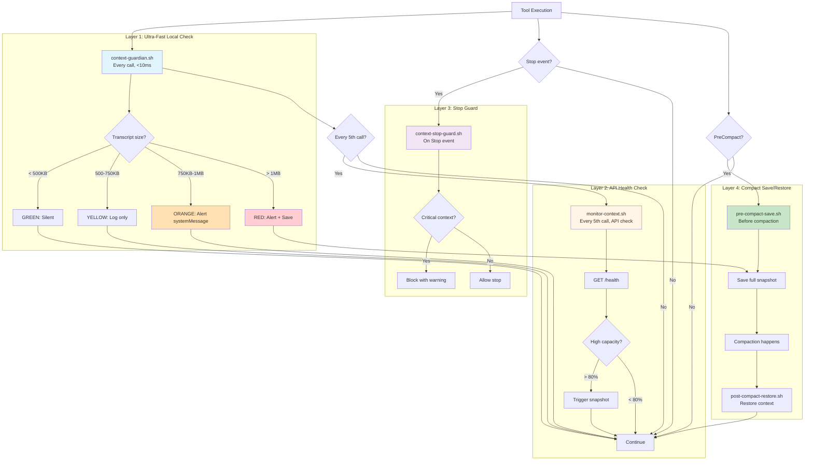
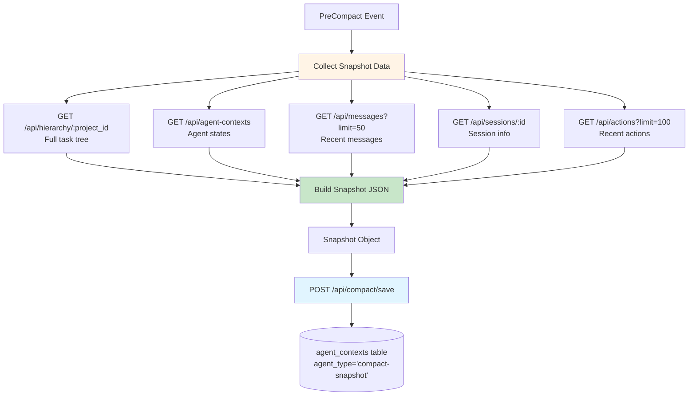
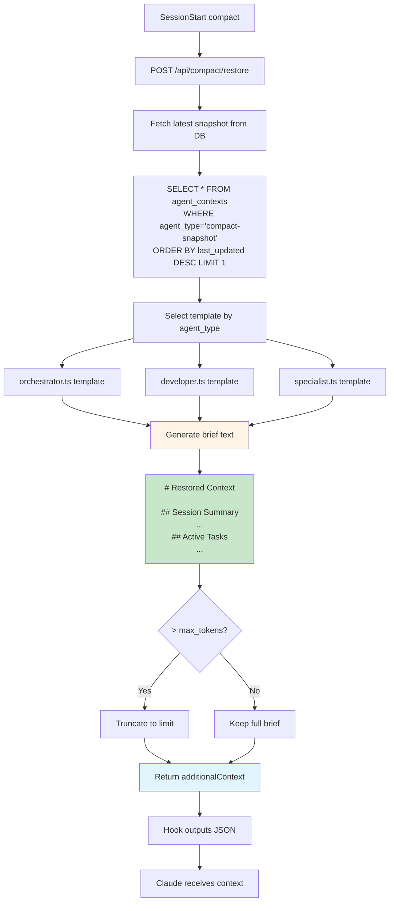

# Context Guardian - 4-Layer Protection

The Context Guardian is DCM's proactive context protection system. It uses a 4-layer defense-in-depth strategy to prevent context loss from window overflow.

## Why Context Protection Matters

Claude has a finite context window (typically 200K tokens). When this fills up:
1. Claude triggers **compaction** (conversation compression)
2. Without DCM: Context is lost, agents restart from scratch
3. With DCM: Context is saved, restored, and monitored

**The Guardian's job:** Prevent reaching compaction by monitoring and alerting early.

## The 4 Layers



## Layer 1: Ultra-Fast Local Check

**Script:** `context-guardian.sh`
**Event:** PostToolUse (every tool call)
**Frequency:** Every single tool execution
**Performance:** <10ms (no HTTP, local file stat only)

### How It Works

```bash
# Get transcript file size
transcript_path="/tmp/claude-transcript-${session_id}.json"
size_bytes=$(stat -c%s "$transcript_path" 2>/dev/null)
size_kb=$((size_bytes / 1024))
```

### Thresholds

| Zone | Size | Token Est. | Action | Output |
|------|------|------------|--------|--------|
| 🟢 Green | < 500KB | < 140K tokens | None | Silent |
| 🟡 Yellow | 500-750KB | 140-210K tokens | Log warning | Silent to Claude |
| 🟠 Orange | 750KB-1MB | 210-280K tokens | Alert Claude | systemMessage |
| 🔴 Red | > 1MB | > 280K tokens | Alert + Save | systemMessage + snapshot |

**Token estimation:** `tokens ≈ bytes / 4` (conservative estimate for text/code mix)

### Zone Behaviors

#### Green Zone (< 500KB)

```bash
# No action, silent exit
exit 0
```

**Why:** Plenty of context space remaining. No need to alert or log.

#### Yellow Zone (500-750KB)

```bash
log_message "INFO" "Transcript ${size_kb}KB (YELLOW)"
exit 0
```

**Why:** Approaching limit but not urgent. Log for admin visibility, don't distract Claude.

#### Orange Zone (750KB-1MB)

```bash
log_message "WARN" "Transcript ${size_kb}KB (ORANGE) - alerting Claude"
printf '{"systemMessage":"[DCM Guardian] Context at %dKB. Consider running /compact soon."}' "$size_kb"
exit 0
```

**Output to Claude:**
```
[DCM Guardian] Context at 850KB. Consider running /compact soon.
```

**Why:** High context usage. Claude should know but isn't critical yet.

#### Red Zone (> 1MB)

```bash
log_message "ALERT" "Transcript ${size_kb}KB (RED) - triggering proactive save"

# Alert Claude
printf '{"systemMessage":"[DCM Guardian] Context at %dKB (>1MB). Run /compact NOW to avoid context loss."}' "$size_kb"

# Fire-and-forget: proactive save
timeout 1.5s curl -s -X POST "${API_URL}/api/compact/save" \
    -H "Content-Type: application/json" \
    -d "$(jq -n \
        --arg sid "$session_id" \
        --arg summary "Guardian proactive save at ${size_kb}KB" \
        '{session_id: $sid, trigger: "proactive", context_summary: $summary}')" \
    2>/dev/null >/dev/null &

exit 0
```

**Output to Claude:**
```
[DCM Guardian] Context at 1050KB (>1MB). Run /compact NOW to avoid context loss.
```

**Why:** Critical threshold. Compaction likely imminent. Save snapshot now so we have recent state if compaction happens before user runs /compact.

### Caching Strategy

To avoid hammering the API on every tool call, Guardian caches the DCM health check:

```bash
HEALTH_CACHE="/tmp/.dcm-health-cache"
HEALTH_CACHE_TTL=60  # seconds

# Check cache age
if [[ -f "$HEALTH_CACHE" ]]; then
    cache_age=$(( $(date +%s) - $(stat -c%Y "$HEALTH_CACHE") ))
    if (( cache_age < HEALTH_CACHE_TTL )); then
        # Use cached result
        exit 0
    fi
fi

# Cache expired, check health
curl -s -o /dev/null -w "%{http_code}" "${API_URL}/health"
```

**Result:** API is only checked once per minute maximum, even with hundreds of tool calls.

### Performance Breakdown

```
Tool execution completes
  ↓ <1ms
Claude invokes PostToolUse hook
  ↓ <1ms
Bash launches context-guardian.sh
  ↓ 2-5ms
stat transcript file (local disk)
  ↓ 1-3ms
Compare size to thresholds
  ↓ <1ms
Output JSON (if needed)
  ↓ <1ms
Hook exits
  ↓ <1ms
Total: 8-15ms
```

## Layer 2: Proactive Monitoring

**Script:** `monitor-context.sh`
**Event:** PostToolUse (every tool call, but acts every Nth call)
**Frequency:** Every 5th tool execution (configurable)
**Performance:** 25-100ms (includes API call)

### How It Works

```bash
# Counter file
COUNTER_FILE="/tmp/.dcm-monitor-counter"

# Increment counter
if [[ -f "$COUNTER_FILE" ]]; then
    count=$(cat "$COUNTER_FILE")
else
    count=0
fi
count=$((count + 1))
echo "$count" > "$COUNTER_FILE"

# Check every Nth call
CHECK_INTERVAL=5
if (( count % CHECK_INTERVAL != 0 )); then
    exit 0  # Not this call
fi

# Reset counter
echo "0" > "$COUNTER_FILE"

# Check API health
health=$(curl -s "${API_URL}/health" | jq -r '.database.capacity_percentage // 0')

if (( health > 80 )); then
    # High capacity, trigger snapshot
    curl -s -X POST "${API_URL}/api/compact/save" \
        -d "{\"session_id\": \"$session_id\", \"trigger\": \"monitor\"}" \
        > /dev/null 2>&1 &
fi
```

### Cooldown Mechanism

To prevent snapshot spam:

```bash
COOLDOWN_FILE="/tmp/.dcm-last-proactive"
COOLDOWN_SECONDS=120

if [[ -f "$COOLDOWN_FILE" ]]; then
    last_snapshot=$(cat "$COOLDOWN_FILE")
    now=$(date +%s)
    elapsed=$((now - last_snapshot))

    if (( elapsed < COOLDOWN_SECONDS )); then
        # Still in cooldown, skip
        exit 0
    fi
fi

# Take snapshot
curl -s -X POST "${API_URL}/api/compact/save" ...

# Update cooldown
date +%s > "$COOLDOWN_FILE"
```

**Result:** Minimum 2 minutes between proactive snapshots.

### Configuration

```bash
# Environment variables (set in .env or export)
CHECK_INTERVAL=5         # Check every 5th call
COOLDOWN_SECONDS=120     # 2 minutes between snapshots
CAPACITY_THRESHOLD=80    # Trigger at 80% capacity
```

## Layer 3: Stop Guard

**Script:** `context-stop-guard.sh`
**Event:** Stop
**Frequency:** Once per session stop
**Performance:** <100ms

### How It Works

```bash
# Check if there are critical unsaved changes
unsaved_tasks=$(curl -s "${API_URL}/api/subtasks?status=running" | jq '. | length')

if (( unsaved_tasks > 0 )); then
    # Block stop with warning
    printf '{"decision":"block","reason":"You have %d running tasks. Save context before stopping."}' "$unsaved_tasks"
    exit 0
fi

# Allow stop
printf '{"decision":"allow"}'
exit 0
```

**When it blocks:**
- Running subtasks exist
- Recent critical errors
- Large unsaved context

**When it allows:**
- All tasks completed or paused
- Context recently saved
- User force-stop flag

### Decision Format

```json
{
  "decision": "block",
  "reason": "You have 3 running tasks. Save context before stopping."
}
```

Claude shows this to the user and prevents the stop action.

## Layer 4: Compact Save/Restore

**Scripts:** `pre-compact-save.sh` + `post-compact-restore.sh`
**Events:** PreCompact + SessionStart(compact)
**Frequency:** Each compaction (rare, maybe 1-2x per long session)
**Performance:** Save 500ms-2s, Restore 200ms-1s

### PreCompact Save Process



**Snapshot structure:**
```json
{
  "session_id": "session-abc123",
  "trigger": "auto",
  "timestamp": "2026-02-09T10:30:00.000Z",
  "context_summary": "Working on authentication feature, 3 active tasks",
  "active_tasks": [
    {
      "id": "uuid",
      "description": "Create User model",
      "status": "running",
      "agent_type": "backend-laravel"
    }
  ],
  "modified_files": [
    "/app/Models/User.php",
    "/database/migrations/2026_02_09_create_users_table.php"
  ],
  "key_decisions": [
    "Using JWT for authentication",
    "PostgreSQL for user storage"
  ],
  "agent_states": {
    "backend-laravel": {
      "status": "running",
      "progress": "60%",
      "last_action": "Migration created"
    },
    "frontend-react": {
      "status": "blocked",
      "blocked_by": "backend-laravel",
      "waiting_for": "API endpoints"
    }
  },
  "recent_messages": [
    {
      "from": "backend-laravel",
      "to": "frontend-react",
      "topic": "api_endpoint_created",
      "payload": {"endpoint": "/api/login"}
    }
  ]
}
```

### PostCompact Restore Process



**Output JSON:**
```json
{
  "hookSpecificOutput": {
    "additionalContext": "# Restored Context\n\n## Session Summary\nYou were working on implementing user authentication for a Laravel + React application.\n\n## Progress\n- ✅ User model created\n- ✅ Migration created\n- 🔄 API endpoints in progress (60%)\n- ⏸️ Frontend components blocked (waiting for API)\n\n## Active Tasks\n1. **backend-laravel** (running): Create authentication routes\n2. **frontend-react** (blocked): Build login form component\n\n## Recent Decisions\n- Using JWT for token-based authentication\n- PostgreSQL for user storage\n- bcrypt for password hashing\n\n## Modified Files\n- /app/Models/User.php\n- /database/migrations/2026_02_09_create_users_table.php\n\n## Next Steps\n1. Complete authentication routes\n2. Test API endpoints\n3. Unblock frontend team\n4. Build login UI"
  }
}
```

**Token optimization:**
- Brief is limited to `max_tokens` (default: 2000)
- Headers are always included
- Content is truncated at paragraph boundaries
- Truncation notice added at end

## Monitoring Guardian Health

### Check Guardian Logs

```bash
tail -f /tmp/dcm-guardian.log
```

**Example output:**
```
[2026-02-09 10:30:15] [INFO] Transcript 450KB (GREEN)
[2026-02-09 10:31:22] [INFO] Transcript 520KB (YELLOW)
[2026-02-09 10:32:45] [WARN] Transcript 800KB (ORANGE) - alerting Claude
[2026-02-09 10:33:10] [ALERT] Transcript 1050KB (RED) - triggering proactive save
```

### Check Monitor Stats

```bash
curl http://127.0.0.1:3847/api/cleanup/stats | jq
```

**Response:**
```json
{
  "last_cleanup": "2026-02-09T10:30:00.000Z",
  "messages": {
    "total": 234,
    "expired": 12,
    "active": 222
  },
  "proactive_snapshots": 3,
  "last_snapshot": "2026-02-09T10:33:10.000Z"
}
```

### View Compact History

```bash
curl "http://127.0.0.1:3847/api/agent-contexts?agent_type=compact-snapshot" | jq
```

**Response:**
```json
{
  "contexts": [
    {
      "id": "uuid",
      "session_id": "session-abc123",
      "trigger": "proactive",
      "last_updated": "2026-02-09T10:33:10.000Z",
      "token_count": 1234
    }
  ]
}
```

## Tuning Guardian Parameters

### Adjust Thresholds

Edit `context-guardian.sh`:

```bash
# Conservative (more alerts)
readonly THRESHOLD_YELLOW=$((400 * 1024))   # 400KB
readonly THRESHOLD_ORANGE=$((650 * 1024))   # 650KB
readonly THRESHOLD_RED=$((900 * 1024))      # 900KB

# Aggressive (fewer alerts)
readonly THRESHOLD_YELLOW=$((600 * 1024))   # 600KB
readonly THRESHOLD_ORANGE=$((850 * 1024))   # 850KB
readonly THRESHOLD_RED=$((1150 * 1024))     # 1150KB
```

### Adjust Monitor Interval

Edit `monitor-context.sh`:

```bash
# Check more frequently
CHECK_INTERVAL=3  # Every 3rd call

# Check less frequently
CHECK_INTERVAL=10  # Every 10th call
```

### Adjust Cooldown

Edit `monitor-context.sh`:

```bash
# Shorter cooldown (more snapshots)
COOLDOWN_SECONDS=60  # 1 minute

# Longer cooldown (fewer snapshots)
COOLDOWN_SECONDS=300  # 5 minutes
```

## Troubleshooting

### Problem: False Alarms

**Symptom:** Orange/red alerts but Claude not near limit

**Cause:** Transcript file includes metadata not sent to Claude

**Solution:**
1. Adjust thresholds upward by 10-20%
2. Use monitor layer (Layer 2) as primary indicator
3. Check actual token count via `/api/context/health/:agent_id`

### Problem: Too Many Snapshots

**Symptom:** Frequent proactive snapshots, API slow

**Solution:**
1. Increase cooldown: `COOLDOWN_SECONDS=300`
2. Increase capacity threshold: `CAPACITY_THRESHOLD=90`
3. Check database performance

### Problem: Guardian Not Alerting

**Symptom:** No systemMessage despite high context

**Solution:**
1. Check hook is installed: `cat ~/.config/ClaudeCode/settings.json`
2. Check transcript_path is correct
3. Test manually: `echo '{"transcript_path": "/path/to/transcript.json"}' | bash context-guardian.sh`

## Next Steps

- [06-compact-lifecycle.md](./06-compact-lifecycle.md) - Compact process deep dive
- [07-inter-agent-comm.md](./07-inter-agent-comm.md) - Inter-agent messaging
- [13-configuration.md](./13-configuration.md) - All configuration options

---

**Guardian Version:** 3.0.0 (4-layer protection active)
