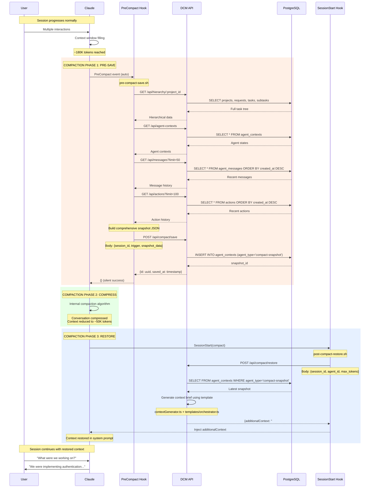

# Compact Save/Restore Lifecycle

This document provides a comprehensive deep-dive into DCM's compaction handling - the most critical feature for maintaining context continuity across Claude's context window limits.

## Why Compaction Happens

Claude Code has a finite context window (typically 200K tokens). As conversations grow:

1. **Token accumulation:** Each message, tool call, and response adds tokens
2. **Threshold reached:** When approaching the limit (~180K tokens)
3. **Compaction triggered:** Claude compresses the conversation automatically
4. **Context loss:** Without DCM, detailed context is lost

**DCM's solution:** Save state before compaction, restore it after.

## The Complete Lifecycle



## Phase 1: Pre-Compact Save

### Trigger Detection

PreCompact hook fires on two triggers:

```json
{
  "trigger": "auto",  // Claude's automatic compaction
  "session_id": "session-abc123",
  "cwd": "/home/user/project",
  "timestamp": "2026-02-09T10:30:00.000Z",
  "transcript_path": "/tmp/claude-transcript-abc123.json"
}
```

or

```json
{
  "trigger": "manual",  // User runs /compact command
  "session_id": "session-abc123",
  ...
}
```

### Data Collection

The `pre-compact-save.sh` script collects data from multiple sources:

#### 1. Hierarchical Task Tree

```bash
project_id=$(curl -s "${API_URL}/api/projects/by-path?path=${cwd}" | jq -r '.id')

hierarchy=$(curl -s "${API_URL}/api/hierarchy/${project_id}")
```

**Returns:**
```json
{
  "project": {
    "id": "uuid",
    "name": "My Project",
    "path": "/home/user/project"
  },
  "requests": [
    {
      "id": "uuid",
      "prompt": "Add authentication",
      "status": "active",
      "tasks": [
        {
          "id": "uuid",
          "name": "Backend Auth",
          "wave_number": 1,
          "subtasks": [
            {
              "id": "uuid",
              "agent_type": "backend-laravel",
              "description": "Create User model",
              "status": "completed"
            },
            {
              "id": "uuid",
              "agent_type": "backend-laravel",
              "description": "Create auth routes",
              "status": "running"
            }
          ]
        }
      ]
    }
  ]
}
```

#### 2. Agent States

```bash
agent_contexts=$(curl -s "${API_URL}/api/agent-contexts")
```

**Returns:**
```json
{
  "contexts": [
    {
      "id": "uuid",
      "agent_id": "backend-laravel-123",
      "agent_type": "backend-laravel",
      "role_context": {
        "current_task": "Authentication routes",
        "progress": "60%",
        "blockers": []
      },
      "skills_to_restore": ["eloquent", "routing"],
      "tools_used": ["Read", "Write", "Bash"],
      "last_updated": "2026-02-09T10:25:00.000Z"
    }
  ]
}
```

#### 3. Recent Messages

```bash
messages=$(curl -s "${API_URL}/api/messages?limit=50")
```

**Returns:**
```json
{
  "messages": [
    {
      "id": "uuid",
      "from_agent_id": "backend-laravel",
      "to_agent_id": "frontend-react",
      "topic": "api_endpoint_created",
      "payload": {
        "endpoint": "/api/login",
        "method": "POST",
        "description": "User login endpoint"
      },
      "priority": 5,
      "created_at": "2026-02-09T10:20:00.000Z"
    }
  ]
}
```

#### 4. Recent Actions

```bash
actions=$(curl -s "${API_URL}/api/actions?limit=100&session_id=${session_id}")
```

**Returns:**
```json
{
  "actions": [
    {
      "id": "uuid",
      "tool_name": "Write",
      "tool_type": "builtin",
      "file_paths": ["/app/Http/Controllers/AuthController.php"],
      "exit_code": 0,
      "duration_ms": 45,
      "created_at": "2026-02-09T10:28:00.000Z"
    }
  ]
}
```

### Snapshot Assembly

The hook combines all collected data into a comprehensive snapshot:

```bash
snapshot=$(jq -n \
  --arg sid "$session_id" \
  --arg trigger "$trigger" \
  --arg summary "$(generate_summary)" \
  --argjson hierarchy "$hierarchy" \
  --argjson agents "$agent_contexts" \
  --argjson messages "$messages" \
  --argjson actions "$actions" \
  --argjson files "$(get_modified_files)" \
  --argjson decisions "$(extract_key_decisions)" \
  '{
    session_id: $sid,
    trigger: $trigger,
    timestamp: (now | todate),
    context_summary: $summary,
    hierarchy: $hierarchy,
    agent_states: $agents,
    recent_messages: $messages,
    recent_actions: $actions,
    modified_files: $files,
    key_decisions: $decisions
  }')
```

### Snapshot Storage

```bash
curl -s -X POST "${API_URL}/api/compact/save" \
  -H "Content-Type: application/json" \
  -d "$snapshot"
```

**API handler (src/api/compact.ts):**
```typescript
export async function postCompactSave(c: Context) {
  const body = await c.req.json();
  const sql = getDb();

  const result = await sql`
    INSERT INTO agent_contexts (
      project_id,
      agent_id,
      agent_type,
      role_context,
      last_updated
    ) VALUES (
      ${body.project_id},
      ${body.session_id},
      'compact-snapshot',
      ${JSON.stringify(body)},
      NOW()
    )
    RETURNING id, last_updated
  `;

  return c.json({
    id: result[0].id,
    saved_at: result[0].last_updated
  });
}
```

**Database record:**
```sql
-- agent_contexts table
id: uuid
project_id: uuid (from cwd lookup)
agent_id: session-abc123
agent_type: 'compact-snapshot' -- Special marker
role_context: { /* full snapshot JSON */ }
last_updated: 2026-02-09 10:30:00
```

## Phase 2: Compaction

During this phase, Claude's internal process:

1. Analyzes conversation history
2. Identifies redundant or low-value content
3. Compresses messages while preserving key information
4. Reduces context from ~180K to ~50K tokens

**DCM is passive during this phase.** No hooks fire.

## Phase 3: Post-Compact Restore

### Restore Trigger

After compaction, Claude Code restarts the session with a special trigger:

```json
{
  "trigger": "compact",
  "session_id": "session-abc123",
  "cwd": "/home/user/project",
  "timestamp": "2026-02-09T10:30:05.000Z"
}
```

The `post-compact-restore.sh` hook matches on `"matcher": "compact"`.

### Context Brief Generation

```bash
# Detect agent type (orchestrator, developer, specialist)
agent_type=$(detect_agent_type)  # From cwd, prompt analysis, etc.

# Request context brief
brief=$(curl -s -X POST "${API_URL}/api/compact/restore" \
  -H "Content-Type: application/json" \
  -d "{
    \"session_id\": \"${session_id}\",
    \"agent_id\": \"${agent_type}\",
    \"agent_type\": \"${agent_type}\",
    \"max_tokens\": 2000
  }")
```

**API handler flow (src/api/compact.ts):**

```typescript
export async function postCompactRestore(c: Context) {
  const { session_id, agent_id, agent_type, max_tokens = 2000 } = await c.req.json();
  const sql = getDb();

  // 1. Fetch latest snapshot
  const snapshots = await sql`
    SELECT role_context
    FROM agent_contexts
    WHERE agent_id = ${session_id}
      AND agent_type = 'compact-snapshot'
    ORDER BY last_updated DESC
    LIMIT 1
  `;

  if (snapshots.length === 0) {
    return c.json({ additionalContext: "" });
  }

  const snapshot = snapshots[0].role_context;

  // 2. Generate context brief using template
  const brief = await generateContextBrief(
    agent_id,
    agent_type,
    session_id,
    {
      maxTokens: max_tokens,
      includeHistory: true,
      includeMessages: true,
      includeBlocking: true,
      snapshot  // Pass snapshot data
    }
  );

  // 3. Return as additionalContext
  return c.json({
    additionalContext: brief.brief
  });
}
```

### Template Selection

DCM has 4 prompt templates based on agent role:

```typescript
// src/templates/index.ts
export function generateBrief(
  agentType: string,
  data: AgentContextData,
  agentId: string,
  sessionId: string
): string {
  if (agentType.includes("orchestrator") || agentType.includes("tech-lead")) {
    return orchestratorTemplate(data, agentId, sessionId);
  }
  if (agentType.includes("developer") || agentType.includes("backend") || agentType.includes("frontend")) {
    return developerTemplate(data, agentId, sessionId);
  }
  if (agentType.includes("specialist")) {
    return specialistTemplate(data, agentId, sessionId);
  }
  return validatorTemplate(data, agentId, sessionId);
}
```

#### Orchestrator Template

```markdown
# Restored Context - Orchestration View

## Session Summary
Working on: {{prompt}}
Progress: {{progress_percentage}}%
Started: {{started_at}}

## Wave Status
Current Wave: {{current_wave}}
- Wave 0: {{wave_0_status}} (Dependencies, migrations)
- Wave 1: {{wave_1_status}} (Backend implementation)
- Wave 2: {{wave_2_status}} (Frontend integration)

## Active Subtasks
{{#each active_subtasks}}
- {{agent_type}}: {{description}} ({{status}})
  {{#if blocked_by}}Blocked by: {{blocked_by}}{{/if}}
{{/each}}

## Agent Status
{{#each agent_states}}
- {{agent_id}}: {{status}} ({{progress}})
{{/each}}

## Key Decisions
{{#each key_decisions}}
- {{decision}}
{{/each}}

## Modified Files (Last 20)
{{#each modified_files}}
- {{file_path}}
{{/each}}

## Next Steps
{{next_steps}}
```

#### Developer Template

```markdown
# Restored Context - Development View

## Current Task
{{current_task_description}}
Status: {{status}} ({{progress}}%)

## Recent Changes
{{#each modified_files}}
- {{file_path}} ({{tool_name}}, {{timestamp}})
{{/each}}

## Code Context
Language: {{language}}
Framework: {{framework}}
Dependencies: {{dependencies}}

## Active Issues
{{#each blockers}}
- {{issue}}
{{/each}}

## Tools Recently Used
{{#each tools_used}}
- {{tool_name}} ({{count}} times)
{{/each}}

## Next Action
{{next_action}}
```

### Context Injection

The hook outputs the brief in `hookSpecificOutput.additionalContext`:

```bash
# Extract brief from API response
brief=$(echo "$response" | jq -r '.additionalContext')

# Output JSON for Claude Code
jq -n \
  --arg context "$brief" \
  '{
    hookSpecificOutput: {
      additionalContext: $context
    }
  }'
```

**Example output:**
```json
{
  "hookSpecificOutput": {
    "additionalContext": "# Restored Context\n\n## Session Summary\nYou were implementing user authentication for a Laravel + React application.\n\n## Progress\nCurrent Wave: 1 (Backend Implementation)\n- Wave 0: ✅ Completed (Database migrations)\n- Wave 1: 🔄 In Progress (60% - Auth routes)\n- Wave 2: ⏸️ Blocked (Frontend components)\n\n## Active Subtasks\n- backend-laravel: Create authentication routes (running)\n- frontend-react: Build login form (blocked by backend-laravel)\n\n## Recent Decisions\n- Using JWT for stateless authentication\n- PostgreSQL for user storage\n- bcrypt for password hashing\n- Middleware for route protection\n\n## Modified Files\n1. /app/Models/User.php\n2. /database/migrations/2026_02_09_create_users_table.php\n3. /app/Http/Controllers/AuthController.php (in progress)\n\n## Next Steps\n1. Complete AuthController (login, register, logout methods)\n2. Test authentication endpoints with Postman\n3. Document API endpoints\n4. Unblock frontend team with API spec"
  }
}
```

**Claude receives this as:**
```
<system>
# Restored Context

## Session Summary
You were implementing user authentication for a Laravel + React application.

[... full brief ...]
</system>
```

## Token Optimization

### Brief Truncation

If brief exceeds `max_tokens`, DCM truncates intelligently:

```typescript
function truncateBrief(brief: string, maxChars: number): string {
  if (brief.length <= maxChars) return brief;

  const lines = brief.split("\n");
  const result: string[] = [];
  let currentLength = 0;

  for (const line of lines) {
    // Always include headers (# ## ###)
    if (line.startsWith("#")) {
      if (currentLength + line.length + 1 <= maxChars) {
        result.push(line);
        currentLength += line.length + 1;
      }
      continue;
    }

    // Add content lines if space permits
    if (currentLength + line.length + 1 <= maxChars - 50) {
      result.push(line);
      currentLength += line.length + 1;
    } else {
      break;
    }
  }

  // Add truncation notice
  result.push("");
  result.push("---");
  result.push("*[Brief truncated due to token limit]*");

  return result.join("\n");
}
```

**Result:** Brief maintains structure, critical headers included, content trimmed.

### Token Estimation

```typescript
const CHARS_PER_TOKEN = 3.5;  // Conservative estimate for text/code mix

function estimateTokens(text: string): number {
  return Math.ceil(text.length / CHARS_PER_TOKEN);
}
```

## Snapshot History

DCM keeps snapshot history for debugging and analysis:

```bash
# List all snapshots for a session
curl "http://127.0.0.1:3847/api/agent-contexts?agent_id=session-abc123&agent_type=compact-snapshot" | jq
```

**Response:**
```json
{
  "contexts": [
    {
      "id": "uuid-1",
      "agent_id": "session-abc123",
      "agent_type": "compact-snapshot",
      "last_updated": "2026-02-09T10:30:00.000Z",
      "role_context": {
        "trigger": "auto",
        "context_summary": "Working on authentication, 3 active tasks",
        "active_tasks": [...]
      }
    },
    {
      "id": "uuid-2",
      "agent_id": "session-abc123",
      "agent_type": "compact-snapshot",
      "last_updated": "2026-02-09T11:15:00.000Z",
      "role_context": {
        "trigger": "proactive",
        "context_summary": "Guardian proactive save at 1050KB",
        "active_tasks": [...]
      }
    }
  ]
}
```

## Testing Compact Flow

### Manual Compact Test

```bash
# 1. Create a test session with lots of context
cd /tmp/test-project
claude-code

# 2. In Claude: Create many files, run many commands
"Create 20 test files with Lorem Ipsum content"

# 3. Manually trigger compact
/compact

# 4. Check snapshot was saved
curl "http://127.0.0.1:3847/api/agent-contexts?agent_type=compact-snapshot" | jq '.contexts | length'
# Should return: 1 (or more)

# 5. Restart Claude Code session

# 6. Check context was restored
"What were we working on?"
# Claude should remember the test files
```

### Proactive Save Test

```bash
# 1. Start session
claude-code

# 2. Check guardian is working
tail -f /tmp/dcm-guardian.log

# 3. Generate lots of context (simulated)
dd if=/dev/urandom of=/tmp/large-file.txt bs=1M count=2
cat /tmp/large-file.txt
# Repeat many times

# 4. Guardian should alert and save
# Look for: [ALERT] Transcript 1050KB (RED) - triggering proactive save

# 5. Check snapshot
curl "http://127.0.0.1:3847/api/agent-contexts?agent_type=compact-snapshot" | jq
```

## Troubleshooting

### Problem: Context Not Restored

**Symptom:** After compaction, Claude has no memory of previous work

**Debug steps:**

1. Check snapshot was saved:
   ```bash
   curl "http://127.0.0.1:3847/api/agent-contexts?agent_id=session-abc123&agent_type=compact-snapshot"
   ```

2. Check SessionStart hook fired:
   ```bash
   cat ~/.config/ClaudeCode/settings.json | jq '.hooks.SessionStart'
   ```

3. Test restore manually:
   ```bash
   curl -X POST http://127.0.0.1:3847/api/compact/restore \
     -H "Content-Type: application/json" \
     -d '{"session_id": "session-abc123", "agent_id": "orchestrator", "agent_type": "orchestrator", "max_tokens": 2000}'
   ```

4. Check hook logs:
   ```bash
   bash hooks/post-compact-restore.sh < test-input.json
   ```

### Problem: Brief Too Short

**Symptom:** Restored context missing important details

**Solution:**

1. Increase max_tokens:
   ```bash
   # In post-compact-restore.sh
   max_tokens=5000  # Default: 2000
   ```

2. Check truncation:
   ```bash
   curl -X POST http://127.0.0.1:3847/api/compact/restore ... | jq '.additionalContext' | grep "truncated"
   ```

3. Prioritize critical information in templates

### Problem: Snapshot Too Large

**Symptom:** Slow saves, database bloat

**Solution:**

1. Limit action history:
   ```bash
   # In pre-compact-save.sh
   actions=$(curl "${API_URL}/api/actions?limit=50&session_id=${session_id}")  # Default: 100
   ```

2. Compress old snapshots:
   ```sql
   -- Manually compress snapshots older than 7 days
   UPDATE agent_contexts
   SET role_context = jsonb_strip_nulls(role_context)
   WHERE agent_type = 'compact-snapshot'
     AND last_updated < NOW() - INTERVAL '7 days';
   ```

3. Delete old snapshots:
   ```sql
   DELETE FROM agent_contexts
   WHERE agent_type = 'compact-snapshot'
     AND last_updated < NOW() - INTERVAL '30 days';
   ```

## Performance Metrics

| Phase | Duration | Notes |
|-------|----------|-------|
| Pre-Compact Save | 500ms-2s | Depends on data volume |
| Compaction | 2-5s | Claude's internal process |
| Post-Compact Restore | 200ms-1s | Template generation |
| Total overhead | 700ms-8s | Rare event (1-2x per long session) |

## Next Steps

- [07-inter-agent-comm.md](./07-inter-agent-comm.md) - Inter-agent messaging
- [08-orchestration.md](./08-orchestration.md) - Wave management
- [11-database-schema.md](./11-database-schema.md) - agent_contexts table details

---

**Compact System Version:** 3.0.0 (Full save/restore cycle)
