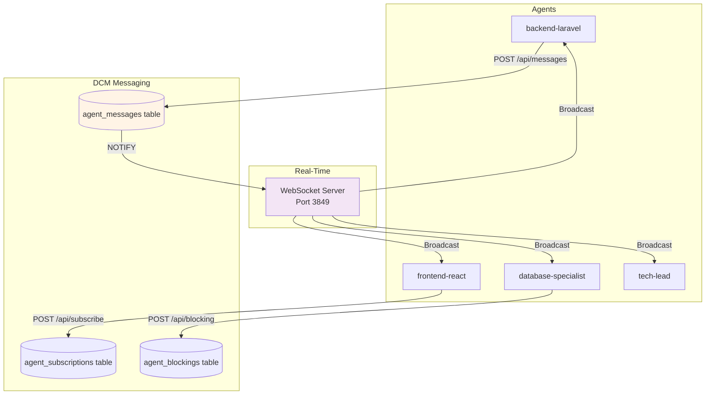
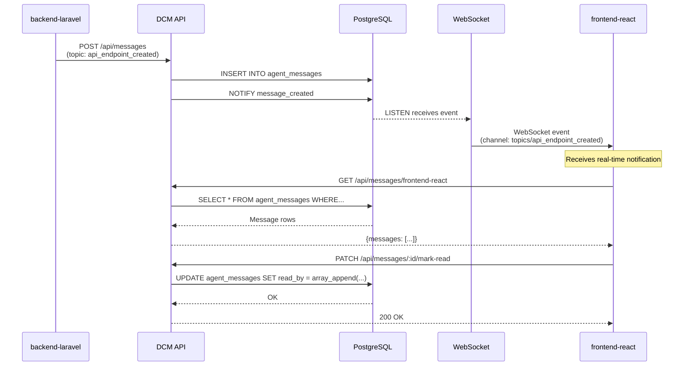

# Inter-Agent Communication

DCM provides a comprehensive pub/sub messaging system for agents to coordinate work, share context, and avoid duplication. This document covers messages, subscriptions, blocking, and real-time events.

## Why Inter-Agent Communication?

In multi-agent sessions, agents need to:
- **Share artifacts:** "I created the API endpoint `/api/users`"
- **Coordinate work:** "Wait for me to finish the database migration"
- **Avoid conflicts:** "I'm modifying `User.php`, don't touch it"
- **Broadcast decisions:** "We're using JWT authentication for all routes"

Without coordination, agents:
- Duplicate work
- Create merge conflicts
- Use incompatible approaches
- Lack awareness of dependencies

## Architecture Overview



## Messages API

### Message Structure

```typescript
interface AgentMessage {
  id: string;                    // UUID
  project_id: string;            // Scoping to project
  from_agent_id: string;         // Sender
  to_agent_id: string | null;    // Recipient (null = broadcast)
  message_type: "info" | "request" | "response" | "notification";
  topic: string;                 // Routing key
  payload: object;               // Message data (JSONB)
  priority: number;              // 0-10 scale
  read_by: string[];             // Array of agent IDs that read this
  created_at: string;            // ISO timestamp
  expires_at: string | null;     // TTL (null = no expiration)
}
```

### Sending Messages

#### Broadcast Message

```bash
curl -X POST http://127.0.0.1:3847/api/messages \
  -H "Content-Type: application/json" \
  -d '{
    "from_agent_id": "backend-laravel",
    "to_agent_id": null,
    "topic": "api_endpoint_created",
    "message_type": "info",
    "payload": {
      "endpoint": "/api/users",
      "method": "GET",
      "response_type": "User[]",
      "file": "/app/Http/Controllers/UserController.php"
    },
    "priority": 5
  }'
```

**Response:**
```json
{
  "id": "uuid",
  "created_at": "2026-02-09T10:30:00.000Z"
}
```

**Who receives:** All agents (broadcast)

#### Direct Message

```bash
curl -X POST http://127.0.0.1:3847/api/messages \
  -H "Content-Type: application/json" \
  -d '{
    "from_agent_id": "backend-laravel",
    "to_agent_id": "frontend-react",
    "topic": "api_contract_ready",
    "message_type": "notification",
    "payload": {
      "endpoints": ["/api/users", "/api/users/:id"],
      "types_file": "/types/api.ts",
      "ready_for_integration": true
    },
    "priority": 7,
    "expires_at": "2026-02-09T12:00:00.000Z"
  }'
```

**Who receives:** Only `frontend-react`

### Receiving Messages

#### Get Messages for Agent

```bash
curl "http://127.0.0.1:3847/api/messages/frontend-react?session_id=session-abc123"
```

**Response:**
```json
{
  "messages": [
    {
      "id": "uuid",
      "from_agent_id": "backend-laravel",
      "to_agent_id": "frontend-react",
      "topic": "api_contract_ready",
      "payload": {...},
      "priority": 7,
      "created_at": "2026-02-09T10:30:00.000Z",
      "is_read": false
    },
    {
      "id": "uuid",
      "from_agent_id": "tech-lead",
      "to_agent_id": null,
      "topic": "architecture_decision",
      "payload": {"decision": "Use JWT auth"},
      "priority": 8,
      "created_at": "2026-02-09T10:25:00.000Z",
      "is_read": false
    }
  ]
}
```

#### Get All Messages

```bash
curl "http://127.0.0.1:3847/api/messages?limit=50&offset=0"
```

### Message Topics

Topics are routing keys that categorize messages. Common patterns:

| Topic | Description | Example Payload |
|-------|-------------|-----------------|
| `api_endpoint_created` | New API endpoint | `{endpoint, method, description}` |
| `schema_updated` | Database schema change | `{table, migration_file}` |
| `file_modified` | File changed by agent | `{file_path, changes_summary}` |
| `task_completed` | Agent finished task | `{subtask_id, result}` |
| `architecture_decision` | Design decision | `{decision, rationale}` |
| `blocker_resolved` | Dependency unblocked | `{blocked_agent_id, resolution}` |
| `wave_transition` | Wave changed | `{from_wave, to_wave}` |
| `error_encountered` | Agent error | `{error, context}` |

**Convention:** Use `snake_case` for topics.

### Message Priority

Priority affects delivery order and urgency:

| Priority | Level | Use Case |
|----------|-------|----------|
| 0-2 | Low | FYI, logging, debugging info |
| 3-5 | Normal | Standard communication |
| 6-8 | High | Important decisions, blockers resolved |
| 9-10 | Critical | Urgent errors, breaking changes |

```bash
# High priority message
{
  "from_agent_id": "database-specialist",
  "topic": "schema_breaking_change",
  "payload": {
    "table": "users",
    "change": "Renamed column email → email_address",
    "impact": "All API endpoints must update"
  },
  "priority": 9
}
```

### Message Expiration

Messages can have TTL (time-to-live):

```bash
# Expires in 1 hour
{
  "from_agent_id": "orchestrator",
  "topic": "wave_transition",
  "payload": {"from_wave": 1, "to_wave": 2},
  "expires_at": "2026-02-09T11:30:00.000Z"
}
```

Expired messages are:
1. Cleaned up by background worker (every 60s)
2. Filtered out from queries
3. Archived to logs (optional)

### Read Tracking

When an agent reads a message, mark it:

```bash
# In agent code or hook
message_id="uuid"
agent_id="frontend-react"

curl -X PATCH "http://127.0.0.1:3847/api/messages/${message_id}/mark-read" \
  -d "{\"agent_id\": \"${agent_id}\"}"
```

**Database update:**
```sql
UPDATE agent_messages
SET read_by = array_append(read_by, 'frontend-react')
WHERE id = 'uuid';
```

## Subscriptions API

### Topic-Based Subscriptions

Agents subscribe to topics they care about:

```bash
curl -X POST http://127.0.0.1:3847/api/subscribe \
  -H "Content-Type: application/json" \
  -d '{
    "agent_id": "frontend-react",
    "topic": "api_endpoint_created"
  }'
```

**Response:**
```json
{
  "id": "uuid",
  "created_at": "2026-02-09T10:30:00.000Z"
}
```

Now `frontend-react` will be notified of all messages with topic `api_endpoint_created`.

### Multiple Subscriptions

```bash
# Subscribe to multiple topics
for topic in "api_endpoint_created" "schema_updated" "architecture_decision"; do
  curl -X POST http://127.0.0.1:3847/api/subscribe \
    -d "{\"agent_id\": \"frontend-react\", \"topic\": \"$topic\"}"
done
```

### List Subscriptions

```bash
curl "http://127.0.0.1:3847/api/subscriptions/frontend-react"
```

**Response:**
```json
{
  "subscriptions": [
    {
      "id": "uuid",
      "agent_id": "frontend-react",
      "topic": "api_endpoint_created",
      "created_at": "2026-02-09T10:30:00.000Z"
    },
    {
      "id": "uuid",
      "agent_id": "frontend-react",
      "topic": "schema_updated",
      "created_at": "2026-02-09T10:31:00.000Z"
    }
  ]
}
```

### Unsubscribe

```bash
curl -X POST http://127.0.0.1:3847/api/unsubscribe \
  -H "Content-Type: application/json" \
  -d '{
    "agent_id": "frontend-react",
    "topic": "api_endpoint_created"
  }'
```

## Blocking API

Agents can block other agents to enforce dependencies:

### Block an Agent

```bash
curl -X POST http://127.0.0.1:3847/api/blocking \
  -H "Content-Type: application/json" \
  -d '{
    "blocking_agent_id": "backend-laravel",
    "blocked_agent_id": "frontend-react",
    "reason": "API endpoints not ready. Wait for /api/users completion."
  }'
```

**Effect:**
- `frontend-react` is blocked
- Can query blocking status
- Can display warning to user
- Orchestrator can detect and handle

### Check if Blocked

```bash
curl "http://127.0.0.1:3847/api/blocking/check?agent_id=frontend-react"
```

**Response:**
```json
{
  "blocked": true,
  "blocking_agents": [
    {
      "blocking_agent_id": "backend-laravel",
      "reason": "API endpoints not ready",
      "created_at": "2026-02-09T10:30:00.000Z"
    }
  ]
}
```

**In agent code:**
```bash
blocked=$(curl -s "${API_URL}/api/blocking/check?agent_id=${agent_id}" | jq -r '.blocked')

if [[ "$blocked" == "true" ]]; then
    echo "Agent is blocked. Waiting for dependencies..."
    exit 1
fi
```

### Unblock an Agent

```bash
curl -X POST http://127.0.0.1:3847/api/unblock \
  -H "Content-Type: application/json" \
  -d '{
    "agent_id": "backend-laravel",
    "unblock_agent_id": "frontend-react"
  }'
```

Or automatically after task completion:

```bash
# In save-agent-result.sh hook
if [[ "$status" == "completed" ]]; then
    # Unblock any agents waiting for this one
    curl -X POST "${API_URL}/api/unblock" \
        -d "{\"agent_id\": \"${agent_id}\", \"unblock_agent_id\": \"*\"}"
fi
```

### List Blockings

```bash
curl "http://127.0.0.1:3847/api/blocking/backend-laravel"
```

**Response:**
```json
{
  "blocking": [
    {
      "id": "uuid",
      "blocked_agent_id": "frontend-react",
      "reason": "API endpoints not ready",
      "created_at": "2026-02-09T10:30:00.000Z"
    },
    {
      "id": "uuid",
      "blocked_agent_id": "mobile-flutter",
      "reason": "API endpoints not ready",
      "created_at": "2026-02-09T10:30:00.000Z"
    }
  ]
}
```

## Real-Time Events via WebSocket

Messages, subscriptions, and blockings trigger real-time WebSocket events.

### Connect to WebSocket

1. Get auth token:
   ```bash
   token=$(curl -X POST http://127.0.0.1:3847/api/auth/token \
     -d '{"agent_id": "frontend-react"}' | jq -r '.token')
   ```

2. Connect to WebSocket:
   ```javascript
   const ws = new WebSocket('ws://127.0.0.1:3849');

   ws.onopen = () => {
     // Authenticate
     ws.send(JSON.stringify({
       type: 'auth',
       agent_id: 'frontend-react',
       token: token,
       timestamp: Date.now()
     }));

     // Subscribe to channels
     ws.send(JSON.stringify({
       type: 'subscribe',
       channel: 'agents/frontend-react',
       timestamp: Date.now()
     }));

     ws.send(JSON.stringify({
       type: 'subscribe',
       channel: 'topics/api_endpoint_created',
       timestamp: Date.now()
     }));
   };

   ws.onmessage = (event) => {
     const msg = JSON.parse(event.data);
     console.log('Received:', msg);
   };
   ```

### Event Types

When messages are sent, WebSocket broadcasts:

```json
{
  "channel": "agents/frontend-react",
  "event": "message.new",
  "data": {
    "message_id": "uuid",
    "from_agent": "backend-laravel",
    "topic": "api_endpoint_created",
    "content": {
      "endpoint": "/api/users",
      "method": "GET"
    },
    "priority": 5
  },
  "timestamp": 1707400000000
}
```

```json
{
  "channel": "topics/api_endpoint_created",
  "event": "message.new",
  "data": {
    "message_id": "uuid",
    "from_agent": "backend-laravel",
    "to_agent": null,
    "content": {...}
  },
  "timestamp": 1707400000000
}
```

### Blocking Events

```json
{
  "channel": "agents/frontend-react",
  "event": "agent.blocked",
  "data": {
    "blocking_agent": "backend-laravel",
    "reason": "API endpoints not ready",
    "timestamp": "2026-02-09T10:30:00.000Z"
  },
  "timestamp": 1707400000000
}
```

```json
{
  "channel": "agents/frontend-react",
  "event": "agent.unblocked",
  "data": {
    "blocking_agent": "backend-laravel",
    "reason": "API endpoints completed",
    "timestamp": "2026-02-09T10:45:00.000Z"
  },
  "timestamp": 1707400000000
}
```

## Common Patterns

### Pattern 1: API Contract Sharing

```bash
# backend-laravel completes API endpoint
curl -X POST "${API_URL}/api/messages" -d '{
  "from_agent_id": "backend-laravel",
  "to_agent_id": null,
  "topic": "api_endpoint_created",
  "payload": {
    "endpoint": "/api/users",
    "method": "GET",
    "request_params": {"page": "number", "limit": "number"},
    "response_type": "User[]",
    "response_example": [{"id": 1, "name": "John", "email": "john@example.com"}],
    "file": "/app/Http/Controllers/UserController.php",
    "test_url": "http://localhost:8000/api/users"
  },
  "priority": 7
}'

# frontend-react receives and uses it
messages=$(curl "${API_URL}/api/messages/frontend-react")
endpoint=$(echo "$messages" | jq -r '.messages[] | select(.topic=="api_endpoint_created") | .payload.endpoint')

# Now frontend can implement the client
```

### Pattern 2: Schema Migration Notice

```bash
# database-specialist runs migration
curl -X POST "${API_URL}/api/messages" -d '{
  "from_agent_id": "database-specialist",
  "to_agent_id": null,
  "topic": "schema_updated",
  "payload": {
    "table": "users",
    "migration": "2026_02_09_add_two_factor_to_users",
    "changes": [
      "Added column: two_factor_secret (TEXT NULL)",
      "Added column: two_factor_recovery_codes (TEXT NULL)"
    ],
    "breaking": false,
    "migration_file": "/database/migrations/2026_02_09_add_two_factor_to_users.php"
  },
  "priority": 6
}'

# All agents receive and update their models/types
```

### Pattern 3: Wave Transition Broadcast

```bash
# orchestrator transitions wave
curl -X POST "${API_URL}/api/messages" -d '{
  "from_agent_id": "orchestrator",
  "to_agent_id": null,
  "topic": "wave_transition",
  "payload": {
    "from_wave": 1,
    "to_wave": 2,
    "completed_tasks": ["backend-implementation", "api-tests"],
    "next_tasks": ["frontend-components", "ui-integration"]
  },
  "priority": 8
}'

# All agents receive and prepare for next wave
```

### Pattern 4: Conflict Prevention

```bash
# Agent A starts modifying file
curl -X POST "${API_URL}/api/messages" -d '{
  "from_agent_id": "backend-laravel",
  "topic": "file_lock",
  "payload": {
    "file": "/app/Models/User.php",
    "action": "modifying",
    "estimated_duration": "5 minutes"
  },
  "priority": 6,
  "expires_at": "2026-02-09T10:40:00.000Z"
}'

# Agent B checks before modifying
locks=$(curl "${API_URL}/api/messages?topic=file_lock")
file_locked=$(echo "$locks" | jq '.messages[] | select(.payload.file=="/app/Models/User.php")')

if [[ -n "$file_locked" ]]; then
    echo "File is locked by ${from_agent_id}. Waiting..."
    sleep 30
fi
```

## Message Flow Diagram



## Troubleshooting

### Problem: Messages Not Received

**Debug:**
```bash
# 1. Check message was sent
curl "http://127.0.0.1:3847/api/messages" | jq '.messages | length'

# 2. Check agent subscriptions
curl "http://127.0.0.1:3847/api/subscriptions/frontend-react"

# 3. Check message topic matches subscription
curl "http://127.0.0.1:3847/api/messages" | jq '.messages[0].topic'

# 4. Check expiration
curl "http://127.0.0.1:3847/api/messages" | jq '.messages[0].expires_at'
```

### Problem: WebSocket Not Receiving Events

**Debug:**
```bash
# 1. Check WebSocket is running
lsof -i :3849

# 2. Check authentication
# In browser console or Node.js
ws.send(JSON.stringify({type: 'auth', agent_id: 'test', token: 'your-token'}));
# Should receive: {type: 'ack', success: true}

# 3. Check subscription
ws.send(JSON.stringify({type: 'subscribe', channel: 'global'}));
# Should receive: {type: 'ack', success: true}

# 4. Test NOTIFY manually
psql -U dcm -d claude_context -c "NOTIFY message_created, '{\"test\": true}';"
```

### Problem: Agent Stays Blocked

**Debug:**
```bash
# 1. Check blocking status
curl "http://127.0.0.1:3847/api/blocking/check?agent_id=frontend-react"

# 2. List all blockings
curl "http://127.0.0.1:3847/api/blocking/backend-laravel"

# 3. Force unblock
curl -X POST "http://127.0.0.1:3847/api/unblock" \
  -d '{"agent_id": "backend-laravel", "unblock_agent_id": "frontend-react"}'
```

## Next Steps

- [08-orchestration.md](./08-orchestration.md) - Wave and batch management
- [09-websocket.md](./09-websocket.md) - WebSocket protocol details
- [10-dashboard.md](./10-dashboard.md) - Viewing messages in UI

---

**Inter-Agent Communication Version:** 3.0.0 (Full pub/sub + blocking)
