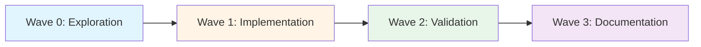
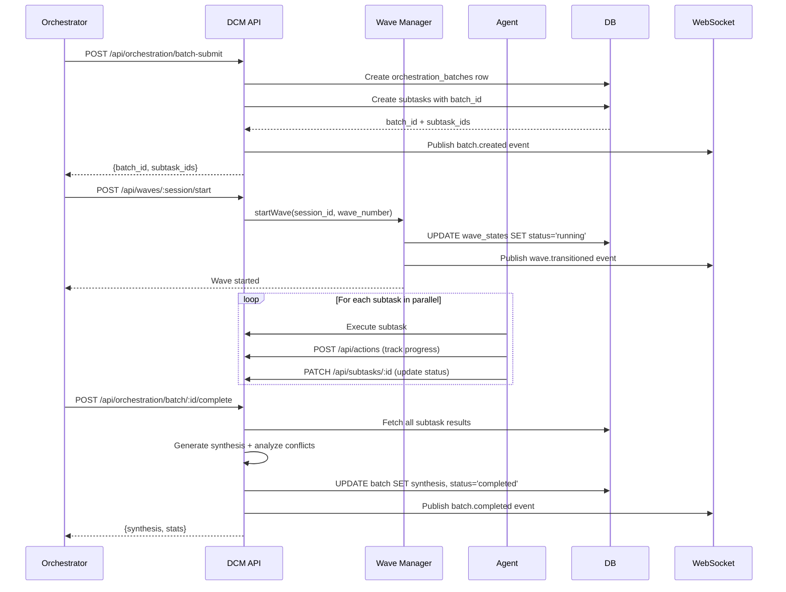

# Wave Orchestration System

**Version:** 3.0.0
**Generated:** 2026-02-09
**Status:** Production Ready

## Overview

DCM's orchestration system provides sophisticated multi-agent task coordination through a wave-based execution model. It enables complex workflows to be decomposed into manageable subtasks, executed in parallel where possible, and synthesized into coherent results.

## Core Concepts

### Waves

Waves are sequential execution phases that group related subtasks. Each wave must complete before the next begins, enabling:

- **Ordered execution**: Critical dependencies between phases
- **Parallel work**: Multiple agents working simultaneously within a wave
- **Clear phase transitions**: Explicit boundaries between work stages
- **Failure isolation**: Failed waves don't cascade to future waves



### Wave States

Each wave progresses through states:

| State | Description | Next States |
|-------|-------------|-------------|
| `pending` | Wave created, not started | `running` |
| `running` | Tasks actively executing | `completed`, `failed` |
| `completed` | All tasks succeeded | N/A |
| `failed` | One or more critical failures | N/A |

### Orchestration Batches

Batches represent a collection of subtasks submitted together for wave execution. Each batch tracks:

- **Total tasks**: Number of subtasks in the batch
- **Completed tasks**: Successfully finished subtasks
- **Failed tasks**: Subtasks that encountered errors
- **Synthesis**: Aggregated results and conflict analysis

### Subtasks

Individual work items assigned to specific agent types. Subtasks within a wave can execute in parallel unless dependencies exist.

**Subtask Properties:**
- `agent_type`: Role (e.g., "backend-laravel", "frontend-react")
- `agent_id`: Instance identifier
- `description`: Task specification
- `status`: pending, running, paused, blocked, completed, failed
- `priority`: 1-10 scale (higher = more important)
- `blocked_by`: Array of subtask IDs that must complete first
- `result`: JSONB output data
- `context_snapshot`: State captured at task start

## Wave Execution Flow



## API Reference

### Batch Submission

**POST** `/api/orchestration/batch-submit`

Create a batch of tasks for wave execution.

**Request Body:**
```json
{
  "session_id": "session-uuid",
  "wave_number": 1,
  "tasks": [
    {
      "task_id": "uuid",
      "agent_type": "backend-laravel",
      "description": "Create User API endpoint",
      "priority": 8
    },
    {
      "task_id": "uuid",
      "agent_type": "frontend-react",
      "description": "Build user profile component",
      "priority": 5
    }
  ]
}
```

**Response:**
```json
{
  "success": true,
  "batch": {
    "id": "batch-uuid",
    "session_id": "session-uuid",
    "wave_number": 1,
    "status": "pending",
    "total_tasks": 2,
    "completed_tasks": 0,
    "failed_tasks": 0,
    "created_at": "2026-02-09T10:00:00Z",
    "subtask_ids": ["subtask-uuid-1", "subtask-uuid-2"]
  }
}
```

### Get Batch Status

**GET** `/api/orchestration/batch/:id`

Retrieve batch status with all subtasks.

**Response:**
```json
{
  "batch": {
    "id": "batch-uuid",
    "wave_number": 1,
    "status": "running",
    "total_tasks": 2,
    "completed_tasks": 1,
    "failed_tasks": 0,
    "subtasks": [
      {
        "id": "subtask-uuid-1",
        "agent_type": "backend-laravel",
        "status": "completed",
        "priority": 8,
        "result": {
          "files": ["app/Http/Controllers/UserController.php"],
          "summary": "Created CRUD endpoints for User resource"
        },
        "created_at": "2026-02-09T10:00:00Z",
        "completed_at": "2026-02-09T10:15:00Z"
      },
      {
        "id": "subtask-uuid-2",
        "agent_type": "frontend-react",
        "status": "running",
        "priority": 5,
        "created_at": "2026-02-09T10:00:00Z"
      }
    ]
  }
}
```

### Complete Batch

**POST** `/api/orchestration/batch/:id/complete`

Mark batch as complete and generate synthesis.

**Response:**
```json
{
  "success": true,
  "synthesis": {
    "summary": "Wave 1: 2/2 tasks completed. 5 files modified, 0 conflicts.",
    "results": [
      {
        "agent": "backend-laravel",
        "status": "completed",
        "files": ["app/Http/Controllers/UserController.php", "routes/api.php"],
        "summary": "Created User API endpoint",
        "duration_ms": 45000
      },
      {
        "agent": "frontend-react",
        "status": "completed",
        "files": ["src/components/UserProfile.tsx", "src/hooks/useUser.ts"],
        "summary": "Built user profile component",
        "duration_ms": 60000
      }
    ],
    "conflicts": [],
    "files_changed": [
      "app/Http/Controllers/UserController.php",
      "routes/api.php",
      "src/components/UserProfile.tsx",
      "src/hooks/useUser.ts",
      "src/types/user.ts"
    ],
    "next_wave_ready": true,
    "tokens_saved": 2900,
    "stats": {
      "total_tasks": 2,
      "completed": 2,
      "failed": 0,
      "files_modified": 5,
      "avg_duration_ms": 52500,
      "total_duration_ms": 105000
    }
  }
}
```

### Get Synthesis

**GET** `/api/orchestration/synthesis/:id`

Retrieve synthesis JSONB (optimized for token savings).

Returns the synthesis object only, without wrapping metadata.

### Analyze Conflicts

**GET** `/api/orchestration/conflicts/:id`

Analyze batch subtasks for potential conflicts.

**Response:**
```json
{
  "batch_id": "batch-uuid",
  "conflicts": [
    {
      "type": "file_conflict",
      "severity": "high",
      "agents": ["backend-laravel", "frontend-react"],
      "description": "Multiple agents modified the same file: src/types/user.ts",
      "files": ["src/types/user.ts"]
    }
  ],
  "conflict_count": 1
}
```

**Conflict Types:**
- **file_conflict**: Multiple agents modified the same file
- **dependency_conflict**: Blocked task depends on failed task

## Wave Management API

### Create Wave

**POST** `/api/waves/:session_id/create`

**Request Body:**
```json
{
  "wave_number": 1,
  "name": "Implementation Phase",
  "description": "Core feature implementation"
}
```

**Response:**
```json
{
  "success": true,
  "wave": {
    "id": "wave-uuid",
    "session_id": "session-uuid",
    "wave_number": 1,
    "status": "pending",
    "total_tasks": 0,
    "completed_tasks": 0,
    "failed_tasks": 0,
    "started_at": null,
    "completed_at": null
  }
}
```

### Start Wave

**POST** `/api/waves/:session_id/start`

**Request Body:**
```json
{
  "wave_number": 1
}
```

### Get Current Wave

**GET** `/api/waves/:session_id/current`

Returns the currently running wave or latest pending wave.

### Get Wave History

**GET** `/api/waves/:session_id/history`

Returns all waves for a session, ordered by wave number.

### Transition to Next Wave

**POST** `/api/waves/:session_id/transition`

Automatically transitions from the last completed wave to the next pending wave.

## Orchestration Planner

The orchestration planner provides intelligent task decomposition and prompt crafting.

### Craft Scoped Prompt

**POST** `/api/orchestration/craft-prompt`

Generate a scoped, token-optimized prompt for a subagent.

**Request Body:**
```json
{
  "task_description": "Add user authentication to the API",
  "agent_type": "backend-laravel",
  "session_id": "session-uuid",
  "target_files": [
    "app/Http/Controllers/AuthController.php",
    "routes/api.php"
  ],
  "target_directories": ["app/Http/Middleware"],
  "context_budget_tokens": 2000,
  "wave_number": 1
}
```

**Response:**
```json
{
  "crafted_prompt": "# Task for Laravel Backend Developer\n\n## Task\n\nAdd user authentication to the API\n\n## MANDATORY Scope Constraints\n\n**Target Files** (ONLY touch these files):\n- `app/Http/Controllers/AuthController.php`\n- `routes/api.php`\n\n**Target Directories** (stay within these boundaries):\n- `app/Http/Middleware`\n\n**Max Files**: Do not modify more than 5 files.\n\n**Rules**:\n- Do NOT scan the entire codebase\n- Do NOT explore files outside the target scope\n- Do NOT create files unless absolutely necessary\n- Complete your task and report results concisely\n\n## Previous Wave Context\n\n1 task(s) completed in previous wave(s):\n\n- **Explore** (done): Analyzed authentication requirements\n  Result: Found existing JWT library, recommended Sanctum\n\n## Completion\n\nWhen done, provide a concise summary of:\n1. What was changed/found\n2. Files modified (if any)\n3. Any issues or blockers encountered",
  "max_turns": 10,
  "model": "sonnet",
  "complexity": "moderate",
  "scope_directives": {
    "target_files": ["app/Http/Controllers/AuthController.php", "routes/api.php"],
    "target_directories": ["app/Http/Middleware"],
    "max_files": 5,
    "forbidden_actions": ["delete migrations", "drop tables"]
  }
}
```

### Complexity Estimation

The planner estimates task complexity using:

1. **Keyword analysis**: Matches task description against complexity tiers
2. **File count**: Number of target files/directories
3. **Agent scope**: Registry-defined constraints

**Complexity Tiers:**

| Tier | Max Turns | Model | Keywords |
|------|-----------|-------|----------|
| trivial | 3 | haiku | fix typo, rename, update comment, single line |
| simple | 5 | haiku | add field, update config, small change, one file |
| moderate | 10 | sonnet | refactor, implement, create component, multi-file |
| complex | 20 | sonnet | explore, audit, analyze, investigate, debug |
| expert | 30 | opus | architecture, redesign, migration, security audit |

### Decompose Task

**POST** `/api/orchestration/decompose`

Break down a complex task into subtasks with wave assignments.

**Request Body:**
```json
{
  "task_description": "Build a complete user management system with authentication and profiles",
  "session_id": "session-uuid",
  "constraints": {
    "max_parallel": 3,
    "max_total_turns": 50
  }
}
```

**Response:**
```json
{
  "plan_id": "plan_1707400000_abc123",
  "subtasks": [
    {
      "step": 0,
      "wave": 0,
      "agent_type": "Explore",
      "description": "Explore and understand the codebase relevant to: Build a complete user management system",
      "max_turns": 8,
      "model": "sonnet",
      "depends_on": []
    },
    {
      "step": 1,
      "wave": 1,
      "agent_type": "backend-laravel",
      "description": "Implement: Build a complete user management system",
      "max_turns": 10,
      "model": "sonnet",
      "depends_on": [0]
    },
    {
      "step": 2,
      "wave": 1,
      "agent_type": "frontend-react",
      "description": "Implement: Build a complete user management system",
      "max_turns": 10,
      "model": "sonnet",
      "depends_on": [0]
    },
    {
      "step": 3,
      "wave": 2,
      "agent_type": "code-reviewer",
      "description": "Review and validate changes from: Build a complete user management system",
      "max_turns": 5,
      "model": "haiku",
      "depends_on": [1, 2]
    }
  ],
  "execution_plan": {
    "waves": [
      {"wave": 0, "parallel": 1, "tasks": [0]},
      {"wave": 1, "parallel": 2, "tasks": [1, 2]},
      {"wave": 2, "parallel": 1, "tasks": [3]}
    ],
    "total_turns": 33,
    "max_parallel": 3
  }
}
```

## Agent Keyword Matching

The decomposer uses keyword heuristics to match tasks to agent types:

| Agent Type | Keywords |
|------------|----------|
| Explore | explore, find, search, scan, investigate, understand, codebase |
| Snipper | edit, modify, change, update, fix, create file, write code |
| frontend-react | react, component, ui, frontend, tsx, jsx, css, style |
| backend-laravel | laravel, php, controller, migration, model, artisan |
| supabase-backend | supabase, rls, policy, database, schema, sql |
| test-engineer | test, testing, spec, coverage, assert, expect, jest, vitest |
| security-specialist | security, vulnerability, auth, permission, owasp |
| docs-writer | document, readme, docs, api doc, changelog |
| code-reviewer | review, audit, quality, lint, clean |
| performance-engineer | performance, optimize, cache, latency, profil |

## Database Schema

### `wave_states` Table

Tracks wave state machine for each session.

```sql
CREATE TABLE wave_states (
  id UUID PRIMARY KEY DEFAULT gen_random_uuid(),
  session_id TEXT NOT NULL,
  wave_number INTEGER NOT NULL,
  status TEXT DEFAULT 'pending',
  total_tasks INTEGER DEFAULT 0,
  completed_tasks INTEGER DEFAULT 0,
  failed_tasks INTEGER DEFAULT 0,
  started_at TIMESTAMPTZ,
  completed_at TIMESTAMPTZ,
  UNIQUE(session_id, wave_number)
);
```

### `orchestration_batches` Table

Tracks batch submissions and synthesis.

```sql
CREATE TABLE orchestration_batches (
  id UUID PRIMARY KEY DEFAULT gen_random_uuid(),
  session_id TEXT NOT NULL,
  wave_number INTEGER NOT NULL,
  status TEXT DEFAULT 'pending',
  total_tasks INTEGER DEFAULT 0,
  completed_tasks INTEGER DEFAULT 0,
  failed_tasks INTEGER DEFAULT 0,
  synthesis JSONB,
  created_at TIMESTAMPTZ DEFAULT NOW(),
  completed_at TIMESTAMPTZ
);
```

### Subtasks Batch Linking

Subtasks are linked to batches via `batch_id`:

```sql
ALTER TABLE subtasks ADD COLUMN batch_id UUID REFERENCES orchestration_batches(id);
```

## WebSocket Events

### Wave Events

- `wave.transitioned` - Wave status changed
- `wave.completed` - Wave successfully finished
- `wave.failed` - Wave failed with critical errors

**Event Payload:**
```json
{
  "channel": "global",
  "event": "wave.transitioned",
  "data": {
    "session_id": "session-uuid",
    "from": 0,
    "to": 1,
    "status": "running"
  },
  "timestamp": 1707400000000
}
```

### Batch Events

- `batch.created` - New batch submitted
- `batch.completed` - Batch finished and synthesized

**Event Payload:**
```json
{
  "channel": "global",
  "event": "batch.completed",
  "data": {
    "batch_id": "batch-uuid",
    "session_id": "session-uuid",
    "wave_number": 1,
    "completed_tasks": 5,
    "failed_tasks": 0,
    "next_wave_ready": true
  },
  "timestamp": 1707400000000
}
```

## Best Practices

### 1. Wave Design

- **Wave 0**: Always start with exploration/planning
- **Wave 1-N**: Implementation waves grouped by dependency
- **Final Wave**: Validation, testing, and documentation

### 2. Task Granularity

- Keep subtasks atomic (1 responsibility)
- Target 5-15 minutes per subtask
- Avoid subtasks that span >20 turns

### 3. Parallel Execution

- Maximum 3-5 parallel agents per wave
- Ensure truly independent work (no file conflicts)
- Use `blocked_by` for explicit dependencies

### 4. Scope Management

- Always provide `target_files` or `target_directories`
- Set `max_files` to prevent scope creep
- Use `forbidden_actions` for safety constraints

### 5. Synthesis Optimization

- Use `/api/orchestration/synthesis/:id` for token-optimized results
- Check conflicts before next wave: `/api/orchestration/conflicts/:id`
- Archive synthesis for long-term context recovery

## Example: Full Orchestration Flow

```bash
# 1. Create wave state
curl -X POST http://localhost:3847/api/waves/session-abc/create \
  -H "Content-Type: application/json" \
  -d '{"wave_number": 1}'

# 2. Submit batch of tasks
curl -X POST http://localhost:3847/api/orchestration/batch-submit \
  -H "Content-Type: application/json" \
  -d '{
    "session_id": "session-abc",
    "wave_number": 1,
    "tasks": [
      {
        "task_id": "task-uuid-1",
        "agent_type": "backend-laravel",
        "description": "Create User CRUD endpoints",
        "priority": 8
      },
      {
        "task_id": "task-uuid-2",
        "agent_type": "frontend-react",
        "description": "Build user management UI",
        "priority": 7
      }
    ]
  }'

# 3. Start wave
curl -X POST http://localhost:3847/api/waves/session-abc/start \
  -H "Content-Type: application/json" \
  -d '{"wave_number": 1}'

# 4. Agents execute (tracked automatically via hooks)

# 5. Complete batch and generate synthesis
curl -X POST http://localhost:3847/api/orchestration/batch/batch-uuid/complete

# 6. Check for conflicts
curl http://localhost:3847/api/orchestration/conflicts/batch-uuid

# 7. Transition to next wave
curl -X POST http://localhost:3847/api/waves/session-abc/transition
```

## Troubleshooting

### Wave Not Transitioning

**Symptom:** Wave stuck in "running" state.

**Cause:** Not all subtasks marked as completed/failed.

**Solution:**
```bash
# Check batch status
curl http://localhost:3847/api/orchestration/batch/batch-uuid

# Manually complete pending subtasks or mark them failed
curl -X PATCH http://localhost:3847/api/subtasks/subtask-uuid \
  -H "Content-Type: application/json" \
  -d '{"status": "completed"}'
```

### High Conflict Count

**Symptom:** Multiple file conflicts reported.

**Cause:** Insufficient scope constraints or overlapping responsibilities.

**Solution:**
- Refine `target_files` to be more specific
- Use `target_directories` to enforce boundaries
- Split conflicting tasks into sequential waves

### Synthesis Too Large

**Symptom:** Synthesis exceeds token budget.

**Cause:** Too many subtasks or verbose results.

**Solution:**
```bash
# Use synthesis endpoint (token-optimized)
curl http://localhost:3847/api/orchestration/synthesis/batch-uuid

# Or set context_budget_tokens in craft-prompt
```

## Next Steps

- [09-websocket.md](./09-websocket.md) - Real-time event subscriptions
- [10-dashboard.md](./10-dashboard.md) - Wave visualization UI
- [07-inter-agent-comm.md](./07-inter-agent-comm.md) - Agent messaging

---

**Status:** Wave orchestration system active since Phase 9. Production-ready.
