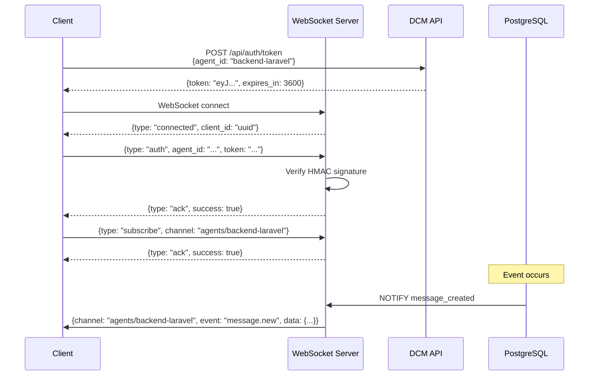

# WebSocket Protocol

DCM's WebSocket server provides real-time bidirectional communication for agents, orchestrators, and the dashboard. This document covers the complete protocol, authentication, channels, and client implementation.

## Overview

**Server:** ws://127.0.0.1:3849
**Technology:** Bun native WebSocket (zero dependencies)
**Authentication:** HMAC-signed tokens
**Protocol:** JSON messages over WebSocket
**Features:**
- Channel-based pub/sub
- PostgreSQL LISTEN/NOTIFY bridge
- Client state management
- Automatic reconnection support

## Connection Flow



## Authentication

### Step 1: Get Token from API

```bash
curl -X POST http://127.0.0.1:3847/api/auth/token \
  -H "Content-Type: application/json" \
  -d '{
    "agent_id": "backend-laravel",
    "session_id": "session-abc123"
  }'
```

**Response:**
```json
{
  "token": "eyJhbGciOiJIUzI1NiIsInR5cCI6IkpXVCJ9.eyJhZ2VudF9pZCI6ImJhY2tlbmQtbGFyYXZlbCIsInNlc3Npb25faWQiOiJzZXNzaW9uLWFiYzEyMyIsImlhdCI6MTcwNzQwMDAwMCwiZXhwIjoxNzA3NDAzNjAwfQ.signature",
  "expires_in": 3600
}
```

**Token structure:**
```json
{
  "agent_id": "backend-laravel",
  "session_id": "session-abc123",
  "iat": 1707400000,
  "exp": 1707403600
}
```

**Rate limit:** 10 requests per 15 minutes per IP

### Step 2: Connect and Authenticate

```javascript
const ws = new WebSocket('ws://127.0.0.1:3849');

ws.onopen = () => {
  // Send auth message
  ws.send(JSON.stringify({
    type: 'auth',
    agent_id: 'backend-laravel',
    session_id: 'session-abc123',
    token: 'eyJ...',
    timestamp: Date.now()
  }));
};

ws.onmessage = (event) => {
  const msg = JSON.parse(event.data);

  if (msg.type === 'ack' && msg.id === 'auth') {
    console.log('Authenticated:', msg.success);
  }
};
```

**Authentication message:**
```json
{
  "type": "auth",
  "agent_id": "backend-laravel",
  "session_id": "session-abc123",
  "token": "eyJ...",
  "timestamp": 1707400000000
}
```

**Success response:**
```json
{
  "type": "ack",
  "id": "auth",
  "success": true,
  "timestamp": 1707400000000
}
```

**Failure response:**
```json
{
  "error": "Invalid token",
  "code": "INVALID_TOKEN",
  "timestamp": 1707400000000
}
```

## Channels

Channels are routing keys for pub/sub messaging.

### Channel Types

```typescript
type ChannelType = "agents" | "sessions" | "global" | "metrics" | "topics";
```

| Channel | Format | Description |
|---------|--------|-------------|
| Agent | `agents/{agent_id}` | Messages for specific agent |
| Session | `sessions/{session_id}` | Session-scoped events |
| Global | `global` | Broadcast to all clients |
| Metrics | `metrics` | System metrics updates |
| Topic | `topics/{topic_name}` | Topic-based routing |

### Subscribing to Channels

```javascript
// Subscribe to agent channel
ws.send(JSON.stringify({
  type: 'subscribe',
  channel: 'agents/backend-laravel',
  timestamp: Date.now(),
  id: 'sub-1'
}));

// Subscribe to session channel
ws.send(JSON.stringify({
  type: 'subscribe',
  channel: 'sessions/session-abc123',
  timestamp: Date.now(),
  id: 'sub-2'
}));

// Subscribe to topic
ws.send(JSON.stringify({
  type: 'subscribe',
  channel: 'topics/api_endpoint_created',
  timestamp: Date.now(),
  id: 'sub-3'
}));

// Subscribe to global
ws.send(JSON.stringify({
  type: 'subscribe',
  channel: 'global',
  timestamp: Date.now(),
  id: 'sub-4'
}));
```

**Acknowledgment:**
```json
{
  "type": "ack",
  "id": "sub-1",
  "success": true,
  "timestamp": 1707400000000
}
```

### Unsubscribing

```javascript
ws.send(JSON.stringify({
  type: 'unsubscribe',
  channel: 'agents/backend-laravel',
  timestamp: Date.now()
}));
```

## Message Types

### Client → Server

#### Subscribe
```json
{
  "type": "subscribe",
  "channel": "agents/backend-laravel",
  "timestamp": 1707400000000,
  "id": "msg-uuid"
}
```

#### Unsubscribe
```json
{
  "type": "unsubscribe",
  "channel": "agents/backend-laravel",
  "timestamp": 1707400000000
}
```

#### Publish
```json
{
  "type": "publish",
  "channel": "agents/frontend-react",
  "event": "custom.event",
  "data": {
    "key": "value"
  },
  "timestamp": 1707400000000
}
```

#### Ping
```json
{
  "type": "ping",
  "timestamp": 1707400000000,
  "id": "ping-123"
}
```

### Server → Client

#### Event
```json
{
  "channel": "agents/backend-laravel",
  "event": "message.new",
  "data": {
    "message_id": "uuid",
    "from_agent": "frontend-react",
    "topic": "request_api_endpoint",
    "content": {
      "endpoint": "/api/users/:id",
      "method": "GET"
    },
    "priority": 5
  },
  "timestamp": 1707400000000
}
```

#### Ack
```json
{
  "type": "ack",
  "id": "msg-uuid",
  "success": true,
  "timestamp": 1707400000000
}
```

#### Error
```json
{
  "error": "Invalid channel format",
  "code": "INVALID_CHANNEL",
  "details": {
    "channel": "invalid-format"
  },
  "timestamp": 1707400000000
}
```

#### Connected
```json
{
  "type": "connected",
  "client_id": "client-uuid",
  "timestamp": 1707400000000
}
```

#### Pong
```json
{
  "type": "pong",
  "timestamp": 1707400000000
}
```

## Event Types

### Task Events

| Event | Description | Data |
|-------|-------------|------|
| `task.created` | New task list created | `{task_id, request_id, wave_number}` |
| `task.updated` | Task status changed | `{task_id, status}` |
| `task.completed` | Task finished | `{task_id, result}` |
| `task.failed` | Task failed | `{task_id, error}` |

### Subtask Events

| Event | Description | Data |
|-------|-------------|------|
| `subtask.created` | New subtask assigned | `{subtask_id, agent_type, description}` |
| `subtask.updated` | Subtask progress | `{subtask_id, status}` |
| `subtask.running` | Subtask started | `{subtask_id, agent_id}` |
| `subtask.completed` | Subtask done | `{subtask_id, result}` |
| `subtask.failed` | Subtask failed | `{subtask_id, error}` |

### Message Events

| Event | Description | Data |
|-------|-------------|------|
| `message.new` | New message sent | `{message_id, from_agent, topic, content}` |
| `message.read` | Message read | `{message_id, agent_id}` |
| `message.expired` | Message expired | `{message_id}` |

### Agent Events

| Event | Description | Data |
|-------|-------------|------|
| `agent.connected` | Agent connected | `{agent_id, client_id}` |
| `agent.disconnected` | Agent disconnected | `{agent_id, reason}` |
| `agent.heartbeat` | Keepalive ping | `{agent_id, timestamp}` |
| `agent.blocked` | Agent blocking another | `{blocking_agent, blocked_agent, reason}` |
| `agent.unblocked` | Agent unblocked | `{blocking_agent, blocked_agent}` |

### Metric Events

| Event | Description | Data |
|-------|-------------|------|
| `metric.update` | System metrics | `{active_sessions, agents, tasks, ...}` |

### Session Events

| Event | Description | Data |
|-------|-------------|------|
| `session.created` | New session started | `{session_id, project_id}` |
| `session.ended` | Session completed | `{session_id, duration_ms}` |

### System Events

| Event | Description | Data |
|-------|-------------|------|
| `system.error` | System error | `{error, context}` |
| `system.info` | System info | `{message}` |

## PostgreSQL LISTEN/NOTIFY Bridge

DCM uses PostgreSQL's LISTEN/NOTIFY to bridge database events to WebSocket clients.

### Database Side

```sql
-- Trigger on agent_messages insert
CREATE OR REPLACE FUNCTION notify_message_created()
RETURNS TRIGGER AS $$
BEGIN
  PERFORM pg_notify(
    'message_created',
    json_build_object(
      'message_id', NEW.id,
      'from_agent_id', NEW.from_agent_id,
      'to_agent_id', NEW.to_agent_id,
      'topic', NEW.topic
    )::text
  );
  RETURN NEW;
END;
$$ LANGUAGE plpgsql;

CREATE TRIGGER message_created_trigger
AFTER INSERT ON agent_messages
FOR EACH ROW
EXECUTE FUNCTION notify_message_created();
```

### WebSocket Bridge (src/websocket/bridge.ts)

```typescript
import { getDb } from '../db/client';
import type { WSClient } from './types';

export async function setupBridge(clients: Map<string, WSClient>) {
  const sql = getDb();

  // Listen to PostgreSQL channels
  await sql`LISTEN message_created`;
  await sql`LISTEN subtask_updated`;
  await sql`LISTEN agent_blocked`;

  // Handle notifications
  sql.listen('message_created', (payload) => {
    const data = JSON.parse(payload);

    // Broadcast to relevant clients
    const channel = data.to_agent_id
      ? `agents/${data.to_agent_id}`
      : `topics/${data.topic}`;

    broadcastToChannel(clients, channel, {
      channel,
      event: 'message.new',
      data,
      timestamp: Date.now()
    });
  });
}

function broadcastToChannel(
  clients: Map<string, WSClient>,
  channel: string,
  message: object
) {
  for (const [clientId, client] of clients) {
    const clientData = client.data as WSClientData;
    if (clientData.subscriptions.has(channel)) {
      client.send(JSON.stringify(message));
    }
  }
}
```

## Client State Management

Each WebSocket client has associated state:

```typescript
interface WSClientData {
  id: string;                    // Client UUID
  agent_id?: string;             // Authenticated agent ID
  session_id?: string;           // Session ID
  subscriptions: Set<string>;    // Subscribed channels
  authenticated: boolean;        // Authentication status
  connectedAt: number;           // Connection timestamp
  lastPing: number;              // Last ping timestamp
}
```

**State lifecycle:**

1. **Connect:** Create client data with UUID
2. **Auth:** Set `agent_id`, mark `authenticated: true`
3. **Subscribe:** Add to `subscriptions` Set
4. **Unsubscribe:** Remove from `subscriptions`
5. **Disconnect:** Cleanup, broadcast disconnect event

## Client Implementation Examples

### JavaScript/TypeScript

```typescript
class DCMWebSocketClient {
  private ws: WebSocket | null = null;
  private token: string = '';
  private agentId: string = '';
  private reconnectAttempts = 0;
  private maxReconnectAttempts = 5;
  private reconnectDelay = 1000;

  constructor(agentId: string) {
    this.agentId = agentId;
  }

  async connect() {
    // Get token
    const response = await fetch('http://127.0.0.1:3847/api/auth/token', {
      method: 'POST',
      headers: {'Content-Type': 'application/json'},
      body: JSON.stringify({agent_id: this.agentId})
    });
    const {token} = await response.json();
    this.token = token;

    // Connect WebSocket
    this.ws = new WebSocket('ws://127.0.0.1:3849');

    this.ws.onopen = () => {
      console.log('Connected');
      this.reconnectAttempts = 0;

      // Authenticate
      this.send({
        type: 'auth',
        agent_id: this.agentId,
        token: this.token,
        timestamp: Date.now()
      });

      // Subscribe to agent channel
      this.send({
        type: 'subscribe',
        channel: `agents/${this.agentId}`,
        timestamp: Date.now()
      });
    };

    this.ws.onmessage = (event) => {
      const msg = JSON.parse(event.data);
      this.handleMessage(msg);
    };

    this.ws.onclose = () => {
      console.log('Disconnected');
      this.reconnect();
    };

    this.ws.onerror = (error) => {
      console.error('WebSocket error:', error);
    };

    // Start ping interval
    setInterval(() => this.ping(), 30000);
  }

  private handleMessage(msg: any) {
    if (msg.type === 'ack') {
      console.log('Ack:', msg);
    } else if (msg.event) {
      console.log('Event:', msg.event, msg.data);
      // Handle specific events
      switch (msg.event) {
        case 'message.new':
          this.onNewMessage(msg.data);
          break;
        case 'agent.blocked':
          this.onBlocked(msg.data);
          break;
      }
    } else if (msg.type === 'pong') {
      console.log('Pong received');
    }
  }

  private send(data: object) {
    if (this.ws && this.ws.readyState === WebSocket.OPEN) {
      this.ws.send(JSON.stringify(data));
    }
  }

  private ping() {
    this.send({type: 'ping', timestamp: Date.now()});
  }

  private reconnect() {
    if (this.reconnectAttempts >= this.maxReconnectAttempts) {
      console.error('Max reconnect attempts reached');
      return;
    }

    this.reconnectAttempts++;
    const delay = this.reconnectDelay * Math.pow(2, this.reconnectAttempts - 1);
    console.log(`Reconnecting in ${delay}ms...`);

    setTimeout(() => {
      this.connect();
    }, delay);
  }

  subscribe(channel: string) {
    this.send({
      type: 'subscribe',
      channel,
      timestamp: Date.now()
    });
  }

  unsubscribe(channel: string) {
    this.send({
      type: 'unsubscribe',
      channel,
      timestamp: Date.now()
    });
  }

  publish(channel: string, event: string, data: any) {
    this.send({
      type: 'publish',
      channel,
      event,
      data,
      timestamp: Date.now()
    });
  }

  disconnect() {
    if (this.ws) {
      this.ws.close();
      this.ws = null;
    }
  }

  // Event handlers (override these)
  onNewMessage(data: any) {
    console.log('New message:', data);
  }

  onBlocked(data: any) {
    console.warn('Agent blocked:', data);
  }
}

// Usage
const client = new DCMWebSocketClient('backend-laravel');
await client.connect();

client.onNewMessage = (data) => {
  console.log('Received message from:', data.from_agent);
  console.log('Topic:', data.topic);
  console.log('Content:', data.content);
};
```

### Python

```python
import asyncio
import websockets
import json
import time
import requests

class DCMWebSocketClient:
    def __init__(self, agent_id):
        self.agent_id = agent_id
        self.ws = None
        self.token = None

    async def connect(self):
        # Get token
        response = requests.post(
            'http://127.0.0.1:3847/api/auth/token',
            json={'agent_id': self.agent_id}
        )
        self.token = response.json()['token']

        # Connect WebSocket
        async with websockets.connect('ws://127.0.0.1:3849') as ws:
            self.ws = ws

            # Authenticate
            await ws.send(json.dumps({
                'type': 'auth',
                'agent_id': self.agent_id,
                'token': self.token,
                'timestamp': int(time.time() * 1000)
            }))

            # Subscribe
            await ws.send(json.dumps({
                'type': 'subscribe',
                'channel': f'agents/{self.agent_id}',
                'timestamp': int(time.time() * 1000)
            }))

            # Listen for messages
            async for message in ws:
                msg = json.loads(message)
                await self.handle_message(msg)

    async def handle_message(self, msg):
        if msg.get('type') == 'ack':
            print(f"Ack: {msg}")
        elif msg.get('event'):
            print(f"Event: {msg['event']}")
            if msg['event'] == 'message.new':
                await self.on_new_message(msg['data'])

    async def on_new_message(self, data):
        print(f"New message from {data['from_agent']}: {data['content']}")

# Usage
client = DCMWebSocketClient('backend-laravel')
asyncio.run(client.connect())
```

## Troubleshooting

### Problem: Connection Refused

**Check:**
```bash
# Is WebSocket server running?
lsof -i :3849

# If not, start it
cd context-manager
bun run src/websocket-server.ts
```

### Problem: Authentication Failed

**Debug:**
```javascript
// Check token is valid
const tokenPayload = JSON.parse(atob(token.split('.')[1]));
console.log('Token expires:', new Date(tokenPayload.exp * 1000));

// Check current time
console.log('Current time:', new Date());

// If expired, get new token
const response = await fetch('http://127.0.0.1:3847/api/auth/token', {
  method: 'POST',
  body: JSON.stringify({agent_id: 'backend-laravel'})
});
```

### Problem: Not Receiving Events

**Debug:**
```javascript
// 1. Check subscriptions
ws.send(JSON.stringify({type: 'ping'}));
// Should receive pong

// 2. Test global channel
ws.send(JSON.stringify({type: 'subscribe', channel: 'global'}));

// 3. Manually trigger event
curl -X POST http://127.0.0.1:3847/api/messages \
  -d '{"from_agent_id": "test", "topic": "test", "payload": {}}'

// Should receive message.new event on global channel
```

## Performance Metrics

| Metric | Value | Notes |
|--------|-------|-------|
| Latency (local) | 1-5ms | Same machine |
| Latency (LAN) | 5-20ms | Local network |
| Throughput | 10K msg/s | Per connection |
| Max connections | 5000 | Bun limitation |
| Message size | 1MB max | Payload limit |
| Ping interval | 30s | Client-initiated |

## Next Steps

- [10-dashboard.md](./10-dashboard.md) - Dashboard WebSocket usage
- [07-inter-agent-comm.md](./07-inter-agent-comm.md) - Message API
- WebSocket client SDK: `src/sdk/ws-client.ts`

---

**WebSocket Protocol Version:** 3.0.0 (HMAC auth + LISTEN/NOTIFY bridge)
