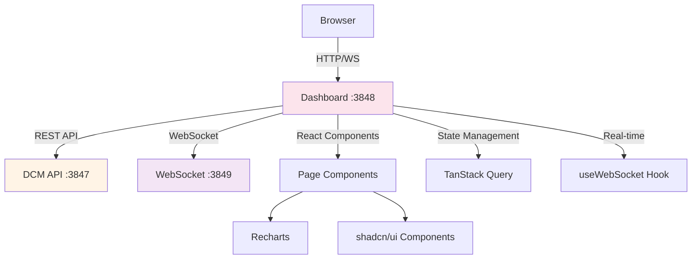

# DCM Dashboard

**Version:** 3.0.0
**Generated:** 2026-02-09
**Status:** Production Ready

## Overview

The DCM Dashboard is a real-time monitoring and visualization interface built with Next.js 16, React 19, and shadcn/ui. It provides comprehensive visibility into multi-agent sessions, context management, and orchestration workflows.

**Technology Stack:**
- **Framework**: Next.js 16 (App Router)
- **UI Library**: React 19
- **Components**: shadcn/ui (Radix UI primitives)
- **Charts**: Recharts v3
- **Styling**: Tailwind CSS v4
- **Data Fetching**: TanStack Query v5
- **Icons**: Lucide React
- **Real-time**: WebSocket connection

**Access:** http://localhost:3848

## Architecture



## Dashboard Pages

### 1. Main Dashboard (`/dashboard`)

**Purpose:** High-level KPIs and system health monitoring.

**Components:**
- **Health Card**: API and database connectivity status
- **KPI Cards**: Success rate, actions/hour, active agents, sessions
- **Agent Distribution**: Bar chart of agent types
- **System Health**: Action rates and completion metrics
- **Recent Activity**: Latest tool invocations
- **Active Agents**: Currently running agents

**Data Sources:**
- `/api/dashboard/kpis` - Aggregated metrics (15s refresh)
- `/api/active-sessions` - Running agents (10s refresh)
- `/api/actions` - Recent actions (15s refresh)
- `/health` - API status (30s refresh)

**Key Metrics:**
```typescript
interface DashboardKPIs {
  sessions: {
    total: number;
    active: number;
    avg_duration_ms: number;
  };
  actions_24h: {
    total: number;
    success_rate: number;
    actions_per_hour: number;
  };
  agents: {
    active_count: number;
    by_type: Record<string, number>;
  };
  subtasks: {
    running: number;
    completed: number;
    failed: number;
  };
  routing: {
    total_keywords: number;
    total_tools: number;
    coverage: number;
  };
}
```

**Screenshot Reference:**


### 2. Sessions Browser (`/sessions`)

**Purpose:** View and filter all Claude Code sessions.

**Features:**
- Session list with status badges
- Filter by date range and status
- Search by session ID
- Sort by start time, duration, tool count
- Export to CSV/JSON

**Data Displayed:**
- Session ID
- Project name
- Start/end time
- Duration
- Total tools used
- Success/error counts
- Status (active/ended)

**API Endpoint:** `/api/sessions`

**Detail View (`/sessions/[id]`):**
- Full session timeline
- Tool usage breakdown
- Agent activity log
- Context snapshots
- Wave history

### 3. Agents (`/agents`)

**Purpose:** Monitor agent contexts and active instances.

**Features:**
- Agent context browser
- Filter by agent type
- Real-time status updates
- Context snapshot viewer
- Skills and tools tracking

**Data Displayed:**
- Agent ID
- Agent type
- Status (running/paused/completed)
- Progress summary
- Last updated timestamp
- Skills to restore
- Tools used

**API Endpoint:** `/api/agent-contexts`

**Detail View (`/agents/[id]`):**
- Full context JSON viewer
- Agent history
- Related subtasks
- Message timeline

### 4. Messages (`/messages`)

**Purpose:** Inter-agent pub/sub messaging interface.

**Features:**
- Message browser with filters
- Topic-based filtering
- Read/unread status
- Priority sorting
- Expiration tracking

**Data Displayed:**
- Message ID
- From agent
- To agent (or "broadcast")
- Topic
- Message type (info/request/response/notification)
- Payload preview
- Created/expires timestamp
- Read by list

**API Endpoint:** `/api/messages`

### 5. Projects (`/projects`)

**Purpose:** Project hierarchy and statistics.

**Features:**
- Project list
- Hierarchical tree view
- Request/task/subtask counts
- Last activity timestamp
- Filter by activity

**Data Displayed:**
- Project ID
- Project path
- Project name
- Total requests
- Total subtasks
- Total actions
- Success rate
- Last activity

**API Endpoint:** `/api/projects`

**Detail View (`/projects/[id]`):**
- Full hierarchy tree
- Request timeline
- Wave breakdown
- Agent distribution

### 6. Routing (`/routing`)

**Purpose:** Intelligent routing statistics and coverage.

**Features:**
- Keyword-to-tool mapping table
- Success rate visualization
- Usage count tracking
- Feedback submission interface
- Coverage metrics

**Data Displayed:**
- Keyword
- Tool name
- Tool type
- Score (feedback-driven)
- Usage count
- Success count
- Success rate
- Last used timestamp

**API Endpoints:**
- `/api/routing/stats` - Aggregated statistics
- `/api/routing/suggest?keyword=...` - Tool suggestions
- `/api/routing/feedback` - Submit feedback

### 7. Waves (`/waves`)

**Purpose:** Wave orchestration tracking.

**Features:**
- Wave timeline visualization
- Current wave status
- Task completion progress
- Wave transition history
- Batch status

**Data Displayed:**
- Wave number
- Status (pending/running/completed/failed)
- Total/completed/failed tasks
- Start/completion time
- Duration
- Batch assignments

**API Endpoints:**
- `/api/waves/:session_id/history` - All waves
- `/api/waves/:session_id/current` - Active wave

### 8. Flows (`/flows`)

**Purpose:** Task orchestration flow visualization.

**Features:**
- Orchestration batch browser
- Subtask dependency graph
- Conflict analysis
- Synthesis viewer

**Data Displayed:**
- Batch ID
- Wave number
- Status
- Total/completed/failed tasks
- Synthesis summary
- Files changed
- Conflicts

**API Endpoint:** `/api/orchestration/batch/:id`

### 9. Registry (`/registry`)

**Purpose:** Agent registry catalog browser.

**Features:**
- 3-tab interface: All / Agents / Skills
- Search and filter
- Agent metadata viewer
- Wave assignment display

**Data Displayed:**
- Agent type
- Display name
- Category
- Description
- Capabilities
- Default scope
- Allowed tools
- Forbidden actions
- Max files
- Wave assignments
- Recommended model

**API Endpoint:** `/api/registry/catalog`

**Catalog Structure:**
```typescript
interface AgentCatalog {
  agents: AgentRegistryEntry[]; // 66+ agents
  skills: SkillEntry[];          // 226+ skills
}
```

### 10. Compact Operations (`/compact`)

**Purpose:** Compact lifecycle monitoring.

**Features:**
- Snapshot browser
- Save/restore status
- Context brief preview
- Trigger analysis

**Data Displayed:**
- Snapshot ID
- Session ID
- Agent ID
- Agent type
- Trigger (auto/manual/proactive)
- Context summary
- Active tasks snapshot
- Saved timestamp

**API Endpoints:**
- `/api/compact/snapshot/:session_id` - Get snapshot
- `/api/compact/status/:session_id` - Check compact status

### 11. Context Viewer (`/context`)

**Purpose:** Inspect context briefs.

**Features:**
- Agent context selector
- Format toggle (brief/raw)
- Token counter
- Max tokens slider
- Copy to clipboard

**API Endpoint:** `/api/context/:agent_id?session_id=...&format=...&max_tokens=...`

### 12. Live Activity (`/live`)

**Purpose:** Real-time activity feed via WebSocket.

**Features:**
- Live event stream
- Event type filtering
- Channel subscriptions
- Auto-scroll toggle

**WebSocket Connection:** `ws://localhost:3849`

**Event Types:**
- Task events
- Subtask events
- Message events
- Agent events
- Wave events
- Metric events

### 13. Tools Summary (`/tools`)

**Purpose:** Tool usage analytics.

**Features:**
- Tool usage frequency
- Tool type breakdown
- Success rate by tool
- Timeline visualization

**API Endpoint:** `/stats/tools-summary`

### 14. Performance Metrics (`/performance`)

**Purpose:** System performance monitoring.

**Features:**
- Response time graphs
- Database query performance
- Hook execution metrics
- WebSocket latency
- Action throughput

## Global Components

### Navigation

**Sidebar (`src/components/Sidebar.tsx`)**

Left navigation menu with icons and labels:
- Dashboard (Home)
- Sessions
- Agents
- Messages
- Projects
- Routing
- Waves
- Flows
- Registry
- Compact
- Context
- Live
- Tools
- Performance

**Header (`src/components/Header.tsx`)**

Top bar with:
- Global search
- Theme toggle (dark/light)
- Notification center
- Settings menu

### Global Search

**Component:** `src/components/GlobalSearch.tsx`

**Features:**
- Quick search across sessions, projects, agents
- Keyboard shortcut: `Cmd/Ctrl + K`
- Fuzzy matching
- Recent searches

### Notification Center

**Component:** `src/components/NotificationCenter.tsx`

**Features:**
- Real-time alerts
- WebSocket-driven notifications
- Badge count
- Dismiss/clear all

## Chart Components

**Location:** `src/components/charts/`

### Line Chart
Time-series data visualization.

### Area Chart
Area-fill time-series visualization.

### Bar Chart
Category comparison visualization.

### Pie Chart
Distribution breakdown visualization.

### KPI Card
Metric display with icon, value, and trend indicator.

## Filters

**Location:** `src/components/filters/`

### Date Range Filter
Date picker with presets (Today, Last 7 days, Last 30 days, Custom).

### Agent Filter
Multi-select agent type dropdown.

### Status Filter
Status selector (Active, Completed, Failed, All).

## Data Fetching

**API Client:** `src/lib/api-client.ts`

Type-safe TypeScript client with methods for all endpoints:

```typescript
// Example usage
import { apiClient } from "@/lib/api-client";

// Fetch dashboard KPIs
const kpis = await apiClient.getDashboardKPIs();

// Get sessions
const sessions = await apiClient.getSessions();

// Get session by ID
const session = await apiClient.getSessionById("session-uuid");
```

**Query Provider:** `src/providers/query-provider.tsx`

TanStack Query configuration:
- 5-minute default staleTime
- Automatic retries on failure
- Persistent cache (localStorage)

## WebSocket Integration

**Hook:** `src/hooks/useWebSocket.ts`

```typescript
import { useWebSocket } from "@/hooks/useWebSocket";

function LiveDashboard() {
  const { connected, subscribe, unsubscribe, events } = useWebSocket({
    url: "ws://localhost:3849",
    onMessage: (message) => {
      console.log("Received:", message);
    },
  });

  useEffect(() => {
    if (connected) {
      subscribe("sessions/session-abc");
      subscribe("global");
    }
    return () => {
      unsubscribe("sessions/session-abc");
    };
  }, [connected]);

  return (
    <div>
      <p>Status: {connected ? "Connected" : "Disconnected"}</p>
      <ul>
        {events.map((event, i) => (
          <li key={i}>{event.event}: {JSON.stringify(event.data)}</li>
        ))}
      </ul>
    </div>
  );
}
```

## Theming

**Dark/Light Mode:** Supported via Tailwind CSS dark mode classes.

**Toggle:** `<ThemeToggle />` component in header.

**Persistence:** Theme preference stored in localStorage.

## Responsive Design

All pages are responsive with breakpoints:
- **Mobile**: < 640px
- **Tablet**: 640px - 1024px
- **Desktop**: > 1024px

## Performance Optimizations

1. **Code Splitting**: Each page is a separate chunk (Next.js automatic)
2. **Data Caching**: TanStack Query cache with staleTime
3. **Lazy Loading**: Charts and heavy components load on demand
4. **Debouncing**: Search inputs debounced (300ms)
5. **Virtualization**: Large lists use virtual scrolling (not yet implemented)

## Export Functionality

**Component:** `src/components/ExportButton.tsx`

Export data to:
- **CSV**: Comma-separated values
- **JSON**: Full JSON export

Available on:
- Sessions page
- Actions page
- Messages page
- Routing page

## Error Handling

**Error Boundary:** `src/components/ErrorBoundary.tsx`

Catches component errors and displays fallback UI with:
- Error message
- Stack trace (dev mode)
- Reset button

## Accessibility

- **Keyboard Navigation**: All interactive elements accessible via keyboard
- **ARIA Labels**: Screen reader support
- **Focus Management**: Logical tab order
- **Color Contrast**: WCAG 2.1 AA compliant

## Development

### Run Dashboard Locally

```bash
cd context-dashboard
bun install
bun run dev
```

Dashboard runs on http://localhost:3848

### Environment Variables

```bash
# context-dashboard/.env.local
NEXT_PUBLIC_API_URL=http://localhost:3847
NEXT_PUBLIC_WS_URL=ws://localhost:3849
```

### Build for Production

```bash
bun run build
bun run start
```

### Type Checking

```bash
bun run type-check
```

## Dashboard Screenshots

Screenshots available in `/home/rony/Assets Projets/Claude-DCM/docs/images/`:

- `dashboard-overview.png` - Main dashboard
- `sessions-browser.png` - Sessions page
- `agents-contexts.png` - Agents page
- `messages-pubsub.png` - Messages page
- `routing-intelligence.png` - Routing page
- `waves-orchestration.png` - Waves page
- `registry-catalog.png` - Registry page

## Troubleshooting

### Dashboard Not Loading

**Symptom:** Blank page or error screen.

**Solution:**
1. Check API is running: `curl http://localhost:3847/health`
2. Check WebSocket: `curl http://localhost:3849`
3. Check browser console for errors
4. Verify environment variables

### Real-time Updates Not Working

**Symptom:** Data not refreshing automatically.

**Solution:**
1. Check WebSocket connection in browser DevTools (Network tab)
2. Verify WebSocket server is running: `dcm status`
3. Check authentication token is valid

### Chart Not Rendering

**Symptom:** Empty chart area or error.

**Solution:**
1. Check data format matches chart requirements
2. Verify Recharts version compatibility
3. Check browser console for errors

## API Integration

All dashboard pages integrate with DCM API endpoints. See [03-api-reference.md](./03-api-reference.md) for complete API documentation.

## Next Steps

- [09-websocket.md](./09-websocket.md) - WebSocket real-time events
- [03-api-reference.md](./03-api-reference.md) - API endpoints
- [08-orchestration.md](./08-orchestration.md) - Wave orchestration

---

**Status:** Dashboard fully implemented. Production-ready since v3.0.0.
