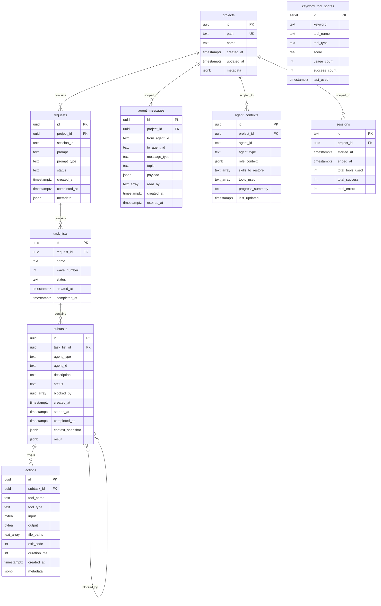

# Database Schema Reference

This document provides comprehensive documentation of DCM's PostgreSQL 16 database schema, including all tables, views, indexes, functions, and relationships.

## Schema Overview

**Database:** `claude_context`
**Version:** 2.0.0
**Tables:** 10
**Views:** 4
**Extensions:** pgcrypto
**Total size:** ~500MB (typical production)

## Entity Relationship Diagram



## Table Definitions

### projects

Root container for all project data.

```sql
CREATE TABLE projects (
    id UUID PRIMARY KEY DEFAULT gen_random_uuid(),
    path TEXT UNIQUE NOT NULL,
    name TEXT,
    created_at TIMESTAMPTZ DEFAULT NOW(),
    updated_at TIMESTAMPTZ DEFAULT NOW(),
    metadata JSONB DEFAULT '{}'
);
```

**Columns:**

| Column | Type | Nullable | Default | Description |
|--------|------|----------|---------|-------------|
| id | UUID | NO | gen_random_uuid() | Primary key |
| path | TEXT | NO | - | Absolute path to project directory (cwd) |
| name | TEXT | YES | NULL | Human-readable project name |
| created_at | TIMESTAMPTZ | NO | NOW() | Project creation timestamp |
| updated_at | TIMESTAMPTZ | NO | NOW() | Last update timestamp (auto-updated) |
| metadata | JSONB | NO | '{}' | Flexible metadata (language, framework, etc.) |

**Constraints:**
- PRIMARY KEY: `id`
- UNIQUE: `path`

**Indexes:**
- `idx_projects_metadata` (GIN on metadata)

**Triggers:**
- `update_projects_updated_at` - Auto-updates `updated_at` on row modification

**Example metadata:**
```json
{
  "language": "typescript",
  "framework": "next.js",
  "version": "16.0.0",
  "stack": ["react", "postgresql", "tailwind"]
}
```

### requests

User prompts submitted to Claude.

```sql
CREATE TABLE requests (
    id UUID PRIMARY KEY DEFAULT gen_random_uuid(),
    project_id UUID REFERENCES projects(id) ON DELETE CASCADE,
    session_id TEXT NOT NULL,
    prompt TEXT NOT NULL,
    prompt_type TEXT,
    status TEXT DEFAULT 'active',
    created_at TIMESTAMPTZ DEFAULT NOW(),
    completed_at TIMESTAMPTZ,
    metadata JSONB DEFAULT '{}'
);
```

**Columns:**

| Column | Type | Nullable | Default | Description |
|--------|------|----------|---------|-------------|
| id | UUID | NO | gen_random_uuid() | Primary key |
| project_id | UUID | YES | NULL | Foreign key to projects |
| session_id | TEXT | NO | - | Claude Code session ID |
| prompt | TEXT | NO | - | User's original prompt |
| prompt_type | TEXT | YES | NULL | Category: feature, debug, explain, search |
| status | TEXT | NO | 'active' | active, completed |
| created_at | TIMESTAMPTZ | NO | NOW() | Request timestamp |
| completed_at | TIMESTAMPTZ | YES | NULL | Completion timestamp |
| metadata | JSONB | NO | '{}' | Additional context |

**Indexes:**
- `idx_requests_project` on `project_id`
- `idx_requests_session` on `session_id`
- `idx_requests_status` on `status`
- `idx_requests_metadata` (GIN on metadata)

**Cascades:** ON DELETE CASCADE from projects

### task_lists

Waves of objectives for each request.

```sql
CREATE TABLE task_lists (
    id UUID PRIMARY KEY DEFAULT gen_random_uuid(),
    request_id UUID REFERENCES requests(id) ON DELETE CASCADE,
    name TEXT,
    wave_number INTEGER DEFAULT 0,
    status TEXT DEFAULT 'pending',
    created_at TIMESTAMPTZ DEFAULT NOW(),
    completed_at TIMESTAMPTZ
);
```

**Columns:**

| Column | Type | Nullable | Default | Description |
|--------|------|----------|---------|-------------|
| id | UUID | NO | gen_random_uuid() | Primary key |
| request_id | UUID | NO | - | Foreign key to requests |
| name | TEXT | YES | NULL | Wave name (e.g., "Backend Implementation") |
| wave_number | INTEGER | NO | 0 | Sequential wave number (0, 1, 2, ...) |
| status | TEXT | NO | 'pending' | pending, running, completed |
| created_at | TIMESTAMPTZ | NO | NOW() | Creation timestamp |
| completed_at | TIMESTAMPTZ | YES | NULL | Completion timestamp |

**Wave numbering convention:**
- Wave -1: Impact analysis (via impact-analyzer agent)
- Wave 0: Legal, GDPR, API contracts
- Wave 1: Migrations, Models, Seeders
- Wave 2: Controllers, Routes, Resources
- Wave 3: TypeScript types, Hooks
- Wave 4: UI Components
- Wave 5: Pages, Layouts
- Wave 6: Tests, Security
- Wave 7: Documentation, SEO
- Wave 8: Anti-regression validation

### subtasks

Individual objectives assigned to agents.

```sql
CREATE TABLE subtasks (
    id UUID PRIMARY KEY DEFAULT gen_random_uuid(),
    task_list_id UUID REFERENCES task_lists(id) ON DELETE CASCADE,
    agent_type TEXT,
    agent_id TEXT,
    description TEXT,
    status TEXT DEFAULT 'pending',
    blocked_by UUID[],
    created_at TIMESTAMPTZ DEFAULT NOW(),
    started_at TIMESTAMPTZ,
    completed_at TIMESTAMPTZ,
    context_snapshot JSONB,
    result JSONB
);
```

**Columns:**

| Column | Type | Nullable | Default | Description |
|--------|------|----------|---------|-------------|
| id | UUID | NO | gen_random_uuid() | Primary key |
| task_list_id | UUID | NO | - | Foreign key to task_lists |
| agent_type | TEXT | YES | NULL | Agent role (backend-laravel, frontend-react) |
| agent_id | TEXT | YES | NULL | Instance ID of the agent |
| description | TEXT | YES | NULL | Subtask description |
| status | TEXT | NO | 'pending' | pending, running, paused, blocked, completed, failed |
| blocked_by | UUID[] | YES | NULL | Array of subtask IDs blocking this one |
| created_at | TIMESTAMPTZ | NO | NOW() | Creation timestamp |
| started_at | TIMESTAMPTZ | YES | NULL | Start timestamp |
| completed_at | TIMESTAMPTZ | YES | NULL | Completion timestamp |
| context_snapshot | JSONB | YES | NULL | Context snapshot at start |
| result | JSONB | YES | NULL | Execution result |

**Indexes:**
- `idx_subtasks_status` on `status`
- `idx_subtasks_agent` on `(agent_type, agent_id)`
- `idx_subtasks_task_list` on `task_list_id`

**Example result:**
```json
{
  "success": true,
  "files_created": [
    "/app/Models/User.php",
    "/database/migrations/2026_02_09_create_users_table.php"
  ],
  "summary": "User model and migration created successfully",
  "duration_ms": 12500
}
```

### actions

Tool invocations with compressed input/output.

```sql
CREATE TABLE actions (
    id UUID PRIMARY KEY DEFAULT gen_random_uuid(),
    subtask_id UUID REFERENCES subtasks(id) ON DELETE CASCADE,
    tool_name TEXT NOT NULL,
    tool_type TEXT NOT NULL,
    input BYTEA,
    output BYTEA,
    file_paths TEXT[],
    exit_code INTEGER DEFAULT 0,
    duration_ms INTEGER,
    created_at TIMESTAMPTZ DEFAULT NOW(),
    metadata JSONB DEFAULT '{}'
);
```

**Columns:**

| Column | Type | Nullable | Default | Description |
|--------|------|----------|---------|-------------|
| id | UUID | NO | gen_random_uuid() | Primary key |
| subtask_id | UUID | YES | NULL | Foreign key to subtasks |
| tool_name | TEXT | NO | - | Tool name (Read, Write, Bash, Task, etc.) |
| tool_type | TEXT | NO | - | builtin, agent, skill, mcp, command |
| input | BYTEA | YES | NULL | Compressed tool input (pg_lz) |
| output | BYTEA | YES | NULL | Compressed tool output (pg_lz) |
| file_paths | TEXT[] | YES | NULL | Array of file paths affected |
| exit_code | INTEGER | NO | 0 | Exit code (0 = success) |
| duration_ms | INTEGER | YES | NULL | Execution duration in milliseconds |
| created_at | TIMESTAMPTZ | NO | NOW() | Execution timestamp |
| metadata | JSONB | NO | '{}' | Additional metadata |

**Indexes:**
- `idx_actions_tool` on `tool_name`
- `idx_actions_created` on `created_at DESC`
- `idx_actions_subtask` on `subtask_id`
- `idx_actions_tool_type` on `tool_type`
- `idx_actions_metadata` (GIN on metadata)

**Tool type detection:**
- `builtin`: Read, Write, Bash, Edit, Grep, Glob
- `agent`: Task (with agent argument)
- `skill`: Skill (with skill name)
- `mcp`: mcp__* prefix
- `command`: npm, git, etc.

**Compression:** Input/output stored as compressed BYTEA to save disk space. Typical compression ratio: 3-5x.

### keyword_tool_scores

Routing intelligence - keyword-to-tool mappings with feedback.

```sql
CREATE TABLE keyword_tool_scores (
    id SERIAL PRIMARY KEY,
    keyword TEXT NOT NULL,
    tool_name TEXT NOT NULL,
    tool_type TEXT NOT NULL,
    score REAL DEFAULT 1.0,
    usage_count INTEGER DEFAULT 1,
    success_count INTEGER DEFAULT 1,
    last_used TIMESTAMPTZ DEFAULT NOW(),
    UNIQUE(keyword, tool_name)
);
```

**Columns:**

| Column | Type | Nullable | Default | Description |
|--------|------|----------|---------|-------------|
| id | SERIAL | NO | nextval() | Primary key |
| keyword | TEXT | NO | - | Search keyword (lowercase) |
| tool_name | TEXT | NO | - | Tool name |
| tool_type | TEXT | NO | - | Tool type |
| score | REAL | NO | 1.0 | Relevance score (0.0-1.0) |
| usage_count | INTEGER | NO | 1 | Times this mapping used |
| success_count | INTEGER | NO | 1 | Times this mapping succeeded |
| last_used | TIMESTAMPTZ | NO | NOW() | Last usage timestamp |

**Indexes:**
- `idx_keyword_scores` on `keyword`
- `idx_keyword_tool` on `tool_name`
- UNIQUE constraint on `(keyword, tool_name)`

**Score calculation:**
```
score = (success_count / usage_count) * freshness_factor
freshness_factor = 1.0 - (days_since_last_use / 30)
```

**Example rows:**
```
keyword: "read file"  | tool_name: Read    | score: 0.95 | usage: 234 | success: 222
keyword: "read file"  | tool_name: Glob    | score: 0.42 | usage: 12  | success: 5
keyword: "search"     | tool_name: Grep    | score: 0.89 | usage: 456 | success: 407
```

### agent_messages

Inter-agent pub/sub messaging.

```sql
CREATE TABLE agent_messages (
    id UUID PRIMARY KEY DEFAULT gen_random_uuid(),
    project_id UUID REFERENCES projects(id) ON DELETE CASCADE,
    from_agent_id TEXT,
    to_agent_id TEXT,
    message_type TEXT NOT NULL,
    topic TEXT,
    payload JSONB NOT NULL,
    read_by TEXT[] DEFAULT '{}',
    created_at TIMESTAMPTZ DEFAULT NOW(),
    expires_at TIMESTAMPTZ
);
```

**Columns:**

| Column | Type | Nullable | Default | Description |
|--------|------|----------|---------|-------------|
| id | UUID | NO | gen_random_uuid() | Primary key |
| project_id | UUID | NO | - | Foreign key to projects |
| from_agent_id | TEXT | YES | NULL | Sender agent ID |
| to_agent_id | TEXT | YES | NULL | Recipient agent ID (NULL = broadcast) |
| message_type | TEXT | NO | - | info, request, response, notification |
| topic | TEXT | YES | NULL | Routing key (snake_case) |
| payload | JSONB | NO | - | Message data |
| read_by | TEXT[] | NO | '{}' | Array of agent IDs that read this |
| created_at | TIMESTAMPTZ | NO | NOW() | Creation timestamp |
| expires_at | TIMESTAMPTZ | YES | NULL | TTL expiration (NULL = never) |

**Indexes:**
- `idx_messages_project` on `project_id`
- `idx_messages_to` on `to_agent_id`
- `idx_messages_topic` on `topic`
- `idx_messages_created` on `created_at DESC`
- `idx_messages_payload` (GIN on payload)

**Cleanup:** Background worker deletes expired messages every 60s.

### agent_contexts

Agent contexts for recovery after compact.

```sql
CREATE TABLE agent_contexts (
    id UUID PRIMARY KEY DEFAULT gen_random_uuid(),
    project_id UUID REFERENCES projects(id) ON DELETE CASCADE,
    agent_id TEXT NOT NULL,
    agent_type TEXT NOT NULL,
    role_context JSONB NOT NULL,
    skills_to_restore TEXT[],
    tools_used TEXT[],
    progress_summary TEXT,
    last_updated TIMESTAMPTZ DEFAULT NOW(),
    UNIQUE(project_id, agent_id)
);
```

**Columns:**

| Column | Type | Nullable | Default | Description |
|--------|------|----------|---------|-------------|
| id | UUID | NO | gen_random_uuid() | Primary key |
| project_id | UUID | NO | - | Foreign key to projects |
| agent_id | TEXT | NO | - | Agent instance ID or session ID for snapshots |
| agent_type | TEXT | NO | - | Agent type or 'compact-snapshot' for snapshots |
| role_context | JSONB | NO | - | Role-specific context data |
| skills_to_restore | TEXT[] | YES | NULL | Skills that were active |
| tools_used | TEXT[] | YES | NULL | Tools invoked |
| progress_summary | TEXT | YES | NULL | Human-readable progress |
| last_updated | TIMESTAMPTZ | NO | NOW() | Last update timestamp (auto-updated) |

**Indexes:**
- `idx_contexts_agent` on `(project_id, agent_type)`
- `idx_contexts_agent_id` on `agent_id`
- `idx_contexts_role` (GIN on role_context)
- UNIQUE constraint on `(project_id, agent_id)`

**Triggers:**
- `update_contexts_updated_at` - Auto-updates `last_updated`

**Special agent_type:**
- `'compact-snapshot'`: Marks full context snapshots saved during PreCompact

### sessions

Claude Code sessions with statistics.

```sql
CREATE TABLE sessions (
    id TEXT PRIMARY KEY,
    project_id UUID REFERENCES projects(id),
    started_at TIMESTAMPTZ DEFAULT NOW(),
    ended_at TIMESTAMPTZ,
    total_tools_used INTEGER DEFAULT 0,
    total_success INTEGER DEFAULT 0,
    total_errors INTEGER DEFAULT 0
);
```

**Columns:**

| Column | Type | Nullable | Default | Description |
|--------|------|----------|---------|-------------|
| id | TEXT | NO | - | Claude Code session ID (Primary key) |
| project_id | UUID | YES | NULL | Foreign key to projects |
| started_at | TIMESTAMPTZ | NO | NOW() | Session start timestamp |
| ended_at | TIMESTAMPTZ | YES | NULL | Session end timestamp (NULL = active) |
| total_tools_used | INTEGER | NO | 0 | Total tool invocations |
| total_success | INTEGER | NO | 0 | Successful tool calls |
| total_errors | INTEGER | NO | 0 | Failed tool calls |

**Indexes:**
- `idx_sessions_project` on `project_id`
- `idx_sessions_started` on `started_at DESC`

## Views

Views provide pre-joined, optimized queries for common access patterns.

### v_actions_full

Complete action view with full hierarchy.

```sql
CREATE OR REPLACE VIEW v_actions_full AS
SELECT
    a.id AS action_id,
    a.tool_name,
    a.tool_type,
    a.exit_code,
    a.duration_ms,
    a.file_paths,
    a.created_at AS action_created_at,
    s.id AS subtask_id,
    s.agent_type,
    s.agent_id,
    s.description AS subtask_description,
    s.status AS subtask_status,
    tl.id AS task_list_id,
    tl.name AS task_list_name,
    tl.wave_number,
    r.id AS request_id,
    r.prompt,
    r.prompt_type,
    r.session_id,
    p.id AS project_id,
    p.path AS project_path,
    p.name AS project_name
FROM actions a
LEFT JOIN subtasks s ON a.subtask_id = s.id
LEFT JOIN task_lists tl ON s.task_list_id = tl.id
LEFT JOIN requests r ON tl.request_id = r.id
LEFT JOIN projects p ON r.project_id = p.id;
```

**Use case:** Get full context for any action without multiple JOINs.

**Example query:**
```sql
SELECT * FROM v_actions_full
WHERE session_id = 'session-abc123'
ORDER BY action_created_at DESC
LIMIT 100;
```

### v_active_agents

Currently running agents grouped by project.

```sql
CREATE OR REPLACE VIEW v_active_agents AS
SELECT
    s.id AS subtask_id,
    p.id AS project_id,
    p.name AS project_name,
    p.path AS project_path,
    s.agent_type,
    s.agent_id,
    s.status,
    s.description,
    s.started_at,
    s.created_at,
    r.session_id,
    r.id AS request_id,
    COUNT(a.id) AS actions_count
FROM subtasks s
JOIN task_lists tl ON s.task_list_id = tl.id
JOIN requests r ON tl.request_id = r.id
LEFT JOIN projects p ON r.project_id = p.id
LEFT JOIN actions a ON a.subtask_id = s.id
WHERE s.status IN ('running', 'paused', 'blocked')
GROUP BY s.id, p.id, p.name, p.path, s.agent_type, s.agent_id, s.status, s.description, s.started_at, s.created_at, r.session_id, r.id;
```

**Use case:** Dashboard display of active agents.

### v_unread_messages

Messages that haven't expired with project context.

```sql
CREATE OR REPLACE VIEW v_unread_messages AS
SELECT
    m.*,
    p.name AS project_name
FROM agent_messages m
JOIN projects p ON m.project_id = p.id
WHERE m.expires_at IS NULL OR m.expires_at > NOW()
ORDER BY m.created_at DESC;
```

**Use case:** Fetch messages for agent context generation.

### v_project_stats

Statistics aggregated by project.

```sql
CREATE OR REPLACE VIEW v_project_stats AS
SELECT
    p.id AS project_id,
    p.name AS project_name,
    p.path,
    COUNT(DISTINCT r.id) AS total_requests,
    COUNT(DISTINCT s.id) AS total_subtasks,
    COUNT(DISTINCT a.id) AS total_actions,
    COUNT(DISTINCT CASE WHEN a.exit_code = 0 THEN a.id END) AS successful_actions,
    COALESCE(AVG(a.duration_ms), 0) AS avg_duration_ms,
    MAX(a.created_at) AS last_activity
FROM projects p
LEFT JOIN requests r ON r.project_id = p.id
LEFT JOIN task_lists tl ON tl.request_id = r.id
LEFT JOIN subtasks s ON s.task_list_id = tl.id
LEFT JOIN actions a ON a.subtask_id = s.id
GROUP BY p.id, p.name, p.path;
```

**Use case:** Project overview page in dashboard.

## Functions & Triggers

### update_updated_at_column()

Auto-updates `updated_at` timestamp on row modification.

```sql
CREATE OR REPLACE FUNCTION update_updated_at_column()
RETURNS TRIGGER AS $$
BEGIN
    NEW.updated_at = NOW();
    RETURN NEW;
END;
$$ LANGUAGE plpgsql;
```

**Attached to:**
- `projects` table
- `agent_contexts` table

## Performance Considerations

### Index Usage

Query plan analysis shows index usage:

```sql
EXPLAIN ANALYZE
SELECT * FROM v_actions_full
WHERE session_id = 'session-abc123'
ORDER BY action_created_at DESC
LIMIT 100;
```

**Expected:** Index scan on `idx_requests_session`.

### JSONB Query Optimization

GIN indexes enable fast JSONB queries:

```sql
-- Fast: Uses idx_projects_metadata GIN index
SELECT * FROM projects
WHERE metadata @> '{"language": "typescript"}';

-- Fast: Uses idx_messages_payload GIN index
SELECT * FROM agent_messages
WHERE payload->>'endpoint' = '/api/users';
```

### Query Patterns

**Good:**
```sql
-- Uses idx_actions_created
SELECT * FROM actions
WHERE created_at > NOW() - INTERVAL '1 hour'
ORDER BY created_at DESC;

-- Uses idx_subtasks_agent
SELECT * FROM subtasks
WHERE agent_type = 'backend-laravel'
  AND status = 'running';
```

**Bad (sequential scan):**
```sql
-- No index on input/output BYTEA
SELECT * FROM actions
WHERE octet_length(input) > 10000;

-- No index on LOWER(tool_name)
SELECT * FROM actions
WHERE LOWER(tool_name) = 'read';
```

## Maintenance

### Vacuum & Analyze

Run regularly for performance:

```sql
VACUUM ANALYZE projects;
VACUUM ANALYZE requests;
VACUUM ANALYZE actions;
VACUUM ANALYZE agent_messages;
```

### Cleanup Expired Messages

Manual cleanup (also done by background worker):

```sql
DELETE FROM agent_messages
WHERE expires_at IS NOT NULL
  AND expires_at < NOW();
```

### Archive Old Data

Archive sessions older than 90 days:

```sql
-- Create archive table
CREATE TABLE sessions_archive (LIKE sessions INCLUDING ALL);

-- Move old sessions
WITH moved AS (
    DELETE FROM sessions
    WHERE ended_at < NOW() - INTERVAL '90 days'
    RETURNING *
)
INSERT INTO sessions_archive
SELECT * FROM moved;
```

## Useful Queries

### Active Sessions

```sql
SELECT s.id, s.started_at, p.name AS project, r.prompt
FROM sessions s
LEFT JOIN projects p ON s.project_id = p.id
LEFT JOIN requests r ON r.session_id = s.id
WHERE s.ended_at IS NULL
ORDER BY s.started_at DESC;
```

### Top Tools by Usage

```sql
SELECT tool_name, COUNT(*) AS usage
FROM actions
WHERE created_at > NOW() - INTERVAL '7 days'
GROUP BY tool_name
ORDER BY usage DESC
LIMIT 10;
```

### Agent Productivity

```sql
SELECT agent_type, COUNT(*) AS tasks_completed, AVG(EXTRACT(EPOCH FROM (completed_at - started_at))) AS avg_duration_seconds
FROM subtasks
WHERE status = 'completed'
  AND completed_at > NOW() - INTERVAL '7 days'
GROUP BY agent_type
ORDER BY tasks_completed DESC;
```

### Message Topics

```sql
SELECT topic, COUNT(*) AS count
FROM agent_messages
WHERE created_at > NOW() - INTERVAL '24 hours'
GROUP BY topic
ORDER BY count DESC;
```

## Next Steps

- [12-cli-reference.md](./12-cli-reference.md) - CLI database commands
- [14-troubleshooting.md](./14-troubleshooting.md) - Database issues
- Schema migrations: `src/db/migrations/`

---

**Schema Version:** 2.0.0 (PostgreSQL 16 with JSONB + LISTEN/NOTIFY)
